# cp.async 系列

cp.async 指令是 Ampere 架构引入的一种异步数据拷贝指令，并在 Hopper 架构上进行了拓展。

当需要把数据从全局内存拷贝到共享内存中时，同步的数据加载命令需要先把数据从全局内存读取到寄存器中，然后在从寄存器保存到共享内存中。这样不仅会增加寄存器压力，还会浪费 L1 带宽，而且由于全局内存延迟较高，导致从全局内存到共享内存需要较多的时间。

使用 cp.async 指令可以异步的把数据从全局内存加载到共享内存中，不需要经过寄存器，从而可以让更多的寄存器参与计算。而且由于是异步拷贝，当需要计算时，数据已经加载到共享内存中了，可以减少等待数据访问的时间。

如下图所示，cp.async 对应下面几种访问模式。在 Ampere 架构上，cp.async 只支持从全局内存异步的加载数据到共享内存。在 Hopper 架构上，由于Tensor Memory Accelerate（TMA）的存在，cp.async 可以支持 1-5D 的 tensor 数据从全局内存异步的拷贝到共享内存或分布式共享内存，也支持从共享内存异步的拷贝到全局内存，以及一个 block cluster 中共享内存间的拷贝。

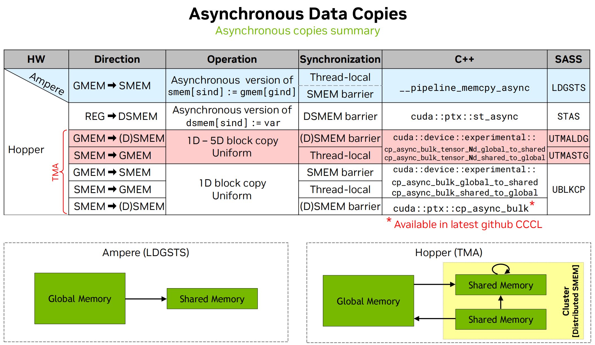

cp.async 有两种类型，cp.async 和 cp.async.bulk。不带 bulk 的就是能在 Ampere 架构上使用的指令，只能从全局内存拷贝到共享内存，一次拷贝的字节数为 4，8 或 16。带 bulk 的指令可以在 Hopper 架构上使用，可以使用 TMA 一次拷贝大量数据。当使用带 bulk 的指令时，数据量必须是 16 bytes 的倍数。Hopper 架构也可以使用 cp.async，但是 Ampere 架构不能使用 cp.async.bulk。

一个异步数据传输操作主要由下面几步组成：
1. 从 src 读数据。
2. 写数据到 dst。
3. 拷贝结果让当前线程或其他线程可见。

由于拷贝是异步的，所以需要通过某种方法来确定拷贝是否完成。在 PTX 中有两种异步拷贝操作完成机制：async-group mechanism 和 mbarrier-based mechanism。

## Async-group mechanism

当使用异步组（async-group mechanism）机制时，发射异步拷贝指令的线程使用 commit 操作指定一个异步操作组，称为 async-group。使用 wait 操作跟踪这个 group 是否完成。其中 bulk 和 non-bulk 需要创建不同的 async-groups。

commit 操作会把前面所有还没有被提交的异步操作提交到一个 async-group 中。当一个 async-group 完成时，说明该 async-group 中的所有异步操作均已完成。不同的 group 会按照提交的顺序来完成，一个 group 中的异步操作没有明确的顺序。

使用 async-group 的流程如下：
1. 初始化一个异步操作。
2. 使用 commit 把异步操作提交到 async-group 中。
3. 使用 wait 等待 group 中的操作完成。
4. group 完成后访问 group 的结果。

## Mbarrier-based mechanism

mbarrier 是一个在共享内存中的对象，详见 [mbarrier](./mbarrier.md)。一个线程可以通过 mbarrier 的状态来确定一个或多个异步操作是否完成。当 mbarrier 的当前状态完成后，说明所有被当前状态跟踪的异步操作均已完成，并且所有参与 mbarrier 的线程可以访问异步操作的结果。

使用流程如下：
1. 初始化一个异步操作
2. 设置一个 mbarrier 对象来跟踪其当前阶段的异步操作。mbarrier 对象可以作为异步操作的一部分，也可以作为单独的操作。
3. 使用 mbarrier.test_wait 或 mbarrier.try_wait 等待 mbarrier 对象完成其当前阶段。
4. 一旦 mbarrier.test_wait 或 mbarrier.try_wait 操作返回 True，即可访问 mbarrier 对象跟踪的异步操作的结果。

## Asynchronous proxy

在 CUDA 中，不同的内存访问方式称为内存代理 (memory proxy)，简称 proxy。当两个内存操作使用不同的内存访问方式时，就称为使用不同的 proxy。

普通的内存访问方式称为 generic proxy，cp{.reduce}.async.bulk 操作由于使用 TMA 来访问数据，因此属于异步代理 (asynchronous proxy)。
跨多个代理访问同一内存位置需要 cross-proxy fence。对于异步代理，应使用 fence.proxy.async 来同步通用代理 (generic proxy) 和异步代理(async proxy) 之间的内存。

cp{.reduce}.async.bulk 操作完成后，会有一个隐式的 generic-async proxy fence。因此，一旦异步操作完成，其结果就会对通用代理可见。

必须使用 async-group 或基于 mbarrier 的完成机制来等待 cp{.reduce}.async.bulk 指令完成。

## Non-bulk copy

### cp.async

启动一个异步拷贝操作从全局内存异步拷贝数据到共享内存中。

ptx指令使用方式如下：
```cpp
cp.async.ca.shared{::cta}.global{.level::cache_hint}{.level::prefetch_size}
                         [dst], [src], cp-size{, src-size}{, cache-policy} ;
cp.async.cg.shared{::cta}.global{.level::cache_hint}{.level::prefetch_size}
                         [dst], [src], 16{, src-size}{, cache-policy} ;
cp.async.ca.shared{::cta}.global{.level::cache_hint}{.level::prefetch_size}
                         [dst], [src], cp-size{, ignore-src}{, cache-policy} ;
cp.async.cg.shared{::cta}.global{.level::cache_hint}{.level::prefetch_size}
                         [dst], [src], 16{, ignore-src}{, cache-policy} ;

.level::cache_hint =     { .L2::cache_hint }
.level::prefetch_size =  { .L2::64B, .L2::128B, .L2::256B }
cp-size =                { 4, 8, 16 }
```

cp.async 是一条非阻塞指令，它启动一个异步数据复制操作，将数据从源地址 src 指定的位置复制到目标地址 dst 指定的位置。这里源地址 src 位于全局内存，目标地址 dst 位于共享内存。

.ca 和 .cg 用于表明复制时缓存的使用情况。.ca 限定符表示从全局内存复制时会在 L1 和 L2 缓存上缓存数据。.cg 限定符表示仅在二级缓存（L2）而非一级缓存（L1）缓存数据。

cp-size 是一个整型常量，指定要复制到目标 dst 的数据大小（以字节为单位）。cp-size 只能为 4、8 和 16。当使用 .ca 时，cp-size可以设置为4，8，16。当使用 .cg 时 cp-size 只能是 16。

可选限定符 .level::cache_hint 用于指定缓存策略。.level::prefetch_size 限定符用于提示将指定大小的额外数据提取到相应的缓存级别。子限定符 prefetch_size 可以设置为 64B、128B 或 256B，从而分别允许预取大小为 64 字节、128 字节或 256 字节。

cp.async 指令可以指定一个 32 位整型操作数 src-size，表示要从 src 复制到 dst 的数据大小（以字节为单位），并且必须小于 cp-size。在这种情况下，目标 dst 中的剩余字节将用零填充。

可选的参数 ignore-src 指定是否完全忽略来自 src 的数据。如果忽略源数据，则将零复制到目标 dst。如果未指定参数 ignore-src，则默认为 False。

```cpp
cp.async.ca.shared.global  [shrd],    [gbl + 4], 4;
cp.async.ca.shared::cta.global  [%r0 + 8], [%r1],     8;
cp.async.cg.shared.global  [%r2],     [%r3],     16;

cp.async.cg.shared.global.L2::64B   [%r2],      [%r3],     16;
cp.async.cg.shared.global.L2::128B  [%r0 + 16], [%r1],     16;
cp.async.cg.shared.global.L2::256B  [%r2 + 32], [%r3],     16;

createpolicy.fractional.L2::evict_last.L2::evict_unchanged.b64 cache-policy, 0.25;
cp.async.ca.shared.global.L2::cache_hint [%r2], [%r1], 4, cache-policy;

cp.async.ca.shared.global                   [shrd], [gbl], 4, p;
cp.async.cg.shared.global.L2::cache_hint   [%r0], [%r2], 16, q, cache-policy;
```

### cp.async.commit_group

将所有先前启动但未提交的 cp.async 指令提交到 cp.async-group 中。

```cpp
cp.async.commit_group ;
```

cp.async.commit_group 指令会为每个线程创建一个新的 cp.async-group，并将所有由执行线程发起但尚未提交给任何 cp.async-group的 cp.async 指令批量添加到新的 cp.async-group 中。如果没有未提交的 cp.async 指令，则 cp.async.commit_group 会返回一个空的 cp.async-group。

执行线程可以使用 cp.async.wait_group 等待 cp.async-group 中所有 cp.async 操作完成。同一 cp.async-group 中任意两个 cp.async 操作之间不提供内存顺序保证。

```cpp
// Example 1:
cp.async.ca.shared.global [shrd], [gbl], 4;
cp.async.commit_group ; // Marks the end of a cp.async group

// Example 2:
cp.async.ca.shared.global [shrd1],   [gbl1],   8;
cp.async.ca.shared.global [shrd1+8], [gbl1+8], 8;
cp.async.commit_group ; // Marks the end of cp.async group 1

cp.async.ca.shared.global [shrd2],    [gbl2],    16;
cp.async.cg.shared.global [shrd2+16], [gbl2+16], 16;
cp.async.commit_group ; // Marks the end of cp.async group 2
```

### cp.async.wait_group, cp.async.wait_all

等待前面的异步拷贝操作完成

```cpp
cp.async.wait_group N;
cp.async.wait_all ;
```

cp.async.wait_group 指令将使执行线程等待，直到最近的 cp.async-groups 中只有 N 个或更少的 cp.async-groups 处于运行状态。例如，当 N = 1 时，该线程允许最近的 1 个 group 正在运行，其余 group 均已完成。当 N 为 0 时，执行线程将等待所有先前的 cp.async-groups 完成。操作数 N 是一个整数常量。

cp.async.wait_all 等效于以下操作：  

```cpp
cp.async.commit_group;
cp.async.wait_group 0;
```

cp.async 操作执行的写入操作仅在以下情况后对执行线程可见：
1. cp.async.wait_all 完成，或
2. cp.async 所属的 cp.async-group 上的 cp.async.wait_group 完成，或
3. mbarrier.test_wait 在跟踪 cp.async 操作完成情况的 mbarrier 对象上返回 True。

两个未与 cp.async.wait_all 或 cp.async.wait_group 或 mbarrier 对象同步的 cp.async 操作之间没有顺序。
cp.async.wait_group 和 cp.async.wait_all 仅为 cp.async 内存操作提供顺序和可见性保证。 

```cpp
// Example of .wait_all:
cp.async.ca.shared.global [shrd1], [gbl1], 4;
cp.async.cg.shared.global [shrd2], [gbl2], 16;
cp.async.wait_all;  // waits for all prior cp.async to complete

// Example of .wait_group :
cp.async.ca.shared.global [shrd3], [gbl3], 8;
cp.async.commit_group;  // End of group 1

cp.async.cg.shared.global [shrd4], [gbl4], 16;
cp.async.commit_group;  // End of group 2

cp.async.cg.shared.global [shrd5], [gbl5], 16;
cp.async.commit_group;  // End of group 3

cp.async.wait_group 1;  // waits for group 1 and group 2 to complete
```

在 cutlass 中 sm80 的 cp.async 一共有 4 种实现，分别是 SM80_CP_ASYNC_CACHEALWAYS，SM80_CP_ASYNC_CACHEGLOBAL，SM80_CP_ASYNC_CACHEALWAYS_ZFILL 和 SM80_CP_ASYNC_CACHEGLOBAL_ZFILL。

其中带 ZFILL 的是可以填充 0，CACHEALWAYS 表示缓存在 L1 和 L2 cache，也就是.ca，CACHEGLOBAL 表示只缓存在 L2 cache，也就是.cg。

前面提到 cp-size 只能是 4、8 和 16，而且cache缓存有 .ca 和 .cg 两种形式，所以 cutlass 对这两种复制方式加了 assert，CACHEALWAYS 版本的 cp-size 可以是 4，8 和 16。CACHEGLOBAL 的 cp-size 只能是 16。如果 cp-size 是 4 或 8 时使用 cg 会报错：'cp.async': unexpected value '4', expected to be 16。

#### 示例代码

```cpp
__global__ void cp_async_size4(float *src, float *dst, int N)
{
    int tid = threadIdx.x;
    int index = blockIdx.x * blockDim.x + tid;

    extern __shared__ float smem[];

    float *gmem_ptr = src + index;
    uint32_t smem_int_ptr = static_cast<uint32_t>(__cvta_generic_to_shared(smem + tid));

    // 启动一个异步拷贝，一次拷贝 4 bytes
    asm volatile("cp.async.ca.shared.global.L2::128B [%0], [%1], %2;\n" ::"r"(smem_int_ptr),
                 "l"(gmem_ptr),
                 "n"(sizeof(float)));

    asm volatile("cp.async.commit_group;\n" ::);
    asm volatile("cp.async.wait_all;\n" ::);

    dst[index] = smem[tid];
}

__global__ void cp_async_size16(float *src, float *dst, int N)
{
    int tid = threadIdx.x;
    int index = blockIdx.x * blockDim.x * 4;

    extern __shared__ float smem[];

    float *gmem_ptr = src + index + tid * 4;
    uint32_t smem_int_ptr = static_cast<uint32_t>(__cvta_generic_to_shared(reinterpret_cast<float4 *>(smem) + tid));

    // 启动一个异步拷贝，一次拷贝 16 bytes
    asm volatile("cp.async.cg.shared.global.L2::128B [%0], [%1], %2;\n" ::"r"(smem_int_ptr),
                 "l"(gmem_ptr),
                 "n"(sizeof(float4)));

    asm volatile("cp.async.commit_group;\n" ::);
    asm volatile("cp.async.wait_all;\n" ::);

    reinterpret_cast<float4 *>(dst + index)[tid] = reinterpret_cast<float4 *>(smem)[tid];
}

int main()
{
    srand(1234);

    int N = 1e8;

    thrust::host_vector<float> h_S(N);
    thrust::host_vector<float> h_D(N);
    thrust::host_vector<float> copy_result(N);

    for (int i = 0; i < N; ++i)
    {
        h_S[i] = static_cast<float>(rand() % 9 + 1);
    }

    thrust::device_vector<float> d_S = h_S;
    thrust::device_vector<float> d_D = h_D;

    constexpr int threads = 256;
    int blocks = (N + threads - 1) / threads;

    cp_async_size4<<<blocks, threads, threads * sizeof(float)>>>(d_S.data().get(), d_D.data().get(), N);
    cp_async_size16<<<blocks, threads, threads * sizeof(float4)>>>(d_S.data().get(), d_D.data().get(), N);
    copy_result = d_D;
    test_copy(h_S.data(), copy_result.data(), N);

    return 0;
}
```

### Profile
#### cp-size 4

使用 cp-size = 4 复制 1e8 个 float 数据。

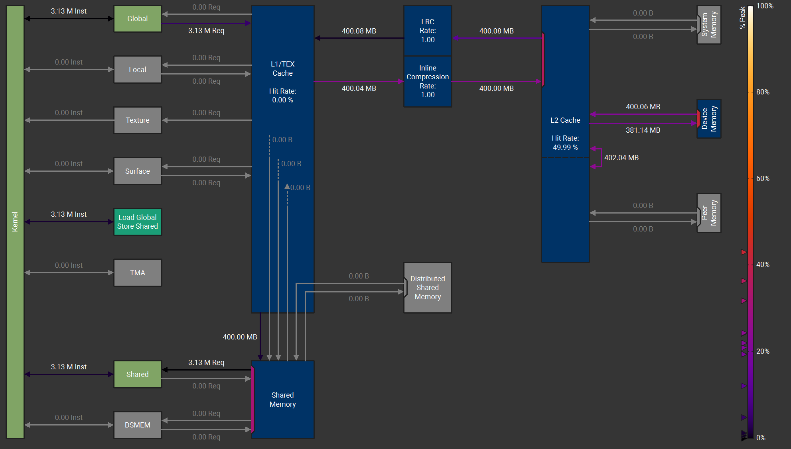

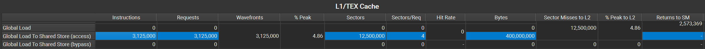

从图上可以看到从 global memory 到 shared memory 是经过了 L1 的，此时使用的 SASS 指令是 LDGSTS.E.LTC128B。

#### cp-size 16

使用 cp-size = 16 复制 1e8 个 float 数据。

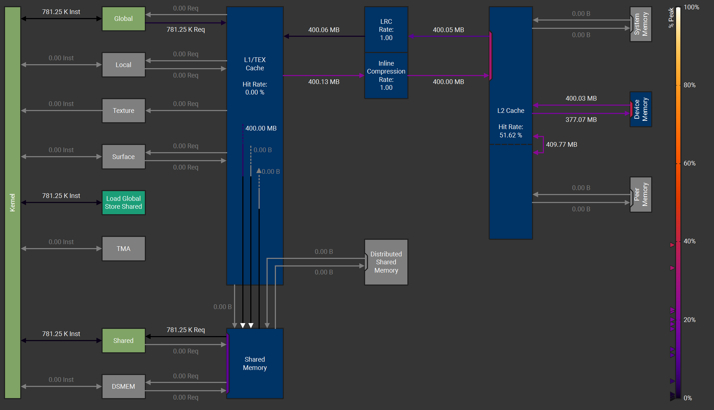

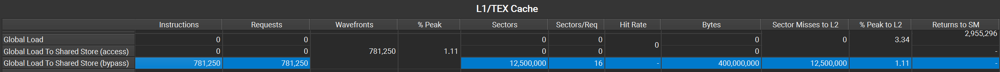

从图上可以看到，从 global memory 到 shared memory 没有经过 L1，此时使用的 SASS 指令是 LDGSTS.E.BYPASS.LTC128B.128。

## Bulk-copy (TMA)

使用 TMA 的 bulk 异步复制有两种形式，一种是异步复制一维数据的 cp.async.bulk，还有一种是可以复制多维 Tensor 的 cp.async.bulk.tensor。

### cp.async.bulk

启动从一个空间到另一个空间的异步复制操作。这种是 1D 非 tensor 的异步拷贝。

cp.async.bulk 支持从 global memory 到 shared memory，global memory 到 distributed shared memory，shared memory 到 distributedshared memory 和 shared memory 到 global memory 的拷贝。

PTX 在 8.6 版本对指令做了调整，主要修改了从 global memory 到 shared memory 和 distributed shared memory 的使用方式。
调整前 dst 统一使用 .shared::cluster，使用 .multicast 区分 cta 和 cluster。调整后 dst 可以直接使用 .shared::cta 或者 .shared::cluster 区分 cta 和 cluster。

下面是 PTX 8.8 版本的指令格式。

```cpp
// global -> shared::cta
cp.async.bulk.dst.src.completion_mechanism{.level::cache_hint}
                      [dstMem], [srcMem], size, [mbar] {, cache-policy}

.dst =                  { .shared::cta }
.src =                  { .global }
.completion_mechanism = { .mbarrier::complete_tx::bytes }
.level::cache_hint =    { .L2::cache_hint }


// global -> shared::cluster
cp.async.bulk.dst.src.completion_mechanism{.multicast}{.level::cache_hint}
                      [dstMem], [srcMem], size, [mbar] {, ctaMask} {, cache-policy}

.dst =                  { .shared::cluster }
.src =                  { .global }
.completion_mechanism = { .mbarrier::complete_tx::bytes }
.level::cache_hint =    { .L2::cache_hint }
.multicast =            { .multicast::cluster  }


// shared::cta -> shared::cluster
cp.async.bulk.dst.src.completion_mechanism [dstMem], [srcMem], size, [mbar]

.dst =                  { .shared::cluster }
.src =                  { .shared::cta }
.completion_mechanism = { .mbarrier::complete_tx::bytes }


// shared::cta -> global
cp.async.bulk.dst.src.completion_mechanism{.level::cache_hint}{.cp_mask}
                      [dstMem], [srcMem], size {, cache-policy} {, byteMask}

.dst =                  { .global }
.src =                  { .shared::cta }
.completion_mechanism = { .bulk_group }
.level::cache_hint =    { .L2::cache_hint }
```

cp.async.bulk 是一条非阻塞指令，它启动一个异步批量复制操作，从源地址 srcMem 指定的位置复制到目标地址 dstMem 指定的位置。
批量复制的方向是从 .src 修饰符指定的空间复制到 .dst 修饰符指定的空间。

32 位的 size 指定要复制的内存大小（以字节数表示）。size 必须是 16 的倍数。内存范围 [dstMem, dstMem + size - 1] 不能溢出目标内存空间，内存范围 [srcMem, srcMem + size - 1] 也不能溢出源内存空间。地址 dstMem 和 srcMem 必须对齐到 16 字节。

当复制的目标是 .shared::cta 时，目标地址位于集群内正在执行指令的 CTA 的共享内存中。
当复制的源是 .shared::cta 且目标是 .shared::cluster 时，目标地址需要位于 CTA cluster 内另一个 CTA 的共享内存中。

修饰符 .completion_mechanism 指定指令变体支持的完成机制。下表总结了不同变体支持的完成机制：

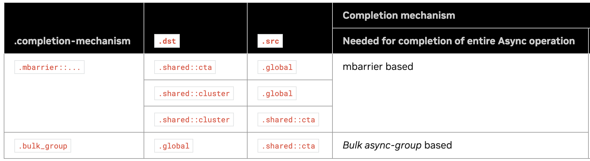

修饰符 .mbarrier::complete_tx::bytes 指定 cp.async.bulk 变体使用基于 mbarrier 的完成机制。complete-tx 操作的 completeCount 参数等于复制的数据量（以字节为单位），将在操作数 mbarrier 指定的 mbarrier 对象上执行。

修饰符 .bulk_group 指定 cp.async.bulk 变体使用 bulk async-group 的完成机制。

总结就是 dst 是shared memory 时用 mbarrier 完成机制，dst 是 global memory 时用 bulk async-group 完成机制。

可选修饰符 .multicast::cluster 允许将数据从全局内存复制到 cluster 中多个 CTA 的共享内存。操作数 ctaMask 指定 cluster 中的目标 CTA，使得 16 位 ctaMask 操作数中的每个位对应于目标 CTA 的 %ctaid。源数据将 multicast 到与每个目标 CTA 共享内存中 dstMem 相同的 CTA 相对偏移量。 mbarrier 信号也会被 multicast 到目标 CTA 共享内存中与 mbar 相同的 CTA 相对偏移量。

当指定可选参数 cache-policy 时，必须使用限定符 .level::cache_hint。64 位操作数 cache-policy 指定了内存访问期间可能使用的缓存驱逐策略。
cache-policy 是针对缓存子系统的提示，可能并非总是被遵循。它仅被视为性能提示，不会改变程序的内存一致性行为。仅当 .src 或 .dst 状态空间中至少有一个是 .global 状态空间时，才支持限定符 .level::cache_hint。

```cpp
// .global -> .shared::cta (strictly non-remote):
cp.async.bulk.shared::cta.global.mbarrier::complete_tx::bytes [dstMem], [srcMem], size, [mbar];

cp.async.bulk.shared::cta.global.mbarrier::complete_tx::bytes.L2::cache_hint
                                             [dstMem], [srcMem], size, [mbar], cache-policy;

// .global -> .shared::cluster:
cp.async.bulk.shared::cluster.global.mbarrier::complete_tx::bytes [dstMem], [srcMem], size, [mbar];

cp.async.bulk.shared::cluster.global.mbarrier::complete_tx::bytes.multicast::cluster
                                             [dstMem], [srcMem], size, [mbar], ctaMask;

cp.async.bulk.shared::cluster.global.mbarrier::complete_tx::bytes.L2::cache_hint
                                             [dstMem], [srcMem], size, [mbar], cache-policy;


// .shared::cta -> .shared::cluster (strictly remote):
cp.async.bulk.shared::cluster.shared::cta.mbarrier::complete_tx::bytes [dstMem], [srcMem], size, [mbar];

// .shared::cta -> .global:
cp.async.bulk.global.shared::cta.bulk_group [dstMem], [srcMem], size;

cp.async.bulk.global.shared::cta.bulk_group.L2::cache_hint} [dstMem], [srcMem], size, cache-policy;

// .shared::cta -> .global with .cp_mask:
cp.async.bulk.global.shared::cta.bulk_group.L2::cache_hint.cp_mask [dstMem], [srcMem], size, cache-policy, byteMask;
```

cp.reduce.async.bulk 和 cp.async.bulk.prefetch 不再详细介绍， 详见 [cp.reduce.async.bulk](https://docs.nvidia.com/cuda/parallel-thread-execution/index.html?highlight=mma%2520sync%2520aligned%2520m8n8k4#data-movement-and-conversion-instructions-cp-reduce-async-bulk) 和 [cp.async.bulk.prefetch](https://docs.nvidia.com/cuda/parallel-thread-execution/index.html?highlight=mma%2520sync%2520aligned%2520m8n8k4#data-movement-and-conversion-instructions-cp-async-bulk-prefetch)。

#### 示例代码

```cpp
__global__ void cp_async_bulk(float *src, float *dst, int N)
{
    int tid = threadIdx.x;
    int index = blockIdx.x * blockDim.x;

    extern __shared__ float smem[];
    __shared__ uint64_t bar[1]; // 定义一个 64 位的 barrier
    bar[0] = 0;

    int transaction_bytes = blockDim.x * sizeof(float);
    uint32_t smem_int_mbar = cast_smem_ptr_to_uint(bar);
    uint32_t smem_int_ptr = cast_smem_ptr_to_uint(smem);

    // 只需要一个线程就可以启动 TMA 异步传输
    if (tid == 0)
    {
        // 初始化 barrier，参与 barrier 的线程数是整个 block 的 thread
        asm volatile("mbarrier.init.shared::cta.b64 [%0], %1;\n" ::"r"(smem_int_mbar),
                     "r"(blockDim.x));
        asm volatile ("fence.proxy.async.shared::cta;"); // 初始化后通过 fence 对异步拷贝可见

        // 设置异步传输的数据量
        asm volatile("mbarrier.expect_tx.shared::cta.b64 [%0], %1;\n" ::"r"(smem_int_mbar),
                     "r"(transaction_bytes));

        // 启动异步传输
        asm volatile("cp.async.bulk.shared::cluster.global.mbarrier::complete_tx::bytes [%0], [%1], %2, [%3];\n"
                     :
                     : "r"(smem_int_ptr), "l"(src + index), "r"(transaction_bytes), "r"(smem_int_mbar)
                     : "memory");
    }
    __syncthreads();

    // arrive，这里使用 arrive 的返回值 token 记录异步传输状态
    uint64_t token = 0;
    asm volatile("mbarrier.arrive.shared::cta.b64 %0, [%1];\n" ::"l"(token), "r"(smem_int_mbar));

    // wait，通过 token 判断传输是否完成
    asm volatile(
        "{\n"
        ".reg .pred                P1;\n"
        "LAB_WAIT:\n"
        "mbarrier.try_wait.shared::cta.b64 P1, [%0], %1;\n"
        "@P1                       bra DONE;\n"
        "bra                   LAB_WAIT;\n"
        "DONE:\n"
        "}\n" ::"r"(smem_int_mbar),
        "l"(token));

    // compute

    asm volatile("fence.proxy.async.shared::cta;"); // TMA 和 LSU 属于不同的 proxy，对同一个内存进行读写需要进行 fence
    __syncthreads();

    // store, shared memory to global memory
    if (tid == 0)
    {
        asm volatile("cp.async.bulk.global.shared::cta.bulk_group [%0], [%1], %2;\n"
                     :
                     : "l"(dst + index), "r"(smem_int_ptr), "r"(transaction_bytes)
                     : "memory");
        asm volatile("cp.async.bulk.commit_group;");
        asm volatile(
            "cp.async.bulk.wait_group.read %0;"
            :
            : "n"(0)
            : "memory");
    }
}

// nvcc async_copy.cu -o cpasync -arch=sm_90a -std=c++17
int main()
{
    srand(1234);

    int N = 1e8;

    thrust::host_vector<float> h_S(N);
    thrust::host_vector<float> h_D(N);
    thrust::host_vector<float> copy_result(N);

    for (int i = 0; i < N; ++i)
    {
        h_S[i] = static_cast<float>(rand() % 9 + 1);
    }

    thrust::device_vector<float> d_S = h_S;
    thrust::device_vector<float> d_D = h_D;

    constexpr int threads = 256;
    int blocks = (N + threads - 1) / threads;
    cp_async_bulk<<<blocks, threads, threads * sizeof(float)>>>(d_S.data().get(), d_D.data().get(), N);

    copy_result = d_D;
    test_copy(h_S.data(), copy_result.data(), N);

    return 0;
}
```

从 global memory 到 shared memory 还有种写法如下，和第一种的主要区别是使用了 mbarrier.arrive.expect_tx.shared。
此外，mbarrier.try_wait 也使用了另一种奇偶校验的写法。

```cpp
__global__ void cp_async_bulk(float *src, float *dst, int N)
{
    int tid = threadIdx.x;
    int index = blockIdx.x * blockDim.x;

    extern __shared__ float smem[];
    __shared__ alignas(8) uint64_t bar[1]; // mbarrier 需要 8 字节对齐
    bar[0] = 0;

    int transaction_bytes = blockDim.x * sizeof(float);
    uint32_t smem_int_mbar = cast_smem_ptr_to_uint(bar);

    if (tid == 0)
    {
        // 初始化 barrier, 这里参与线程数为 1
        asm volatile("mbarrier.init.shared::cta.b64 [%0], %1;\n" ::"r"(smem_int_mbar),
                     "r"(1));

        // 这里会先设置 expect_tx，再执行 arrive-on 操作
        asm volatile("mbarrier.arrive.expect_tx.shared::cta.b64 _, [%0], %1;\n" ::"r"(smem_int_mbar),
                     "r"(transaction_bytes));

        uint32_t smem_int_ptr = cast_smem_ptr_to_uint(smem);
        auto gmem_ptr = src + index;
        asm volatile("cp.async.bulk.shared::cluster.global.mbarrier::complete_tx::bytes [%0], [%1], %2, [%3];\n"
                     :
                     : "r"(smem_int_ptr), "l"(gmem_ptr), "r"(transaction_bytes), "r"(smem_int_mbar)
                     : "memory");
    }
    __syncthreads();

    // wait，使用奇偶校验判断 phase_bit 是否与当前 phase 的奇偶性相同
    int phase_bit = 0;
    asm volatile(
        "{\n"
        ".reg .pred                P1;\n"
        "LAB_WAIT:\n"
        "mbarrier.try_wait.parity.shared::cta.b64 P1, [%0], %1;\n"
        "@P1                       bra DONE;\n"
        "bra                   LAB_WAIT;\n"
        "DONE:\n"
        "}\n" ::"r"(smem_int_mbar),
        "r"(phase_bit));

    // phase_bit ^= 1; // 如果是多阶段，phase_bit 使用后需要切换状态
    dst[index + tid] = smem[tid];
}
```

#### Profile

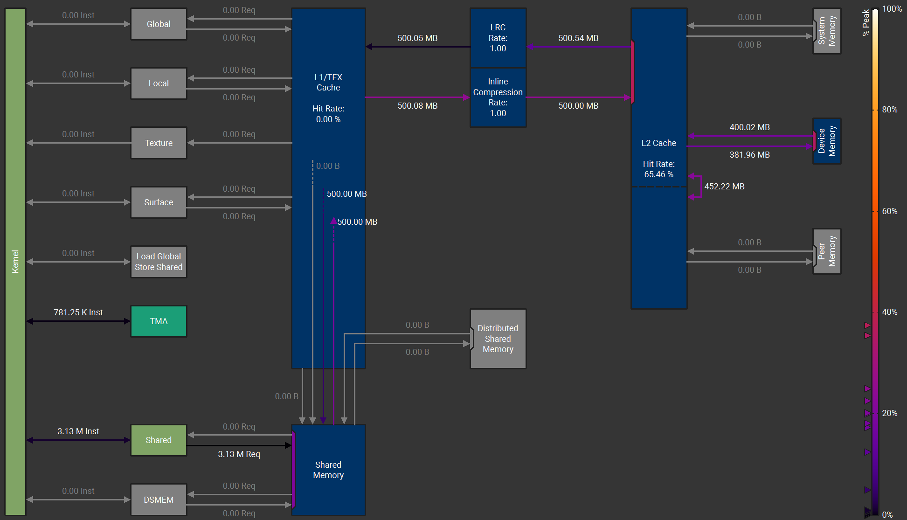

从 profile 中可以看到， 加载数据使用了 TMA，而且从 global memory 到 shared memory 没有经过 L1 cache。此时使用的 SASS 指令是 UBLKCP。


## Tensor copy (TMA Tensor)

Tensor 是一种多维数据结构，维度可以从 1D 到 5D，具有 shape，stride，元素类型等多种属性。PTX 支持对 Tensor 进行复杂的处理，包括 padding，im2col，swizzle 等，详见：[Tensors](https://docs.nvidia.com/cuda/parallel-thread-execution/index.html?highlight=mma%2520sync%2520aligned%2520m8n8k4#tensors)。

在 Hopper 架构中，TMA 支持对 Tensor 进行异步拷贝，底层使用的是 cp.async.bulk.tensor 指令。

由于 Tensor 是多维结构，所以对 Tensor 进行拷贝时限制比较多。主要的限制有下面一些：
1. smem 地址必须 128B 对齐。
2. gmem 地址必须 16B 对齐。
3. strides 必须是 16B 的倍数。
4. copy box 的最内部维度 (stride = 1 的维度) 必须是 16B 的倍数。
5. copy box 的起始地址必须 16B 对齐。

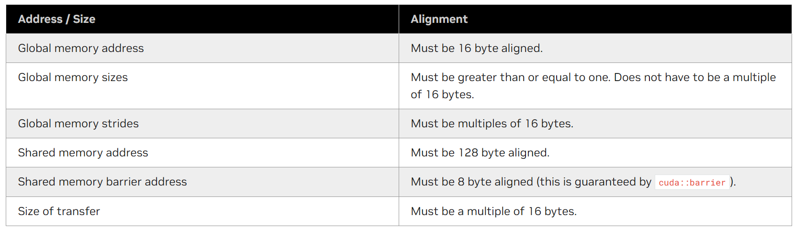

与 tensor copy 有关的信息可以用 tensor map 描述。Tensor-Map 是一个 128 字节的对象，记录了 tensor 的属性以及 copy 时的相关信息。目前只能使用 CUDA API 创建 Tensor-Map。

### cp.async.bulk.tensor

启动一个异步复制操作，从一个空间复制 tensor 到另一个空间。方向可以是 global -> shared::cta，global -> shared::cluster，shared::cta -> global，不支持 shared::cluster和shared::cta 之间的传输。

PTX 在 8.6 版本对指令做了调整，主要修改了从 global memory 到 shared memory 和 distributed shared memory 的使用方式。
调整前 dst 统一使用 .shared::cluster，使用 .multicast 区分 cta 和 cluster。调整后 dst 可以直接使用 .shared::cta 或者 .shared::cluster 区分 cta 和 cluster。

下面是 PTX 8.8 版本的指令格式。

```cpp
// global -> shared::cta
cp.async.bulk.tensor.dim.dst.src{.load_mode}.completion_mechanism{.cta_group}{.level::cache_hint}
                                   [dstMem], [tensorMap, tensorCoords], [mbar]{, im2colInfo} {, cache-policy}

.dst =                  { .shared::cta }
.src =                  { .global }
.dim =                  { .1d, .2d, .3d, .4d, .5d }
.completion_mechanism = { .mbarrier::complete_tx::bytes }
.cta_group =            { .cta_group::1, .cta_group::2 }
.load_mode =            { .tile, .tile::gather4, .im2col, .im2col::w, .im2col::w::128 }
.level::cache_hint =    { .L2::cache_hint }


// global -> shared::cluster
cp.async.bulk.tensor.dim.dst.src{.load_mode}.completion_mechanism{.multicast}{.cta_group}{.level::cache_hint}
                                   [dstMem], [tensorMap, tensorCoords], [mbar]{, im2colInfo}
                                   {, ctaMask} {, cache-policy}

.dst =                  { .shared::cluster }
.src =                  { .global }
.dim =                  { .1d, .2d, .3d, .4d, .5d }
.completion_mechanism = { .mbarrier::complete_tx::bytes }
.cta_group =            { .cta_group::1, .cta_group::2 }
.load_mode =            { .tile, .tile::gather4, .im2col, .im2col::w, .im2col::w::128 }
.level::cache_hint =    { .L2::cache_hint }
.multicast =            { .multicast::cluster  }


// shared::cta -> global
cp.async.bulk.tensor.dim.dst.src{.load_mode}.completion_mechanism{.level::cache_hint}
                                   [tensorMap, tensorCoords], [srcMem] {, cache-policy}

.dst =                  { .global }
.src =                  { .shared::cta }
.dim =                  { .1d, .2d, .3d, .4d, .5d }
.completion_mechanism = { .bulk_group }
.load_mode =            { .tile, .tile::scatter4, .im2col_no_offs }
.level::cache_hint =    { .L2::cache_hint }
```

cp.async.bulk.tensor 是一条非阻塞指令，它启动一个异步复制操作，将 tensor 数据从 .src 空间中的位置复制到 .dst 空间中的位置。dstMem 指定 tensor 数据在 .dst 空间中要复制到的位置，而 srcMem 指定 tensor 数据在 .src 状态空间中要从的位置复制。

操作数 tensorMap 是 Tensor-Map 对象的地址, tensorMap 指定 tensor 复制操作的属性。

Tensor 的维度由 .dim 修饰符指定。
向量操作数 tensorCoords 指定全局内存中 tensor 的起始坐标。tensorCoords 中各个张量坐标的类型为 .s32。向量参数 tensorCoords 的格式取决于指定的 .load_mode，如下所示：


限定符 .load_mode 可以是 .tile 或 .im2col，用于指定如何将源位置的数据复制到目标位置。如果未指定 .load_mode，则默认为 .tile。.tile 和 .im2col 的具体原理可以参考 Tensor 的介绍。

修饰符 .completion_mechanism 指定指令变体支持的完成机制。下表总结了不同变体支持的完成机制：

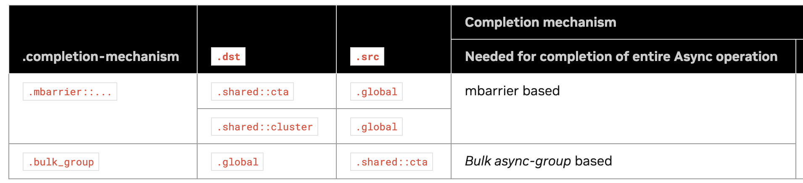

修饰符 .mbarrier::complete_tx::bytes 指定 cp.async.bulk.tensor 变体使用基于 mbarrier 的完成机制。异步复制操作完成后，将对操作数 mbarrier 指定的 mbarrier 对象执行 complete-tx 操作，其 completeCount 参数等于复制的数据量（以字节为单位）。

修饰符 .cta_group 只能与基于 mbarrier 的完成机制一起使用。修饰符 .cta_group 用于标识 CTA-Pair 中 CTA 是奇数编号还是偶数编号。指定 .cta_group::1 时，指定的 mbarrier 对象 mbar 必须位于与共享内存目标 dstMem 相同的 CTA 的共享内存中。指定 .cta_group::2 时，mbarrier 对象 mbar 可以位于与共享内存目标 dstMem 相同的 CTA 的共享内存中，也可以位于其对等 CTA 中。如果未指定 .cta_group，则默认为 .cta_group::1。
修饰符 .bulk_group 指定 cp.async.bulk.tensor 变体使用基于批量异步组的完成机制。


```cpp
.reg .b16 ctaMask;
.reg .u16 i2cOffW, i2cOffH, i2cOffD;
.reg .b64 l2CachePolicy;

cp.async.bulk.tensor.1d.shared::cta.global.mbarrier::complete_tx::bytes.tile  [sMem0], [tensorMap0, {tc0}], [mbar0];

@p cp.async.bulk.tensor.5d.shared::cta.global.im2col.mbarrier::complete_tx::bytes
                     [sMem2], [tensorMap2, {tc0, tc1, tc2, tc3, tc4}], [mbar2], {i2cOffW, i2cOffH, i2cOffD};

cp.async.bulk.tensor.1d.shared::cluster.global.mbarrier::complete_tx::bytes.tile  [sMem0], [tensorMap0, {tc0}], [mbar0];

@p cp.async.bulk.tensor.2d.shared::cluster.global.mbarrier::complete_tx::bytes.multicast::cluster
                     [sMem1], [tensorMap1, {tc0, tc1}], [mbar2], ctaMask;

@p cp.async.bulk.tensor.5d.shared::cluster.global.im2col.mbarrier::complete_tx::bytes
                     [sMem2], [tensorMap2, {tc0, tc1, tc2, tc3, tc4}], [mbar2], {i2cOffW, i2cOffH, i2cOffD};

@p cp.async.bulk.tensor.3d.im2col.shared::cluster.global.mbarrier::complete_tx::bytes.L2::cache_hint
                     [sMem3], [tensorMap3, {tc0, tc1, tc2}], [mbar3], {i2cOffW}, policy;

@p cp.async.bulk.tensor.1d.global.shared::cta.bulk_group  [tensorMap3, {tc0}], [sMem3];

cp.async.bulk.tensor.2d.tile::gather4.shared::cluster.global.mbarrier::complete_tx::bytes
                     [sMem5], [tensorMap6, {x0, y0, y1, y2, y3}], [mbar5];

cp.async.bulk.tensor.3d.im2col::w.shared::cluster.global.mbarrier::complete_tx::bytes
                     [sMem4], [tensorMap5, {t0, t1, t2}], [mbar4], {im2colwHalo, im2colOff};

cp.async.bulk.tensor.1d.shared::cluster.global.tile.cta_group::2
                     [sMem6], [tensorMap7, {tc0}], [peerMbar];
```

cp.reduce.async.bulk.tensor 详见 [cp.reduce.async.bulk.tensor](https://docs.nvidia.com/cuda/parallel-thread-execution/index.html?highlight=mma%2520sync%2520aligned%2520m8n8k4#data-movement-and-conversion-instructions-cp-reduce-async-bulk-tensor)，cp.async.bulk.prefetch.tensor 详见 [cp.async.bulk.prefetch.tensor](https://docs.nvidia.com/cuda/parallel-thread-execution/index.html?highlight=mma%2520sync%2520aligned%2520m8n8k4#data-movement-and-conversion-instructions-cp-async-bulk-prefetch-tensor)，这里不再详细介绍。

### tensor map

tensor map 用于记录拷贝时 tensor 的相关信息，必须在 host 上创建然后传给 CUDA kernel。具体创建方法可以参考 [tensormap](https://docs.nvidia.com/cuda/cuda-c-programming-guide/#asynchronous-data-copies-using-the-tensor-memory-accelerator-tma)


创建 tensor map 需要许多参数。其中包括指向全局内存中数组的指针、数组的大小（以元素数量为单位）、行与行之间的步长（以字节为单位）、共享内存的大小（以元素数量为单位）。具体如下，下面代码展示了通过 CUDA API 创建 tensor map的过程。创建的 tensor map 用于描述一个大小为 GMEM_HEIGHT x GMEM_WIDTH 的二维行主数组。

```cpp
  CUtensorMap tensor_map{}; // 定义 tensor map对象
  constexpr uint32_t rank = 2; // 定义 tensor 的维度，最高支持到5维
  uint64_t size[rank] = {GMEM_WIDTH, GMEM_HEIGHT};  // 确定 tensor 的 shape

  // 确定每一维的 stride，最内层的stride是1，可以忽略。stride的单位是bytes，所以要乘sizeof(float)，大小必须是16bytes的倍数
  uint64_t stride[rank - 1] = {GMEM_WIDTH * sizeof(int)};
  uint32_t box_size[rank] = {SMEM_WIDTH, SMEM_HEIGHT}; // 定义shared memory的shape
  uint32_t elem_stride[rank] = {1, 1}; // smem的stride，默认是1

  // Get a function pointer to the cuTensorMapEncodeTiled driver API.
  auto cuTensorMapEncodeTiled = get_cuTensorMapEncodeTiled();

  // Create the tensor descriptor.
  CUresult res = cuTensorMapEncodeTiled(
    &tensor_map,                // CUtensorMap *tensorMap,
    CUtensorMapDataType::CU_TENSOR_MAP_DATA_TYPE_INT32, // 数据类型
    rank,                       // cuuint32_t tensorRank,
    tensor_ptr,                 // void *globalAddress,
    size,                       // const cuuint64_t *globalDim,
    stride,                     // const cuuint64_t *globalStrides,
    box_size,                   // const cuuint32_t *boxDim,
    elem_stride,                // const cuuint32_t *elementStrides,
    // Interleave patterns，在 channel 上进行分块，只能用于 .im2col模式
    CUtensorMapInterleave::CU_TENSOR_MAP_INTERLEAVE_NONE,
    // Swizzling模式，可以避免bank conflict
    CUtensorMapSwizzle::CU_TENSOR_MAP_SWIZZLE_NONE,
    // L2 Promotion
    CUtensorMapL2promotion::CU_TENSOR_MAP_L2_PROMOTION_NONE,
    // Any element that is outside of bounds will be set to zero by the TMA transfer.
    CUtensorMapFloatOOBfill::CU_TENSOR_MAP_FLOAT_OOB_FILL_NONE
  );
```

当从全局内存读取到共享内存的 copy box 部分超出范围时，与超出范围区域对应的共享内存将以零填充。copy box 的左上角索引也可能为负数。当从共享内存写入全局内存时，copy box 的部分内容可能超出范围，但左上角不能有任何负索引。

Tensor 的大小 shape 是沿一个维度的元素数量。所有大小都必须大于 1。步长 stride 是同一维度元素之间的字节数。例如，一个 4 x 4 的整数矩阵的大小为 4 和 4。由于每个元素有 4 个字节，因此步长分别为 4 和 16 个字节。由于对齐要求，一个 4 x 3 的行主整数矩阵的步长也必须为 4 和 16 个字节。每行都会填充 4 个额外字节，以确保下一行的起始位置与 16 个字节对齐。

#### make_gemm_tma_desc

一般可以使用下面的函数创建 Tensor map。

```cpp
template <uint32_t RANK>
CUtensorMap make_gemm_tma_desc(void *gmem_tensor_ptr, std::vector<int> &gmem_shape, std::vector<int> &smem_shape)
{
    CUtensorMap tensor_map{};

    uint64_t gmem_prob_shape[5] = {1, 1, 1, 1, 1};
    uint64_t gmem_prob_stride[5] = {0, 0, 0, 0, 0};
    uint32_t smem_box_shape[5] = {1, 1, 1, 1, 1};
    uint32_t smem_box_stride[5] = {1, 1, 1, 1, 1};

    gmem_prob_shape[0] = gmem_shape[0];
    gmem_prob_stride[0] = sizeof(float);
    smem_box_shape[0] = smem_shape[0];

    for (int i = 1; i < RANK; ++i)
    {
        gmem_prob_shape[i] = gmem_shape[i];
        gmem_prob_stride[i] = gmem_prob_stride[i - 1] * gmem_shape[i - 1];
        smem_box_shape[i] = smem_shape[i];
    }

    auto tma_format = CUtensorMapDataType::CU_TENSOR_MAP_DATA_TYPE_FLOAT32;
    auto tma_interleave = CUtensorMapInterleave::CU_TENSOR_MAP_INTERLEAVE_NONE;
    auto smem_swizzle = CUtensorMapSwizzle::CU_TENSOR_MAP_SWIZZLE_NONE;
    auto tma_l2Promotion = CUtensorMapL2promotion::CU_TENSOR_MAP_L2_PROMOTION_NONE;
    auto tma_oobFill = CUtensorMapFloatOOBfill::CU_TENSOR_MAP_FLOAT_OOB_FILL_NONE;

    // Create the tensor descriptor.
    CUresult result = cuTensorMapEncodeTiled(
        &tensor_map,          // CUtensorMap *tensorMap,
        tma_format,
        RANK,                 // cuuint32_t tensorRank,
        gmem_tensor_ptr,      // void *globalAddress,
        gmem_prob_shape,      // const cuuint64_t *globalDim,
        gmem_prob_stride + 1, // const cuuint64_t *globalStrides,
        smem_box_shape,       // const cuuint32_t *boxDim,
        smem_box_stride,      // const cuuint32_t *elementStrides,
        tma_interleave,       // Interleave patterns can be used to accelerate loading of values that are less than 4 bytes long.
        smem_swizzle,         // Swizzling can be used to avoid shared memory bank conflicts.
        tma_l2Promotion,      // L2 Promotion can be used to widen the effect of a cache-policy to a wider set of L2 cache lines.
        tma_oobFill           // Any element that is outside of bounds will be set to zero by the TMA transfer.
    );

    if (result != CUDA_SUCCESS)
    {
        std::cerr << "TMA Desc Addr:   " << &tensor_map
                  << "\nformat         " << tma_format
                  << "\ndim            " << RANK
                  << "\ngmem_address   " << gmem_tensor_ptr
                  << "\nglobalDim      " << gmem_prob_shape
                  << "\nglobalStrides  " << gmem_prob_stride
                  << "\nboxDim         " << smem_box_shape
                  << "\nelementStrides " << smem_box_stride
                  << "\ninterleave     " << tma_interleave
                  << "\nswizzle        " << smem_swizzle
                  << "\nl2Promotion    " << tma_l2Promotion
                  << "\noobFill        " << tma_oobFill << std::endl;
        std::cerr << "Error: Failed to initialize the TMA descriptor " << result << std::endl;
        assert(false);
    }

    return tensor_map;
}

```

#### cp_async_bulk_tensor_1d


```cpp
__global__ void cp_async_bulk_tensor_1d(const __grid_constant__ CUtensorMap src_tensor_map, const __grid_constant__ CUtensorMap dst_tensor_map)
{
    int tid = threadIdx.x;
    int crd0 = blockIdx.x * 256;
    __shared__ alignas(128) float smem[256]; // 256 float
    __shared__ alignas(8) uint64_t bar[1];

    int transaction_bytes = blockDim.x * sizeof(float);
    uint32_t smem_int_mbar = cast_smem_ptr_to_uint(bar);
    uint32_t smem_int_ptr = cast_smem_ptr_to_uint(smem);

    if (tid == 0)
    {
        /// Initialize shared memory barrier
        asm volatile("mbarrier.init.shared::cta.b64 [%0], %1;\n" ::"r"(smem_int_mbar),
                     "r"(blockDim.x));
        asm volatile("mbarrier.expect_tx.shared::cta.b64 [%0], %1;\n" ::"r"(smem_int_mbar),
                     "r"(transaction_bytes));
        asm volatile("fence.proxy.async.shared::cta;");
        asm volatile("cp.async.bulk.tensor.1d.shared::cluster.global.mbarrier::complete_tx::bytes"
                     " [%0], [%1, {%3}], [%2];" ::"r"(smem_int_ptr),
                     "l"(&src_tensor_map), "r"(smem_int_mbar), "r"(crd0) : "memory");
    }
    __syncthreads();

    // arrive
    asm volatile("mbarrier.arrive.shared::cta.b64 _, [%0];\n" ::"r"(smem_int_mbar));

    // wait
    int phase_bit = 0;
    asm volatile(
        "{\n"
        ".reg .pred                P1;\n"
        "LAB_WAIT:\n"
        "mbarrier.try_wait.parity.shared::cta.b64 P1, [%0], %1;\n"
        "@P1                       bra DONE;\n"
        "bra                   LAB_WAIT;\n"
        "DONE:\n"
        "}\n" ::"r"(smem_int_mbar),
        "r"(phase_bit));

    // compute

    asm volatile("fence.proxy.async.shared::cta;");
    __syncthreads();

    // store shared memory to global memory
    if (tid == 0)
    {
        asm volatile("cp.async.bulk.tensor.1d.global.shared::cta.bulk_group [%0, {%2}], [%1];" ::"l"(&dst_tensor_map), "r"(smem_int_ptr), "r"(crd0) : "memory");
        asm volatile("cp.async.bulk.commit_group;");
        asm volatile("cp.async.bulk.wait_group.read %0;" ::"n"(0) : "memory");
    }
}
```

#### cp_async_bulk_tensor_2d

```cpp
__global__ void cp_async_bulk_tensor_2d(const __grid_constant__ CUtensorMap src_tensor_map, const __grid_constant__ CUtensorMap dst_tensor_map)
{
    int tid = threadIdx.x;
    int crd0 = blockIdx.x % 32 * 32; // cols
    int crd1 = blockIdx.x / 32 * 32; // rows

    __shared__ alignas(128) float smem[1024];
    __shared__ alignas(8) uint64_t bar[1];

    int transaction_bytes = 1024 * sizeof(float);
    uint32_t smem_int_mbar = cast_smem_ptr_to_uint(bar);
    uint32_t smem_int_ptr = cast_smem_ptr_to_uint(smem);

    if (tid == 0)
    {
        /// Initialize shared memory barrier
        asm volatile("mbarrier.init.shared::cta.b64 [%0], %1;\n" ::"r"(smem_int_mbar),
                     "r"(blockDim.x));
        asm volatile("mbarrier.expect_tx.shared::cta.b64 [%0], %1;\n" ::"r"(smem_int_mbar),
                     "r"(transaction_bytes));
        asm volatile("fence.proxy.async.shared::cta;");
        asm volatile("cp.async.bulk.tensor.2d.shared::cluster.global.mbarrier::complete_tx::bytes"
                     " [%0], [%1, {%3, %4}], [%2];" ::"r"(smem_int_ptr),
                     "l"(&src_tensor_map), "r"(smem_int_mbar), "r"(crd0), "r"(crd1) : "memory");
    }
    __syncthreads();

    // arrive
    asm volatile("mbarrier.arrive.shared::cta.b64 _, [%0];\n" ::"r"(smem_int_mbar));

    // wait
    int phase_bit = 0;
    asm volatile(
        "{\n"
        ".reg .pred                P1;\n"
        "LAB_WAIT:\n"
        "mbarrier.try_wait.parity.shared::cta.b64 P1, [%0], %1;\n"
        "@P1                       bra DONE;\n"
        "bra                   LAB_WAIT;\n"
        "DONE:\n"
        "}\n" ::"r"(smem_int_mbar),
        "r"(phase_bit));

    // compute

    asm volatile("fence.proxy.async.shared::cta;");
    __syncthreads();

    // store shared memory to global memory
    if (tid == 0)
    {
        asm volatile("cp.async.bulk.tensor.2d.global.shared::cta.bulk_group [%0, {%2, %3}], [%1];" ::"l"(&dst_tensor_map), "r"(smem_int_ptr), "r"(crd0), "r"(crd1) : "memory");
        asm volatile("cp.async.bulk.commit_group;");
        asm volatile("cp.async.bulk.wait_group.read %0;" ::"n"(0) : "memory");
    }
}
```

```cpp
// nvcc async_copy.cu -o cpasync -arch=sm_90a -lcuda
int main()
{
    srand(1234);

    int N = 1024 * 1024;

    thrust::host_vector<float> h_S(N);
    thrust::host_vector<float> h_D(N);
    thrust::host_vector<float> copy_result(N);

    for (int i = 0; i < N; ++i)
    {
        h_S[i] = static_cast<float>(i % 1024);
    }

    thrust::device_vector<float> d_S = h_S;
    thrust::device_vector<float> d_D = h_D;

    std::vector<int> gmem_shape = {1024, 1024};
    std::vector<int> smem_shape = {32, 32};

    auto src_gmem_desc = make_gemm_tma_desc<2>(d_S.data().get(), gmem_shape, smem_shape);
    auto dst_gmem_desc = make_gemm_tma_desc<2>(d_D.data().get(), gmem_shape, smem_shape);

    constexpr int threads = 1024;
    int blocks = (N + threads - 1) / threads;

    // cp_async_bulk_tensor_1d<<<blocks, threads>>>(src_gmem_desc, dst_gmem_desc);
    cp_async_bulk_tensor_2d<<<blocks, threads>>>(src_gmem_desc, dst_gmem_desc);

    copy_result = d_D;
    test_copy(h_S.data(), copy_result.data(), N);

    return 0;
}
```

## TMA Swizzle

默认情况下，TMA 会按照数据在全局内存中的布局顺序将数据加载到共享内存中。但是，这种布局对于某些共享内存访问模式可能导致 bank conflict。为了提高性能并减少 bank conflict，TMA 支持使用 swizzle 来更改共享内存布局。关于共享内存 bank conflict 和 swizzle 的介绍详见 swizzle。

在数据传输过程中，TMA 会根据 swizzle 模式对数据进行 shuffle。如下图所示，图中每个色块代表连续的 16 bytes，也就是 4 个 bank，所以一行有128 bytes，32 个 bank。TMA 支持 4 种 swizzle 类型，分别是 None，32B，64B 和 128B。图中从左到右依次是 None，128B，64B 和 32B 对应的swizzle 模式。

None 代表不使用 swizzle，从图中可以看到相同颜色的数据位于相同的 bank，如果访问相同颜色的数据就会产生 bank conflict。

128B 模式可以支持一行 128B，一共 8 行 1024B 的数据参与 swizzle，如左2所示。从图中可以看到，在该模式下相同颜色的数据被 swizzle 到不同的 bank 上，因此访问相同颜色的数据不会发生 bank conflict。

64B 模式可以支持一行 64B，一共 8 行 512B 的数据参与 swizzle，实际 swizzle 的效果等同于 4 行 128B 的效果，但是 64B 模式却不能直接对 4 行 128B 进行swizzle，因为进行 swizzle 的数据宽度不能超过 swizzle 的宽度。从图中可以看到，64B 模式下前 4 行和后 4 行属于重复的 pattern。

同样的 32B 模式可以支持一行 32B，一共 8 行 256B 的数据参与 swizzle，实际 swizzle 的效果等同于 2 行 128B 的效果。

需要注意的是，如果使用 swizzle，则 需要进行 swizzle 的数据的宽度 (假设该维度 stride = 1) 必须小于或等于 swizzle 的跨度。也就是当使用 128B swizzle 时，数据的宽度必须小于等于 128B。当使用 64B swizzle 时，必须小于等于 64B，当使用 32B 时，宽度必须小于等于 32B。

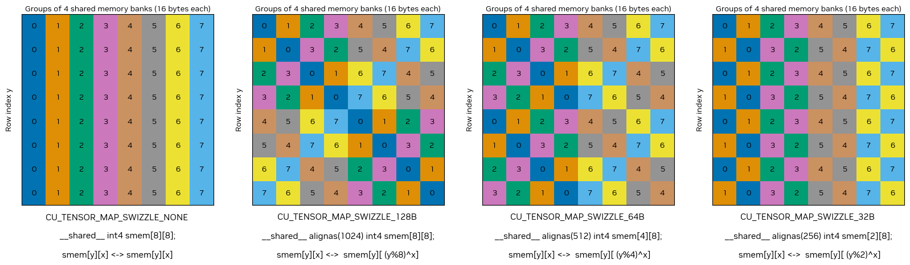

应用 TMA swizzle 模式时，还有一些额外的限制。
1. 全局内存对齐：全局内存必须对齐到 128 字节。
2. 共享内存对齐：共享内存应根据 swizzle 模式重复后的字节数进行对齐。比如 128B 的 swizzle 一共有 1024B 的元素参与，所以需要按照 1024 进行对齐。

共享内存块的内部维度必须满足规定的大小要求。如果不满足这些要求会报错。此外，如果 swizzle 宽度超过内部维度，需要分配的共享内存能够容纳完整的 swizzle 宽度。也就是说如果使用 128B 对 N 行 64B 的数据进行 swizzle，实际分配的共享内存大小需要是 N×128B 大小。

swizzle 中单个元素固定为 16 字节。这意味着数据以 16 字节的块来组织和访问，在规划内存布局和访问模式时必须考虑到这一点。

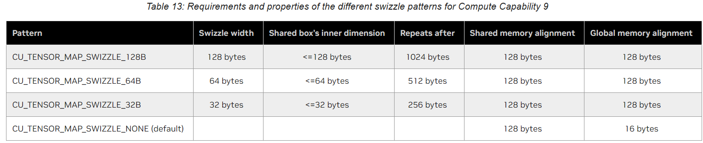

### Swizzle 示例

假如 global memory 的大小是 1024 × 1024，每一行的元素分别是 0 - 1023，然后使用 2D TMA 拷贝数据到 shared memory。
我们使用不同的 swizzle pattern 进行拷贝，并打印 (0, 0) 位置 block 的拷贝结果。

#### 32B swizzle

当我们使用 32B swizzle 时，copy box 的宽度不能超过 32B，所以我们设置 box 为 16 行 8 列，因为元素是 float，所以 8 列刚好等于 32B。

当不用 swizzle 时，shared memory 中的结果如下：
上面是 16 × 8 视图，因为数据在行方向上是连续的，所以下面是 4 × 32 视图，每个元素占用一个 bank。

```cpp
// 16 × 8 view
0 1 2 3 4 5 6 7
0 1 2 3 4 5 6 7
0 1 2 3 4 5 6 7
0 1 2 3 4 5 6 7
0 1 2 3 4 5 6 7
0 1 2 3 4 5 6 7
0 1 2 3 4 5 6 7
0 1 2 3 4 5 6 7
0 1 2 3 4 5 6 7
0 1 2 3 4 5 6 7
0 1 2 3 4 5 6 7
0 1 2 3 4 5 6 7
0 1 2 3 4 5 6 7
0 1 2 3 4 5 6 7
0 1 2 3 4 5 6 7
0 1 2 3 4 5 6 7

// 4 × 32 view
0 1 2 3 4 5 6 7 0 1 2 3 4 5 6 7 0 1 2 3 4 5 6 7 0 1 2 3 4 5 6 7
0 1 2 3 4 5 6 7 0 1 2 3 4 5 6 7 0 1 2 3 4 5 6 7 0 1 2 3 4 5 6 7
0 1 2 3 4 5 6 7 0 1 2 3 4 5 6 7 0 1 2 3 4 5 6 7 0 1 2 3 4 5 6 7
0 1 2 3 4 5 6 7 0 1 2 3 4 5 6 7 0 1 2 3 4 5 6 7 0 1 2 3 4 5 6 7
```

当使用 32B swizzle 时拷贝结果如下：

```cpp
// 16 × 8 view
0 1 2 3 4 5 6 7
0 1 2 3 4 5 6 7
0 1 2 3 4 5 6 7
0 1 2 3 4 5 6 7
4 5 6 7 0 1 2 3
4 5 6 7 0 1 2 3
4 5 6 7 0 1 2 3
4 5 6 7 0 1 2 3
0 1 2 3 4 5 6 7
0 1 2 3 4 5 6 7
0 1 2 3 4 5 6 7
0 1 2 3 4 5 6 7
4 5 6 7 0 1 2 3
4 5 6 7 0 1 2 3
4 5 6 7 0 1 2 3
4 5 6 7 0 1 2 3

// 4 × 32 view
0 1 2 3 4 5 6 7 0 1 2 3 4 5 6 7 0 1 2 3 4 5 6 7 0 1 2 3 4 5 6 7
4 5 6 7 0 1 2 3 4 5 6 7 0 1 2 3 4 5 6 7 0 1 2 3 4 5 6 7 0 1 2 3
0 1 2 3 4 5 6 7 0 1 2 3 4 5 6 7 0 1 2 3 4 5 6 7 0 1 2 3 4 5 6 7
4 5 6 7 0 1 2 3 4 5 6 7 0 1 2 3 4 5 6 7 0 1 2 3 4 5 6 7 0 1 2 3
```

如果用不同的颜色表示连续的四个 bank 中的数据，则 32B swizzle 前后分别是

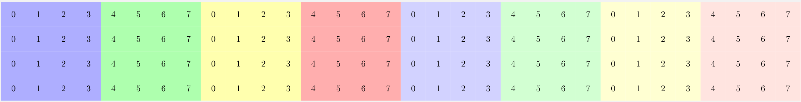

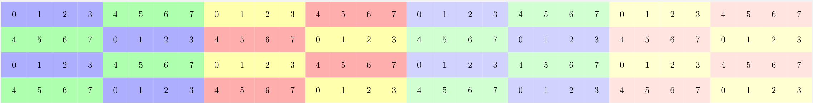

#### 64B swizzle

64B swizzle，copy box 的宽度不能超过 64B，所以我们设置 box 大小是 16 × 16。

没有进行 swizzle 时，数据分布如下。

```cpp
// 16 × 16 view
0 1 2 3 4 5 6 7 8 9 10 11 12 13 14 15
0 1 2 3 4 5 6 7 8 9 10 11 12 13 14 15
0 1 2 3 4 5 6 7 8 9 10 11 12 13 14 15
0 1 2 3 4 5 6 7 8 9 10 11 12 13 14 15
0 1 2 3 4 5 6 7 8 9 10 11 12 13 14 15
0 1 2 3 4 5 6 7 8 9 10 11 12 13 14 15
0 1 2 3 4 5 6 7 8 9 10 11 12 13 14 15
0 1 2 3 4 5 6 7 8 9 10 11 12 13 14 15
0 1 2 3 4 5 6 7 8 9 10 11 12 13 14 15
0 1 2 3 4 5 6 7 8 9 10 11 12 13 14 15
0 1 2 3 4 5 6 7 8 9 10 11 12 13 14 15
0 1 2 3 4 5 6 7 8 9 10 11 12 13 14 15
0 1 2 3 4 5 6 7 8 9 10 11 12 13 14 15
0 1 2 3 4 5 6 7 8 9 10 11 12 13 14 15
0 1 2 3 4 5 6 7 8 9 10 11 12 13 14 15
0 1 2 3 4 5 6 7 8 9 10 11 12 13 14 15

// 8 × 32 view
0 1 2 3 4 5 6 7 8 9 10 11 12 13 14 15 0 1 2 3 4 5 6 7 8 9 10 11 12 13 14 15
0 1 2 3 4 5 6 7 8 9 10 11 12 13 14 15 0 1 2 3 4 5 6 7 8 9 10 11 12 13 14 15
0 1 2 3 4 5 6 7 8 9 10 11 12 13 14 15 0 1 2 3 4 5 6 7 8 9 10 11 12 13 14 15
0 1 2 3 4 5 6 7 8 9 10 11 12 13 14 15 0 1 2 3 4 5 6 7 8 9 10 11 12 13 14 15
0 1 2 3 4 5 6 7 8 9 10 11 12 13 14 15 0 1 2 3 4 5 6 7 8 9 10 11 12 13 14 15
0 1 2 3 4 5 6 7 8 9 10 11 12 13 14 15 0 1 2 3 4 5 6 7 8 9 10 11 12 13 14 15
0 1 2 3 4 5 6 7 8 9 10 11 12 13 14 15 0 1 2 3 4 5 6 7 8 9 10 11 12 13 14 15
0 1 2 3 4 5 6 7 8 9 10 11 12 13 14 15 0 1 2 3 4 5 6 7 8 9 10 11 12 13 14 15
```

64B swizzle 的结果是下面这样。上面是 16 × 16 的视图，下面是 8 × 32 的视图。

```cpp
// 16 × 16 view
0 1 2 3 4 5 6 7 8 9 10 11 12 13 14 15
0 1 2 3 4 5 6 7 8 9 10 11 12 13 14 15
4 5 6 7 0 1 2 3 12 13 14 15 8 9 10 11
4 5 6 7 0 1 2 3 12 13 14 15 8 9 10 11
8 9 10 11 12 13 14 15 0 1 2 3 4 5 6 7
8 9 10 11 12 13 14 15 0 1 2 3 4 5 6 7
12 13 14 15 8 9 10 11 4 5 6 7 0 1 2 3
12 13 14 15 8 9 10 11 4 5 6 7 0 1 2 3
0 1 2 3 4 5 6 7 8 9 10 11 12 13 14 15
0 1 2 3 4 5 6 7 8 9 10 11 12 13 14 15
4 5 6 7 0 1 2 3 12 13 14 15 8 9 10 11
4 5 6 7 0 1 2 3 12 13 14 15 8 9 10 11
8 9 10 11 12 13 14 15 0 1 2 3 4 5 6 7
8 9 10 11 12 13 14 15 0 1 2 3 4 5 6 7
12 13 14 15 8 9 10 11 4 5 6 7 0 1 2 3
12 13 14 15 8 9 10 11 4 5 6 7 0 1 2 3

// 8 × 32 view
0 1 2 3 4 5 6 7 8 9 10 11 12 13 14 15 0 1 2 3 4 5 6 7 8 9 10 11 12 13 14 15
4 5 6 7 0 1 2 3 12 13 14 15 8 9 10 11 4 5 6 7 0 1 2 3 12 13 14 15 8 9 10 11
8 9 10 11 12 13 14 15 0 1 2 3 4 5 6 7 8 9 10 11 12 13 14 15 0 1 2 3 4 5 6 7
12 13 14 15 8 9 10 11 4 5 6 7 0 1 2 3 12 13 14 15 8 9 10 11 4 5 6 7 0 1 2 3
0 1 2 3 4 5 6 7 8 9 10 11 12 13 14 15 0 1 2 3 4 5 6 7 8 9 10 11 12 13 14 15
4 5 6 7 0 1 2 3 12 13 14 15 8 9 10 11 4 5 6 7 0 1 2 3 12 13 14 15 8 9 10 11
8 9 10 11 12 13 14 15 0 1 2 3 4 5 6 7 8 9 10 11 12 13 14 15 0 1 2 3 4 5 6 7
12 13 14 15 8 9 10 11 4 5 6 7 0 1 2 3 12 13 14 15 8 9 10 11 4 5 6 7 0 1 2 3
```

用颜色表示如下：


#### 128B swizzle

128B swizzle 时我们设置 copy box 的大小是 16 × 32。下面是没有进行 swizzle 的结果。

```cpp
0 1 2 3 4 5 6 7 8 9 10 11 12 13 14 15 16 17 18 19 20 21 22 23 24 25 26 27 28 29 30 31
0 1 2 3 4 5 6 7 8 9 10 11 12 13 14 15 16 17 18 19 20 21 22 23 24 25 26 27 28 29 30 31
0 1 2 3 4 5 6 7 8 9 10 11 12 13 14 15 16 17 18 19 20 21 22 23 24 25 26 27 28 29 30 31
0 1 2 3 4 5 6 7 8 9 10 11 12 13 14 15 16 17 18 19 20 21 22 23 24 25 26 27 28 29 30 31
0 1 2 3 4 5 6 7 8 9 10 11 12 13 14 15 16 17 18 19 20 21 22 23 24 25 26 27 28 29 30 31
0 1 2 3 4 5 6 7 8 9 10 11 12 13 14 15 16 17 18 19 20 21 22 23 24 25 26 27 28 29 30 31
0 1 2 3 4 5 6 7 8 9 10 11 12 13 14 15 16 17 18 19 20 21 22 23 24 25 26 27 28 29 30 31
0 1 2 3 4 5 6 7 8 9 10 11 12 13 14 15 16 17 18 19 20 21 22 23 24 25 26 27 28 29 30 31
0 1 2 3 4 5 6 7 8 9 10 11 12 13 14 15 16 17 18 19 20 21 22 23 24 25 26 27 28 29 30 31
0 1 2 3 4 5 6 7 8 9 10 11 12 13 14 15 16 17 18 19 20 21 22 23 24 25 26 27 28 29 30 31
0 1 2 3 4 5 6 7 8 9 10 11 12 13 14 15 16 17 18 19 20 21 22 23 24 25 26 27 28 29 30 31
0 1 2 3 4 5 6 7 8 9 10 11 12 13 14 15 16 17 18 19 20 21 22 23 24 25 26 27 28 29 30 31
0 1 2 3 4 5 6 7 8 9 10 11 12 13 14 15 16 17 18 19 20 21 22 23 24 25 26 27 28 29 30 31
0 1 2 3 4 5 6 7 8 9 10 11 12 13 14 15 16 17 18 19 20 21 22 23 24 25 26 27 28 29 30 31
0 1 2 3 4 5 6 7 8 9 10 11 12 13 14 15 16 17 18 19 20 21 22 23 24 25 26 27 28 29 30 31
0 1 2 3 4 5 6 7 8 9 10 11 12 13 14 15 16 17 18 19 20 21 22 23 24 25 26 27 28 29 30 31
```

下面是 128B swizzle 的结果。

```cpp
0 1 2 3 4 5 6 7 8 9 10 11 12 13 14 15 16 17 18 19 20 21 22 23 24 25 26 27 28 29 30 31
4 5 6 7 0 1 2 3 12 13 14 15 8 9 10 11 20 21 22 23 16 17 18 19 28 29 30 31 24 25 26 27
8 9 10 11 12 13 14 15 0 1 2 3 4 5 6 7 24 25 26 27 28 29 30 31 16 17 18 19 20 21 22 23
12 13 14 15 8 9 10 11 4 5 6 7 0 1 2 3 28 29 30 31 24 25 26 27 20 21 22 23 16 17 18 19
16 17 18 19 20 21 22 23 24 25 26 27 28 29 30 31 0 1 2 3 4 5 6 7 8 9 10 11 12 13 14 15
20 21 22 23 16 17 18 19 28 29 30 31 24 25 26 27 4 5 6 7 0 1 2 3 12 13 14 15 8 9 10 11
24 25 26 27 28 29 30 31 16 17 18 19 20 21 22 23 8 9 10 11 12 13 14 15 0 1 2 3 4 5 6 7
28 29 30 31 24 25 26 27 20 21 22 23 16 17 18 19 12 13 14 15 8 9 10 11 4 5 6 7 0 1 2 3
0 1 2 3 4 5 6 7 8 9 10 11 12 13 14 15 16 17 18 19 20 21 22 23 24 25 26 27 28 29 30 31
4 5 6 7 0 1 2 3 12 13 14 15 8 9 10 11 20 21 22 23 16 17 18 19 28 29 30 31 24 25 26 27
8 9 10 11 12 13 14 15 0 1 2 3 4 5 6 7 24 25 26 27 28 29 30 31 16 17 18 19 20 21 22 23
12 13 14 15 8 9 10 11 4 5 6 7 0 1 2 3 28 29 30 31 24 25 26 27 20 21 22 23 16 17 18 19
16 17 18 19 20 21 22 23 24 25 26 27 28 29 30 31 0 1 2 3 4 5 6 7 8 9 10 11 12 13 14 15
20 21 22 23 16 17 18 19 28 29 30 31 24 25 26 27 4 5 6 7 0 1 2 3 12 13 14 15 8 9 10 11
24 25 26 27 28 29 30 31 16 17 18 19 20 21 22 23 8 9 10 11 12 13 14 15 0 1 2 3 4 5 6 7
28 29 30 31 24 25 26 27 20 21 22 23 16 17 18 19 12 13 14 15 8 9 10 11 4 5 6 7 0 1 2 3
```

用颜色表示如下：

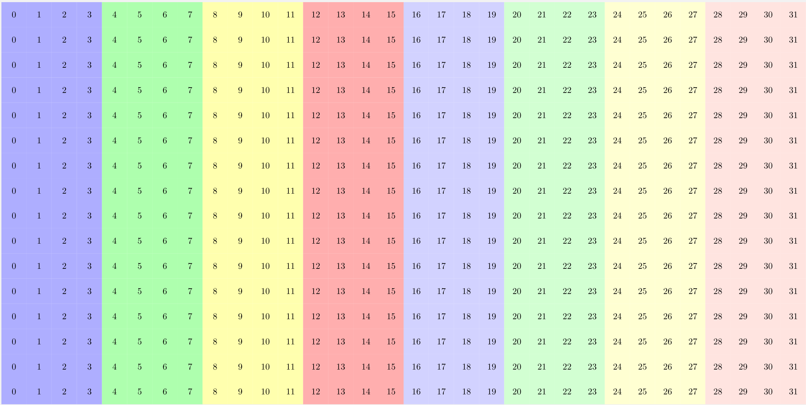

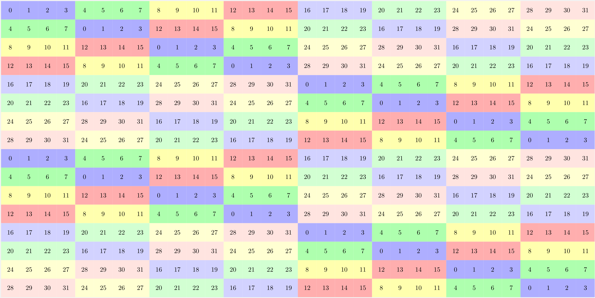

note：有一点需要注意的是，当 copy box 的宽度小于 swizzle 的宽度时，共享内存也需要按照 swizzle 的宽度进行分配，不然会报错。

比如在 copy box 是32行，16列时，一共有 512 个数据，但是进行 128B swizzle 时 要分配 1024B 大小的空间。

copy box 大小是 32 × 16 时，不 swizzle 结果

```cpp
0 1 2 3 4 5 6 7 8 9 10 11 12 13 14 15
0 1 2 3 4 5 6 7 8 9 10 11 12 13 14 15
0 1 2 3 4 5 6 7 8 9 10 11 12 13 14 15
0 1 2 3 4 5 6 7 8 9 10 11 12 13 14 15
0 1 2 3 4 5 6 7 8 9 10 11 12 13 14 15
0 1 2 3 4 5 6 7 8 9 10 11 12 13 14 15
0 1 2 3 4 5 6 7 8 9 10 11 12 13 14 15
0 1 2 3 4 5 6 7 8 9 10 11 12 13 14 15
0 1 2 3 4 5 6 7 8 9 10 11 12 13 14 15
0 1 2 3 4 5 6 7 8 9 10 11 12 13 14 15
0 1 2 3 4 5 6 7 8 9 10 11 12 13 14 15
0 1 2 3 4 5 6 7 8 9 10 11 12 13 14 15
0 1 2 3 4 5 6 7 8 9 10 11 12 13 14 15
0 1 2 3 4 5 6 7 8 9 10 11 12 13 14 15
0 1 2 3 4 5 6 7 8 9 10 11 12 13 14 15
0 1 2 3 4 5 6 7 8 9 10 11 12 13 14 15
0 1 2 3 4 5 6 7 8 9 10 11 12 13 14 15
0 1 2 3 4 5 6 7 8 9 10 11 12 13 14 15
0 1 2 3 4 5 6 7 8 9 10 11 12 13 14 15
0 1 2 3 4 5 6 7 8 9 10 11 12 13 14 15
0 1 2 3 4 5 6 7 8 9 10 11 12 13 14 15
0 1 2 3 4 5 6 7 8 9 10 11 12 13 14 15
0 1 2 3 4 5 6 7 8 9 10 11 12 13 14 15
0 1 2 3 4 5 6 7 8 9 10 11 12 13 14 15
0 1 2 3 4 5 6 7 8 9 10 11 12 13 14 15
0 1 2 3 4 5 6 7 8 9 10 11 12 13 14 15
0 1 2 3 4 5 6 7 8 9 10 11 12 13 14 15
0 1 2 3 4 5 6 7 8 9 10 11 12 13 14 15
0 1 2 3 4 5 6 7 8 9 10 11 12 13 14 15
0 1 2 3 4 5 6 7 8 9 10 11 12 13 14 15
0 1 2 3 4 5 6 7 8 9 10 11 12 13 14 15
0 1 2 3 4 5 6 7 8 9 10 11 12 13 14 15
```

copy box 大小是 32 × 16 时，128B swizzle 结果。32 行 16 列在进行 128B swizzle 时因为列数小于 128B，需要多余的空间进行 swizzle。如果大小还是 512 会报内存越界的错误，设置成 1024 可以正常运行。

运行结果如下：

```cpp
0 1 2 3 4 5 6 7 8 9 10 11 12 13 14 15
0 0 0 0 0 0 0 0 0 0 0 0 0 0 0 0
4 5 6 7 0 1 2 3 12 13 14 15 8 9 10 11
0 0 0 0 0 0 0 0 0 0 0 0 0 0 0 0
8 9 10 11 12 13 14 15 0 1 2 3 4 5 6 7
0 0 0 0 0 0 0 0 0 0 0 0 0 0 0 0
12 13 14 15 8 9 10 11 4 5 6 7 0 1 2 3
0 0 0 0 0 0 0 0 0 0 0 0 0 0 0 0
0 0 0 0 0 0 0 0 0 0 0 0 0 0 0 0
0 1 2 3 4 5 6 7 8 9 10 11 12 13 14 15
0 0 0 0 0 0 0 0 0 0 0 0 0 0 0 0
4 5 6 7 0 1 2 3 12 13 14 15 8 9 10 11
0 0 0 0 0 0 0 0 0 0 0 0 0 0 0 0
8 9 10 11 12 13 14 15 0 1 2 3 4 5 6 7
0 0 0 0 0 0 0 0 0 0 0 0 0 0 0 0
12 13 14 15 8 9 10 11 4 5 6 7 0 1 2 3
0 1 2 3 4 5 6 7 8 9 10 11 12 13 14 15
0 0 0 0 0 0 0 0 0 0 0 0 0 0 0 0
4 5 6 7 0 1 2 3 12 13 14 15 8 9 10 11
0 0 0 0 0 0 0 0 0 0 0 0 0 0 0 0
8 9 10 11 12 13 14 15 0 1 2 3 4 5 6 7
0 0 0 0 0 0 0 0 0 0 0 0 0 0 0 0
12 13 14 15 8 9 10 11 4 5 6 7 0 1 2 3
0 0 0 0 0 0 0 0 0 0 0 0 0 0 0 0
0 0 0 0 0 0 0 0 0 0 0 0 0 0 0 0
0 1 2 3 4 5 6 7 8 9 10 11 12 13 14 15
0 0 0 0 0 0 0 0 0 0 0 0 0 0 0 0
4 5 6 7 0 1 2 3 12 13 14 15 8 9 10 11
0 0 0 0 0 0 0 0 0 0 0 0 0 0 0 0
8 9 10 11 12 13 14 15 0 1 2 3 4 5 6 7
0 0 0 0 0 0 0 0 0 0 0 0 0 0 0 0
12 13 14 15 8 9 10 11 4 5 6 7 0 1 2 3
```

按照 32 × 32 格式打印，结果如下，可以看到结果比较奇怪。CUTLASS 中这种 copy box 宽度小于 swizzle 宽度的情况会直接报错，最好还是选择合适的shape 和swizzle 吧。

```cpp
0 1 2 3 4 5 6 7 8 9 10 11 12 13 14 15 0 0 0 0 0 0 0 0 0 0 0 0 0 0 0 0
4 5 6 7 0 1 2 3 12 13 14 15 8 9 10 11 0 0 0 0 0 0 0 0 0 0 0 0 0 0 0 0
8 9 10 11 12 13 14 15 0 1 2 3 4 5 6 7 0 0 0 0 0 0 0 0 0 0 0 0 0 0 0 0
12 13 14 15 8 9 10 11 4 5 6 7 0 1 2 3 0 0 0 0 0 0 0 0 0 0 0 0 0 0 0 0
0 0 0 0 0 0 0 0 0 0 0 0 0 0 0 0 0 1 2 3 4 5 6 7 8 9 10 11 12 13 14 15
0 0 0 0 0 0 0 0 0 0 0 0 0 0 0 0 4 5 6 7 0 1 2 3 12 13 14 15 8 9 10 11
0 0 0 0 0 0 0 0 0 0 0 0 0 0 0 0 8 9 10 11 12 13 14 15 0 1 2 3 4 5 6 7
0 0 0 0 0 0 0 0 0 0 0 0 0 0 0 0 12 13 14 15 8 9 10 11 4 5 6 7 0 1 2 3
0 1 2 3 4 5 6 7 8 9 10 11 12 13 14 15 0 0 0 0 0 0 0 0 0 0 0 0 0 0 0 0
4 5 6 7 0 1 2 3 12 13 14 15 8 9 10 11 0 0 0 0 0 0 0 0 0 0 0 0 0 0 0 0
8 9 10 11 12 13 14 15 0 1 2 3 4 5 6 7 0 0 0 0 0 0 0 0 0 0 0 0 0 0 0 0
12 13 14 15 8 9 10 11 4 5 6 7 0 1 2 3 0 0 0 0 0 0 0 0 0 0 0 0 0 0 0 0
0 0 0 0 0 0 0 0 0 0 0 0 0 0 0 0 0 1 2 3 4 5 6 7 8 9 10 11 12 13 14 15
0 0 0 0 0 0 0 0 0 0 0 0 0 0 0 0 4 5 6 7 0 1 2 3 12 13 14 15 8 9 10 11
0 0 0 0 0 0 0 0 0 0 0 0 0 0 0 0 8 9 10 11 12 13 14 15 0 1 2 3 4 5 6 7
0 0 0 0 0 0 0 0 0 0 0 0 0 0 0 0 12 13 14 15 8 9 10 11 4 5 6 7 0 1 2 3
0 1 2 3 4 5 6 7 8 9 10 11 12 13 14 15 0 0 0 0 0 0 0 0 0 0 0 0 0 0 0 0
4 5 6 7 0 1 2 3 12 13 14 15 8 9 10 11 0 0 0 0 0 0 0 0 0 0 0 0 0 0 0 0
8 9 10 11 12 13 14 15 0 1 2 3 4 5 6 7 0 0 0 0 0 0 0 0 0 0 0 0 0 0 0 0
12 13 14 15 8 9 10 11 4 5 6 7 0 1 2 3 0 0 0 0 0 0 0 0 0 0 0 0 0 0 0 0
0 0 0 0 0 0 0 0 0 0 0 0 0 0 0 0 0 1 2 3 4 5 6 7 8 9 10 11 12 13 14 15
0 0 0 0 0 0 0 0 0 0 0 0 0 0 0 0 4 5 6 7 0 1 2 3 12 13 14 15 8 9 10 11
0 0 0 0 0 0 0 0 0 0 0 0 0 0 0 0 8 9 10 11 12 13 14 15 0 1 2 3 4 5 6 7
0 0 0 0 0 0 0 0 0 0 0 0 0 0 0 0 12 13 14 15 8 9 10 11 4 5 6 7 0 1 2 3
0 1 2 3 4 5 6 7 8 9 10 11 12 13 14 15 0 0 0 0 0 0 0 0 0 0 0 0 0 0 0 0
4 5 6 7 0 1 2 3 12 13 14 15 8 9 10 11 0 0 0 0 0 0 0 0 0 0 0 0 0 0 0 0
8 9 10 11 12 13 14 15 0 1 2 3 4 5 6 7 0 0 0 0 0 0 0 0 0 0 0 0 0 0 0 0
12 13 14 15 8 9 10 11 4 5 6 7 0 1 2 3 0 0 0 0 0 0 0 0 0 0 0 0 0 0 0 0
0 0 0 0 0 0 0 0 0 0 0 0 0 0 0 0 0 1 2 3 4 5 6 7 8 9 10 11 12 13 14 15
0 0 0 0 0 0 0 0 0 0 0 0 0 0 0 0 4 5 6 7 0 1 2 3 12 13 14 15 8 9 10 11
0 0 0 0 0 0 0 0 0 0 0 0 0 0 0 0 8 9 10 11 12 13 14 15 0 1 2 3 4 5 6 7
0 0 0 0 0 0 0 0 0 0 0 0 0 0 0 0 12 13 14 15 8 9 10 11 4 5 6 7 0 1 2 3
```

## Bulk and Tensor copy completion instructions

### cp.async.bulk.commit_group

将所有先前启动但未提交的 cp.async.bulk 指令提交到 cp.async.bulk-group。

```cpp
cp.async.bulk.commit_group;
```

cp.async.bulk.commit_group 指令创建一个新的 bulk async-group，并将所有由执行线程创建，但是还没被提交到任何一个 bulk async-group 的异步指令提交到新创建的 bulk async-group 中。

如果没有未提交的 cp{.reduce}.async.bulk.{.prefetch}{.tensor} 指令，则 cp.async.bulk.commit_group 会导致 bulk async-group 为空。

正在执行的线程可以使用 cp.async.bulk.wait_group 等待 bulk async-group 中所有 cp{.reduce}.async.bulk.{.prefetch}{.tensor} 操作完成。

同一 bulk async-group 中任意两个 cp{.reduce}.async.bulk.{.prefetch}{.tensor} 操作之间不提供内存顺序保证。


### cp.async.bulk.wait_group

等待 bulk async-group 完成。

```cpp
cp.async.bulk.wait_group{.read} N;
```

cp.async.bulk.wait_group 指令将使执行线程等待，直到最近的 bulk async-group 中只有 N 个或更少的 group 处于待处理状态，并且执行线程提交的所有先前的 bulk async-group 均已完成。例如，当 N 为 0 时，执行线程将等待所有先前的 bulk async-group 完成。操作数 N 是一个整数常量。

默认情况下，cp.async.bulk.wait_group 指令将导致执行线程等待，直到指定 bulk async-group 中的所有 bulk 异步操作完成。这里的异步操作包括以下内容：
1. 从 TensorMap 读取。
2. 从 src 位置读取。
3. 写入各自的目标位置。
4. 写入操作对执行线程可见。

当使用 .read 修饰符时，只需要等待下面读取相关的异步操作完成即可。
1. 从 TensorMap 读取
2. 从 src 位置读取。


```cpp
cp.async.bulk.wait_group.read   0;
cp.async.bulk.wait_group        2;
```

