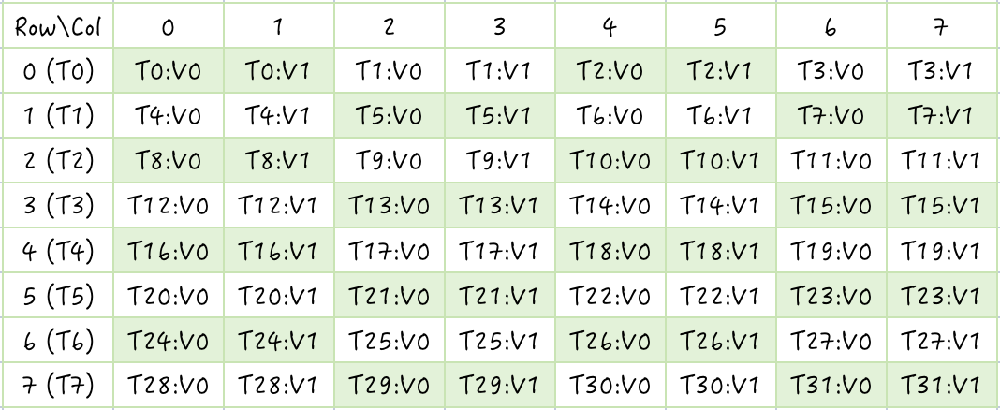
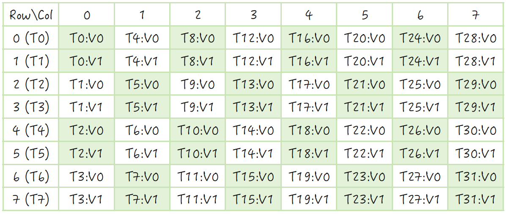
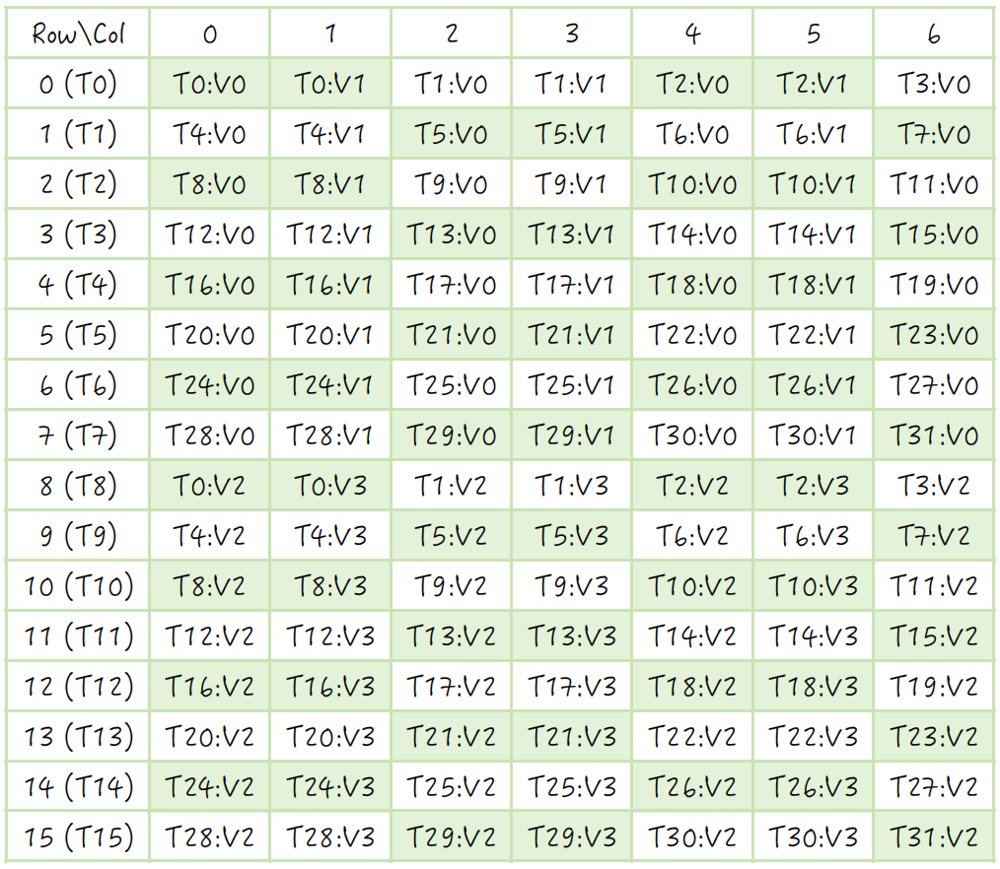
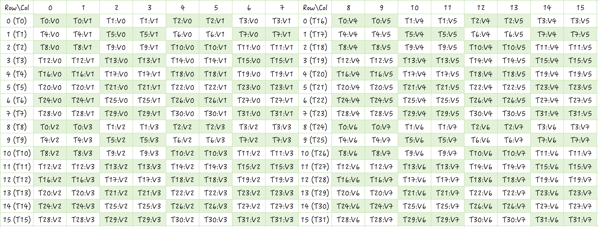

# ldmatrix

## 指令介绍

ldmatrix 是一个可以把数据从共享内存加载到寄存器中的 PTX 指令，主要用于配合 mma 计算使用。ldmatrix 是一个 warp-level 的指令，一个 warp 中的 32 个线程合作搬运数据。

ldmatrix指令的使用方式如下：

```cpp
ldmatrix.sync.aligned.shape.num{.trans}{.ss}.type r, [p];

ldmatrix.sync.aligned.m8n16.num{.ss}.dst_fmt.src_fmt        r, [p];
ldmatrix.sync.aligned.m16n16.num.trans{.ss}.dst_fmt.src_fmt r, [p];

.shape   = {.m8n8, .m16n16};
.num     = {.x1, .x2, .x4};
.ss      = {.shared{::cta}};
.type    = {.b16, .b8};
.dst_fmt = { .b8x16 };
.src_fmt = { .b6x16_p32, .b4x16_p64 };
```

指令中 .sync 和 .aligned 能确保一个warp中的线程执行相同的 ldmatrix 指令。

.shape 表示 ldmatrix 指令加载的数据大小，根据不同的数据类型支持 m8n8，m16n16 和 m8n16 大小的数据。shape 与数据类型的对应关系如下表所示。

| shape   | Matrix shape | Element size               |
|:-------:|:------------:|:--------------------------:|
| .m8n8   | 8x8          | 16-bit                     |
| .m16n16 | 16x16        | 8-bit or 6-bit or 4-bit    |
| .m8n16  | 8x16         | 6-bit or 4-bit             |

从上表可以看到，ldmatrix 支持 16bit，8bit，6bit 和 4bit 的数据类型，type 里的 b16 代表16-bit的意思，因此可以处理 8×8 大小的 bf16 或 fp16 的数据，也可以处理 8×4 大小的 float 数据。

使用 ldmatrix 指令处理 16bit 的数据需要 sm_75 以上，加载其他的数据类型则需要 sm_100a 以上，因此本文只讨论 m8n8 大小数据的处理方式。

.num 可以是 .x1，.x2 和 .x4，分别代表加载 1 个，2 个和 4 个 8×8 大小的矩阵。

.trans 表示加载中是否进行转置。

所以 8×8 大小的 b16 数据是ldmatrix加载的基本单位。这是因为 8×8 的 b16 数据一共有 128bytes，在共享内存的加载中属于一个内存事务，如果不产生 bank conflict 的话可以在一个时钟周期内加载完成。

## 使用方法

使用 ldmatrix 指令除了需要设置上面介绍的参数外，还需要传入相应的寄存器保存加载的数据和当前线程对应的数据地址。

ldmatrix 加载数据的过程可以视为两部分，第一部分，每个线程从传入的地址中加载 128bit 的数据。第二部分，线程之间相互分发数据，得到每个线程最终对应的数据。

每个线程对应一行数据的地址，假设第 i 行的首地址为addr i，则线程和地址的对应关系如下表所示。

| .num | Threads 0-7    | Threads 8-15   | Threads 16-23  | Threads 24-31  |
|------|---------------|---------------|---------------|---------------|
| .x1  | addr0-addr7   | -             | -             | -             |
| .x2  | addr0-addr7   | addr8-addr15  | -             | -             |
| .x4  | addr0-addr7   | addr8-addr15  | addr16-addr23 | addr24-addr31 |

从表中可以看到，当 num = x1 时，只需要加载一个 8×8 矩阵，此时线程 0-7 需要分别传入 0-7 行的地址，warp 中的其余线程不需要地址。加载数据时，0-7 号线程会加载 8 行共 128bytes 的数据，然后将数据分发到一个 warp 的 32 个线程中。分发的过程具体不知道怎么处理的，只知道是这么个过程。

当 num = x2 时，需要加载两个 8×8 矩阵，共 16 行数据，此时线程 0-7 需要加载第一个 8×8 矩阵的地址，8-15 加载第二个 8×8 矩阵的地址。0-15 号线程会加载 16 行的数据，然后分发到全部的线程中。

当 num = x4 时，需要加载四个 8×8 矩阵，共 32 行数据，此时一个 warp 中的所有线程都需要加载一行的数据。

不难看出，加载一个 8×8 大小的矩阵时，行与行之间不需要连续，但是一行中的 8 个元素需要连续。

加载完成后，warp 中的线程与矩阵中的数据的对应关系如下图所示。

当 num = x1 时，线程和数据的关系如下：其中 TiVj 表示线程 Ti 对应的第 Vj 个元素。



当使用可选的限定符 .trans 时，线程与元素的对应关系会发生转置，变成下面这样。



当 num = x2 时



当 num = x4 时



至于为什么是这种布局，主要是因为 mma 指令需要这种布局进行计算。


## 代码测试

下面使用代码来测试 ldmatrix 是如何从共享内存中加载数据的。

### num=x1

当 num=x1 时可以处理一个 8×8 矩阵。首先将数据从全局内存加载到共享内存中。TS 代表 src_data 的数据类型，在这里是 fp16。

```cpp
    int tid = threadIdx.x;

    __shared__ TS smem_src[64];
    smem_src[tid] = S[tid];
    smem_src[tid + 32] = S[tid + 32];

    __syncthreads();
```

然后处理每行的首地址和线程的对应关系。根据上面的介绍，num=x1 时只需要 0-7 号线程处理 8 行的首地址就行了，其余线程的地址不会对结果产生影响，所以可以写成下面这样。

```cpp
    TS *smem_addr = nullptr;
    if (tid < 8)
    {
        smem_addr = smem_src + tid % 8 * N;
    }
```

然后使用 ldmatrix 指令进行搬运数据。这里每个线程对应的数据会保存在 dst1 中。

```cpp
    uint32_t dst1;
    uint32_t smem_int_ptr = cast_smem_ptr_to_uint(smem_addr);
    asm volatile("ldmatrix.sync.aligned.x1.m8n8.shared.b16 {%0}, [%1];\n"
                 : "=r"(dst1)
                 : "r"(smem_int_ptr));
```

到这里 32 个线程分别保存了 8×8 矩阵中的 2 个元素。为了验证加载结果，我们把每个线程寄存器中的数据保存到 D 中。

```cpp
    half_t r1, r2;
    r1.storage = static_cast<uint16_t>(dst1 & 0xFFFF);
    r2.storage = static_cast<uint16_t>(dst1 >> 16);

    int row = tid / 4;
    int col = tid % 4 * 2;
    D[row * N + col + 0] = r1;
    D[row * N + col + 1] = r2;
```

打印结果如下。可以看到和上面介绍的布局一致。

```cpp
thread=0, val= 1  3
thread=1, val= 1  4
thread=2, val= 5  4
thread=3, val= 8  9
thread=4, val= 6  5
thread=5, val= 7  7
thread=6, val= 2  3
thread=7, val= 1  6
thread=8, val= 6  5
thread=9, val= 8  4
thread=10, val= 3  9
thread=11, val= 9  2
thread=12, val= 8  4
thread=13, val= 2  8
thread=14, val= 7  9
thread=15, val= 3  7
thread=16, val= 2  1
thread=17, val= 9  4
thread=18, val= 4  7
thread=19, val= 3  7
thread=20, val= 9  1
thread=21, val= 5  8
thread=22, val= 3  3
thread=23, val= 4  8
thread=24, val= 5  1
thread=25, val= 3  8
thread=26, val= 9  9
thread=27, val= 7  5
thread=28, val= 1  6
thread=29, val= 1  8
thread=30, val= 5  4
thread=31, val= 3  4

m = 8, n = 8
The logical shape of A:
 1  3  1  4  5  4  8  9
 6  5  7  7  2  3  1  6
 6  5  8  4  3  9  9  2
 8  4  2  8  7  9  3  7
 2  1  9  4  4  7  3  7
 9  1  5  8  3  3  4  8
 5  1  3  8  9  9  7  5
 1  6  1  8  5  4  3  4

The copy result of B:
 1  3  1  4  5  4  8  9
 6  5  7  7  2  3  1  6
 6  5  8  4  3  9  9  2
 8  4  2  8  7  9  3  7
 2  1  9  4  4  7  3  7
 9  1  5  8  3  3  4  8
 5  1  3  8  9  9  7  5
 1  6  1  8  5  4  3  4
```

完整代码

```cpp
template <class TS, class TD>
__global__ void ldmatrix_x1(TS *S, TD *D, int M, int N)
{
    int tid = threadIdx.x;

    __shared__ TS smem_src[64];
    smem_src[tid] = S[tid];
    smem_src[tid + 32] = S[tid + 32];

    __syncthreads();

    TS *smem_addr = nullptr;
    if (tid < 8)
    {
        smem_addr = smem_src + tid % 8 * N;
    }

    uint32_t dst1;
    uint32_t smem_int_ptr = cast_smem_ptr_to_uint(smem_addr);
    asm volatile("ldmatrix.sync.aligned.x1.m8n8.shared.b16 {%0}, [%1];\n"
                 : "=r"(dst1)
                 : "r"(smem_int_ptr));

    half_t r1, r2;
    r1.storage = static_cast<uint16_t>(dst1 & 0xFFFF);
    r2.storage = static_cast<uint16_t>(dst1 >> 16);

    int row = tid / 4;
    int col = tid % 4 * 2;
    D[row * N + col + 0] = r1;
    D[row * N + col + 1] = r2;
}
```

### num=x2

num = x2 时需要一个warp的前16个线程加载数据，代码可以写成下面这样。

```cpp
template <class TS, class TD>
__global__ void ldmatrix_x2(TS *S, TD *D, int M, int N)
{
    __shared__ TS smem_src[128];
    for (int i = 0; i < M * N; ++i)
    {
        smem_src[i] = S[i];
    }
    __syncthreads();

    int tid = threadIdx.x;

    TS *smem_addr = nullptr;
    if (tid < 16)
    {
        smem_addr = smem_src + tid % M * N;
    }

    uint32_t dst0, dst1;
    uint32_t smem_int_ptr = cast_smem_ptr_to_uint(smem_addr);
    asm volatile ("ldmatrix.sync.aligned.x2.m8n8.shared.b16 {%0, %1}, [%2];\n"
        : "=r"(dst0), "=r"(dst1)
        :  "r"(smem_int_ptr));

    half_t r1, r2, r3, r4;
    r1.storage = static_cast<uint16_t>(dst0 & 0xFFFF);
    r2.storage = static_cast<uint16_t>(dst0 >> 16);
    r3.storage = static_cast<uint16_t>(dst1 & 0xFFFF);
    r4.storage = static_cast<uint16_t>(dst1 >> 16);

    int row = tid / 4;
    int col = tid % 4 * 2;
    D[row * N + col + 0] = r1;
    D[row * N + col + 1] = r2;
    D[(row + 8) * N + col + 0] = r3;
    D[(row + 8) * N + col + 1] = r4;
}
```

输出结果：

```cpp
m = 16, n = 8
The logical shape of A:
 1  3  1  4  5  4  8  9
 6  5  7  7  2  3  1  6
 6  5  8  4  3  9  9  2
 8  4  2  8  7  9  3  7
 2  1  9  4  4  7  3  7
 9  1  5  8  3  3  4  8
 5  1  3  8  9  9  7  5
 1  6  1  8  5  4  3  4
 2  9  8  6  4  1  1  2
 1  3  9  2  3  4  7  8
 4  9  4  1  7  8  5  7
 2  5  3  4  6  4  7  8
 3  5  2  5  4  9  6  2
 3  5  3  3  8  1  1  9
 7  4  9  2  9  2  9  1
 7  9  4  1  3  2  8  4

The copy result of B:
 1  3  1  4  5  4  8  9
 6  5  7  7  2  3  1  6
 6  5  8  4  3  9  9  2
 8  4  2  8  7  9  3  7
 2  1  9  4  4  7  3  7
 9  1  5  8  3  3  4  8
 5  1  3  8  9  9  7  5
 1  6  1  8  5  4  3  4
 2  9  8  6  4  1  1  2
 1  3  9  2  3  4  7  8
 4  9  4  1  7  8  5  7
 2  5  3  4  6  4  7  8
 3  5  2  5  4  9  6  2
 3  5  3  3  8  1  1  9
 7  4  9  2  9  2  9  1
 7  9  4  1  3  2  8  4
```

### num=x4

num = x4 时可以处理 4 个 8×8 矩阵，因此一共可以处理 256 个 16bit 元素。同样的，先把数据搬运到共享内存中。

```cpp
    int tid = threadIdx.x;

    __shared__ TS smem_src[256];
    for (int i = 0; i < 8; ++i)
    {
        smemA[tid + i * 32] = A[tid + i * 32];
    }
    __syncthreads();
```

然后处理每个线程与每行矩阵首地址的对应关系。此时需要使用全部 32 个线程处理 32 行的首地址。

```cpp
TS *smem_addr = smem_src + tid % M * N + tid / M * 8;
```

然后使用 ldmatrix 进行加载。此时一个线程有 4 个寄存器，可以加载 8 个 16bit 数据。

```cpp
    uint32_t dst0, dst1, dst2, dst3;
    uint32_t smem_int_ptr = cast_smem_ptr_to_uint(smem_addr);
    asm volatile("ldmatrix.sync.aligned.x4.m8n8.shared.b16 {%0, %1, %2, %3}, [%4];\n"
                 : "=r"(dst0), "=r"(dst1), "=r"(dst2), "=r"(dst3)
                 : "r"(smem_int_ptr));
```

打印一下每个线程对应的元素和搬运结果。

```cpp
thread=0, val=1 3 4 7 6 5 6 9
thread=1, val=1 4 8 5 7 7 9 3
thread=2, val=5 4 7 4 2 3 7 1
thread=3, val=8 9 7 7 1 6 2 3
thread=4, val=6 5 2 9 8 4 1 4
thread=5, val=8 4 4 2 2 8 6 3
thread=6, val=3 9 1 3 7 9 5 2
thread=7, val=9 2 2 5 3 7 4 6
thread=8, val=2 1 7 9 9 1 5 7
thread=9, val=9 4 2 4 5 8 9 1
thread=10, val=4 7 3 8 3 3 5 1
thread=11, val=3 7 1 7 4 8 3 7
thread=12, val=5 1 7 6 1 6 8 4
thread=13, val=3 8 6 8 1 8 9 3
thread=14, val=9 9 9 5 5 4 4 2
thread=15, val=7 5 1 7 3 4 7 1
thread=16, val=2 9 1 8 1 3 6 7
thread=17, val=8 6 4 2 9 2 6 2
thread=18, val=4 1 4 2 3 4 5 8
thread=19, val=1 2 8 6 7 8 8 3
thread=20, val=4 9 5 2 2 5 1 5
thread=21, val=4 1 8 2 3 4 5 4
thread=22, val=7 8 6 8 6 4 4 2
thread=23, val=5 7 8 5 7 8 4 5
thread=24, val=3 5 7 5 3 5 6 3
thread=25, val=2 5 4 1 3 3 3 8
thread=26, val=4 9 6 2 8 1 9 8
thread=27, val=6 2 7 2 1 9 1 4
thread=28, val=7 4 9 6 7 9 1 3
thread=29, val=9 2 3 6 4 1 4 5
thread=30, val=9 2 3 8 3 2 3 7
thread=31, val=9 1 8 3 8 4 9 9

m = 16, n = 16
The logical shape of A:
 1  3  1  4  5  4  8  9  6  5  7  7  2  3  1  6
 6  5  8  4  3  9  9  2  8  4  2  8  7  9  3  7
 2  1  9  4  4  7  3  7  9  1  5  8  3  3  4  8
 5  1  3  8  9  9  7  5  1  6  1  8  5  4  3  4
 2  9  8  6  4  1  1  2  1  3  9  2  3  4  7  8
 4  9  4  1  7  8  5  7  2  5  3  4  6  4  7  8
 3  5  2  5  4  9  6  2  3  5  3  3  8  1  1  9
 7  4  9  2  9  2  9  1  7  9  4  1  3  2  8  4
 4  7  8  5  7  4  7  7  6  9  9  3  7  1  2  3
 2  9  4  2  1  3  2  5  1  4  6  3  5  2  4  6
 7  9  2  4  3  8  1  7  5  7  9  1  5  1  3  7
 7  6  6  8  9  5  1  7  8  4  9  3  4  2  7  1
 1  8  4  2  4  2  8  6  6  7  6  2  5  8  8  3
 5  2  8  2  6  8  8  5  1  5  5  4  4  2  4  5
 7  5  4  1  6  2  7  2  6  3  3  8  9  8  1  4
 9  6  3  6  3  8  8  3  1  3  4  5  3  7  9  9

The copy result of B:
 1  3  1  4  5  4  8  9  6  5  7  7  2  3  1  6
 6  5  8  4  3  9  9  2  8  4  2  8  7  9  3  7
 2  1  9  4  4  7  3  7  9  1  5  8  3  3  4  8
 5  1  3  8  9  9  7  5  1  6  1  8  5  4  3  4
 2  9  8  6  4  1  1  2  1  3  9  2  3  4  7  8
 4  9  4  1  7  8  5  7  2  5  3  4  6  4  7  8
 3  5  2  5  4  9  6  2  3  5  3  3  8  1  1  9
 7  4  9  2  9  2  9  1  7  9  4  1  3  2  8  4
 4  7  8  5  7  4  7  7  6  9  9  3  7  1  2  3
 2  9  4  2  1  3  2  5  1  4  6  3  5  2  4  6
 7  9  2  4  3  8  1  7  5  7  9  1  5  1  3  7
 7  6  6  8  9  5  1  7  8  4  9  3  4  2  7  1
 1  8  4  2  4  2  8  6  6  7  6  2  5  8  8  3
 5  2  8  2  6  8  8  5  1  5  5  4  4  2  4  5
 7  5  4  1  6  2  7  2  6  3  3  8  9  8  1  4
 9  6  3  6  3  8  8  3  1  3  4  5  3  7  9  9
```

### num=x4 trans

```cpp
template <class TS, class TD>
__global__ void ldmatrix_x4_trans(TS *S, TD *D, int M, int N)
{
    __shared__ TS smem_src[256];
    for (int i = 0; i < M * N; ++i)
    {
        smem_src[i] = S[i];
    }
    __syncthreads();

    int tid = threadIdx.x;

    TS *smem_addr = smem_src + tid % M * N + tid / M * 8;

    uint32_t dst0, dst1, dst2, dst3;
    uint32_t smem_int_ptr = cast_smem_ptr_to_uint(smem_addr);
    asm volatile ("ldmatrix.sync.aligned.x4.trans.m8n8.shared.b16 {%0, %1, %2, %3}, [%4];\n"
        : "=r"(dst0), "=r"(dst1), "=r"(dst2), "=r"(dst3)
        :  "r"(smem_int_ptr));


    half_t r1, r2, r3, r4, r5, r6, r7, r8;
    r1.storage = static_cast<uint16_t>(dst0 & 0xFFFF);
    r2.storage = static_cast<uint16_t>(dst0 >> 16);
    r3.storage = static_cast<uint16_t>(dst1 & 0xFFFF);
    r4.storage = static_cast<uint16_t>(dst1 >> 16);
    r5.storage = static_cast<uint16_t>(dst2 & 0xFFFF);
    r6.storage = static_cast<uint16_t>(dst2 >> 16);
    r7.storage = static_cast<uint16_t>(dst3 & 0xFFFF);
    r8.storage = static_cast<uint16_t>(dst3 >> 16);

    int row = tid / 4;
    int col = tid % 4 * 2;
    D[row * N + col + 0] = r1;
    D[row * N + col + 1] = r2;
    D[(row + 8) * N + col + 0] = r3;
    D[(row + 8) * N + col + 1] = r4;
    D[row * N + col + 8] = r5;
    D[row * N + col + 9] = r6;
    D[(row + 8) * N + col + 8] = r7;
    D[(row + 8) * N + col + 9] = r8;
}
```

计算结果：

```cpp
m = 16, n = 16
The logical shape of A:
 1  3  1  4  5  4  8  9  6  5  7  7  2  3  1  6
 6  5  8  4  3  9  9  2  8  4  2  8  7  9  3  7
 2  1  9  4  4  7  3  7  9  1  5  8  3  3  4  8
 5  1  3  8  9  9  7  5  1  6  1  8  5  4  3  4
 2  9  8  6  4  1  1  2  1  3  9  2  3  4  7  8
 4  9  4  1  7  8  5  7  2  5  3  4  6  4  7  8
 3  5  2  5  4  9  6  2  3  5  3  3  8  1  1  9
 7  4  9  2  9  2  9  1  7  9  4  1  3  2  8  4
 4  7  8  5  7  4  7  7  6  9  9  3  7  1  2  3
 2  9  4  2  1  3  2  5  1  4  6  3  5  2  4  6
 7  9  2  4  3  8  1  7  5  7  9  1  5  1  3  7
 7  6  6  8  9  5  1  7  8  4  9  3  4  2  7  1
 1  8  4  2  4  2  8  6  6  7  6  2  5  8  8  3
 5  2  8  2  6  8  8  5  1  5  5  4  4  2  4  5
 7  5  4  1  6  2  7  2  6  3  3  8  9  8  1  4
 9  6  3  6  3  8  8  3  1  3  4  5  3  7  9  9

The copy result of B:
 1  6  2  5  2  4  3  7  6  8  9  1  1  2  3  7
 3  5  1  1  9  9  5  4  5  4  1  6  3  5  5  9
 1  8  9  3  8  4  2  9  7  2  5  1  9  3  3  4
 4  4  4  8  6  1  5  2  7  8  8  8  2  4  3  1
 5  3  4  9  4  7  4  9  2  7  3  5  3  6  8  3
 4  9  7  9  1  8  9  2  3  9  3  4  4  4  1  2
 8  9  3  7  1  5  6  9  1  3  4  3  7  7  1  8
 9  2  7  5  2  7  2  1  6  7  8  4  8  8  9  4
 4  2  7  7  1  5  7  9  6  1  5  8  6  1  6  1
 7  9  9  6  8  2  5  6  9  4  7  4  7  5  3  3
 8  4  2  6  4  8  4  3  9  6  9  9  6  5  3  4
 5  2  4  8  2  2  1  6  3  3  1  3  2  4  8  5
 7  1  3  9  4  6  6  3  7  5  5  4  5  4  9  3
 4  3  8  5  2  8  2  8  1  2  1  2  8  2  8  7
 7  2  1  1  8  8  7  8  2  4  3  7  8  4  1  9
 7  5  7  7  6  5  2  3  3  6  7  1  3  5  4  9
```

## stmatrix指令

### 指令介绍

stmatrix 指令与 ldmatrix 类似，可以用于将寄存器中的数据保存到共享内存中。使用方法也和 ldmatrix 类似，不过需要 sm_90 以上才可以使用。

```cpp
stmatrix.sync.aligned.shape.num{.trans}{.ss}.type [p], r;

.shape  = {.m8n8, .m16n8};
.num    = {.x1, .x2, .x4};
.ss     = {.shared{::cta}};
.type   = {.b16, .b8};
```

### 代码测试

__num=x4__

```cpp
template <class TS, class TD>
__global__ void stmatrix_x4(TS *S, TD *D, int M, int N)
{
    int tid = threadIdx.x;
    __shared__ TS smem_src[256], smem_dst[256];
    for (int i = 0; i < 8; ++i)
    {
        smem_src[tid + i * 32] = S[tid + i * 32];
    }
    __syncthreads();

    TS *smem_src_addr = smem_src + tid % M * N + tid / M * 8;

    uint32_t dst0, dst1, dst2, dst3;
    uint32_t smem_src_ptr = cast_smem_ptr_to_uint(smem_src_addr);
    asm volatile("ldmatrix.sync.aligned.x4.m8n8.shared.b16 {%0, %1, %2, %3}, [%4];\n"
                 : "=r"(dst0), "=r"(dst1), "=r"(dst2), "=r"(dst3)
                 : "r"(smem_src_ptr));

    TS *smem_dst_addr = smem_dst + tid % M * N + tid / M * 8;
    uint32_t smem_dst_ptr = cast_smem_ptr_to_uint(smem_dst_addr);
    asm volatile("stmatrix.sync.aligned.x4.m8n8.shared.b16 [%0], {%1, %2, %3, %4};\n" ::"r"(smem_dst_ptr),
                 "r"(dst0), "r"(dst1), "r"(dst2), "r"(dst3));

    for (int i = 0; i < 8; ++i)
    {
        D[tid + i * 32] = smem_dst[tid + i * 32];
    }
}
```

__测试结果__

```cpp
m = 16, n = 16
The logical shape of A:
 1  3  1  4  5  4  8  9  6  5  7  7  2  3  1  6
 6  5  8  4  3  9  9  2  8  4  2  8  7  9  3  7
 2  1  9  4  4  7  3  7  9  1  5  8  3  3  4  8
 5  1  3  8  9  9  7  5  1  6  1  8  5  4  3  4
 2  9  8  6  4  1  1  2  1  3  9  2  3  4  7  8
 4  9  4  1  7  8  5  7  2  5  3  4  6  4  7  8
 3  5  2  5  4  9  6  2  3  5  3  3  8  1  1  9
 7  4  9  2  9  2  9  1  7  9  4  1  3  2  8  4
 4  7  8  5  7  4  7  7  6  9  9  3  7  1  2  3
 2  9  4  2  1  3  2  5  1  4  6  3  5  2  4  6
 7  9  2  4  3  8  1  7  5  7  9  1  5  1  3  7
 7  6  6  8  9  5  1  7  8  4  9  3  4  2  7  1
 1  8  4  2  4  2  8  6  6  7  6  2  5  8  8  3
 5  2  8  2  6  8  8  5  1  5  5  4  4  2  4  5
 7  5  4  1  6  2  7  2  6  3  3  8  9  8  1  4
 9  6  3  6  3  8  8  3  1  3  4  5  3  7  9  9

The copy result of B:
 1  3  1  4  5  4  8  9  6  5  7  7  2  3  1  6
 6  5  8  4  3  9  9  2  8  4  2  8  7  9  3  7
 2  1  9  4  4  7  3  7  9  1  5  8  3  3  4  8
 5  1  3  8  9  9  7  5  1  6  1  8  5  4  3  4
 2  9  8  6  4  1  1  2  1  3  9  2  3  4  7  8
 4  9  4  1  7  8  5  7  2  5  3  4  6  4  7  8
 3  5  2  5  4  9  6  2  3  5  3  3  8  1  1  9
 7  4  9  2  9  2  9  1  7  9  4  1  3  2  8  4
 4  7  8  5  7  4  7  7  6  9  9  3  7  1  2  3
 2  9  4  2  1  3  2  5  1  4  6  3  5  2  4  6
 7  9  2  4  3  8  1  7  5  7  9  1  5  1  3  7
 7  6  6  8  9  5  1  7  8  4  9  3  4  2  7  1
 1  8  4  2  4  2  8  6  6  7  6  2  5  8  8  3
 5  2  8  2  6  8  8  5  1  5  5  4  4  2  4  5
 7  5  4  1  6  2  7  2  6  3  3  8  9  8  1  4
 9  6  3  6  3  8  8  3  1  3  4  5  3  7  9  9
```

