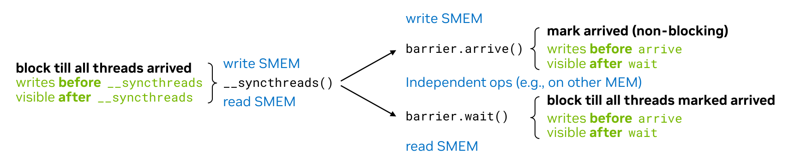
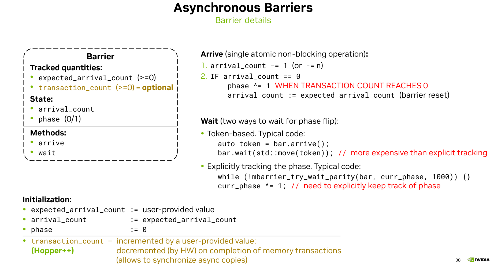
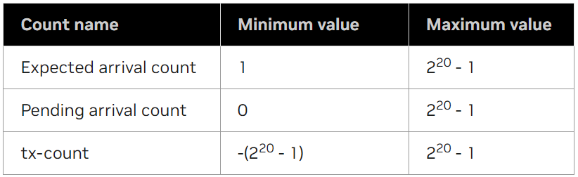

# Asynchronous Barriers

barrier 是一种用于线程同步的方法。一般 thread block 中线程的同步是通过 `__syncthreads()` 进行的。一个线程运行到 `__syncthreads()` 时必须要等待其他线程到达才能执行后续代码，在等待时线程不能干别的事情。

barrier 同步等于是通过 `barrier.arrive()` 和 `barrier.wait()` 把 `__syncthreads()` 拆开了。线程到达 arrive 后可以干别的独立的事情，干完之后再通过 wait 确保与其他线程的同步。



在 PTX 中有多种 barrier 指令，如 `bar`，`barrier` 和 `mbarrier` 等。

本文中主要介绍 `mbarrier`。

mbarrier 是一个共享内存上的 64 位变量，由 expected_arrival_count，transcation_count，arrival_count 和 phase 组成，函数有 arrive 和 wait。
其中 expected_arrival_count 表示有多少线程会参与到 mbarrier 中，这个值由用户提供。transcation_count 是一个可选的变量，在 Hopper 的异步拷贝中可以用到。

mbarrier 在初始化时会根据用户提供的 value 初始化 expected_arrival_count，然后把 arrival_count 也初始化成这个 value。phase 设成 0。transcation_count 如果有的话是根据异步拷贝的数据量设置的。

当一个线程到达 arrive 函数后，arrival_count 会减 1，表示已经有一个线程到达了。当所有的参与线程都到达了 arrive 函数，arrival_count 就会变成 0。当 arrival_count 变成 0 时，表示所有的线程都到达了，此时 phase 状态会切换，arrival_count 会重新被设置为 expected_arrival_count。
如果设置了 transcation_count 则 mbarrier 会等待 transcation_count 和 arrival_count 同时归零后切换 phase。

如果其他线程还没到达 arrive，当前线程会在 wait 函数进行等待。wait 函数有两种判断同步是否完成方法，一种是使用 token 判断，一种是使用奇偶校验判断。如果使用第一种方法，我们需要让 arrive 函数返回一个 token，这个 token 记录着当前 mbarrier 的状态，然后 wait 通过 token 判断当前阶段同步是否完成。
如果使用第二种方法，我们需要定义一个临时的变量，通过将临时变量与 mbarrier 中的 phase 进行奇偶校验来判断同步是否完成。

在 mbarrier 同步中，所有的线程到达 arrive 后 mbarrier 的状态已经切换了，然后每个线程各干各的，到达 wait 就直接返回为 true。
如果部分线程先到达 arrive，此时状态没切换，然后这部分线程到达了 wait，就一直在等待。等到其他线程到达 arrive，且状态切换后 wait 就等待完成。

需要注意的是 mbarrier 只需要一个线程就可以初始化，如果多个线程进行初始化，transcation_count 会进行累加。



下面详细介绍 mbarrier 以及指令的使用方法。

## mbarrier

mbarrier 是创建在共享内存中的对象，支持以下功能：

1. 在 CTA (thread block) 内对线程或线程子集进行同步。
2. 在 CTA cluster 中对线程执行单向同步操作。线程只能对位于 shared::cluster 空间的 mbarrier 执行 arrive 操作，不能执行 *_wait 操作。
3. 等待线程发起的异步内存操作完成，并使其对其他线程可见。

mbarrier 可以通过 mbarrier.init 进行初始化，也可以通过 mbarrier.inval 设置为无效。
mbarrier 支持下面的操作，在调用这些方法前，必须要先对 mbarrier 进行初始化。

```cpp
mbarrier.expect_tx
mbarrier.complete_tx
mbarrier.arrive
mbarrier.arrive_drop
mbarrier.test_wait
mbarrier.try_wait
mbarrier.pending_count
cp.async.mbarrier.arrive
```

与 bar 或 barrier 指令（每个 CTA 只能访问有限数量的 barriers）不同，mbarrier 对象由用户定义，仅受到可用的共享内存总大小的限制。
通过 mbarrier，线程可以在到达 arrive 后进行其他的工作，然后通过 wait 对之前的工作进行同步。

mbarrier 是一个 64 位的共享内存变量，需要 8 字节对齐。
mbarrier 对象中包含下面的信息：

1. 当前 mbarrier 的状态 phase。
2. mbarrier 当前状态还未到达的线程数 (pending arrival count)。
3. mbarrier 下一个状态预期到达的线程数 (expected arrival count)。
4. mbarrier 当前状态还未到达的内存传输字节数 tx-count。

每个变量的有效范围如下：

| Count name             | Minimum value      | Maximum value     |
|:-----------------------|------------------- |------------------ |
| Expected arrival count | 1                  | 2<sup>20</sup> - 1 |
| Pending arrival count  | 0                  | 2<sup>20</sup> - 1 |
| tx-count               | -(2<sup>20</sup> - 1) | 2<sup>20</sup> - 1 |



在 mbarrier 初始化阶段，会根据用户提供的值对上面三个变量进行初始化。其中设置 tx-count 的操作又被称为 `expect-tx` 操作。`expect-tx` 操作用来指定异步传输的数据量，带有一个 expectCount 参数，它会将 mbarrier 的 tx-count 增加 expectCount 指定的值。

tx-count 默认是 0，只有在 Hopper 架构上进行异步传输时才需要设置 tx-count，mbarrier 的 tx-count 需要设置为当前阶段要跟踪的异步内存操作总 bytes 数。每个异步操作完成后，都会对 mbarrier 对象执行 `complete-tx` 操作。`complete-tx` 操作也带有一个completeCount参数，会把 tx-count 减去 completeCount，用来表示当前异步数据传输已经完成。

mbarrier 的 phase 记录了 mbarrier 已经进行了几次同步操作。在每一个 phase 中，threads 首先通过 `arrive-on` 操作来完成当前 phase，然后通过 test_wait 或 try_wait 等待其他线程完成当前阶段。一旦当前阶段完成，mbarrier 会自动重新初始化来用于下一个阶段。

`arrive-on` 操作是线程在到达 arrive 函数后执行的操作，带有一个可选的 count 参数，当线程到达 arrive 后，mbarrier 的 pending arrival count 会减去 count，如果未指定 count 参数，则默认为 1。如果当前阶段已完成，则 mbarrier 将转换到下一个阶段。

在当前 phase 满足下面要求时就表明 mbarrier 的当前 phase 已经完成，将进入下一个 phase。

1. 待处理到达计数 pending arrival count 已达到零。
2. 事务计数 tx-count 已达到零。

在这里注意到 tx-count 的取值范围是 -(2<sup>20</sup> - 1) 到 2<sup>20</sup> - 1。这说明可以先进行异步拷贝，然后再设置 expect-tx。

```cpp
int tx_bytes = 100;
tma_load_1d(tma_buffer, src_addr, tma_mbarrier, tx_bytes);
mbarrier_arrive_and_expect_tx(tma_mbarrier, tx_bytes);
mbarrier_wait(tma_mbarrier, tma_phase);
```

比如上面这段代码，tx_bytes 是 100，代码中先进行了 tma 异步拷贝。传输完成后，tma_mbarrier 中的 tx-count 变为了 -100。然后执行 arrive.expect_tx 操作，这个操作会先设置 expect_tx，然后再执行 arrive。所以此时 tma_mbarrier 中的 tx-count 会加上 100，变成 0，表示传输已经完成。

## mbarrier.init

初始化一个 mbarrier 对象。

```cpp
mbarrier.init{.shared{::cta}}.b64 [addr], count;
```

mbarrier.init 使用无符号 32 位整数 count 在 addr 指定的位置初始化 mbarrier 对象。操作数 count 的值必须在 1 - 2<sup>20</sup>-1 之间。
mbarrier 对象的初始化包括：

1. 把 current phase 设为 0。
2. 把 expected arrival count 设为 count。
3. 把 pending arrival count 设为 count。
4. 把 tx-count 设为 0。tx-count 是异步拷贝时传输的 bytes 数，只有在异步拷贝时才用到，默认是 0。

addr 对象需要 64 位，8 字节对齐。
在包含有效 mbarrier 对象的内存位置上执行 mbarrier.init 操作的行为是未定义的；首先使用 mbarrier.inval 使 mbarrier 对象无效，然后才能使用对应的内存位置。
举例：

```cpp
.shared .b64 shMem, shMem2;
.reg    .b64 addr;
.reg    .b32 %r1;

cvta.shared.u64          addr, shMem2;
mbarrier.init.b64        [addr],   %r1;
bar.cta.sync             0;
// ... other mbarrier operations on addr

mbarrier.init.shared::cta.b64 [shMem], 12;
bar.sync                 0;
// ... other mbarrier operations on shMem
```

```cpp
__global__ void cp_async_bulk(float *src, float *dst, int N)
{
    int tid = threadIdx.x;
    int index = blockIdx.x * blockDim.x;

    __shared__ uint64_t bar[1];
    uint32_t smem_int_mbar = cast_smem_ptr_to_uint(bar);

    if (tid == 0)
    {
        /// Initialize shared memory barrier
        asm volatile("mbarrier.init.shared::cta.b64 [%0], %1;\n" ::"r"(smem_int_mbar),
                     "r"(blockDim.x));
    }
    __syncthreads();
    ...
}
```

## mbarrier.inval

把 mbarrier 对象设为无效。

```cpp
mbarrier.inval{.shared{::cta}}.b64 [addr];
```

mbarrier.inval 会使 addr 指定位置的 mbarrier 对象失效。在将 mbarrier 对象的内存位置用于任何其他用途之前，必须先使其失效。
在不包含有效 mbarrier 对象的内存位置执行除 mbarrier.init 之外的任何 mbarrier 操作都会导致未定义的行为。

## mbarrier.expect_tx

对 mbarrier 对象执行 expect-tx 操作。expect-tx 操作就是把 mbarrier 中的 tx-count 增加 txCount。
tx-count 是一个 phase 中异步拷贝传输的数据量。

```cpp
mbarrier.expect_tx{.sem}{.scope}{.space}.b64 [addr], txCount;

.sem   = { .relaxed }
.scope = { .cta, .cluster }
.space = { .shared{::cta}, .shared::cluster }
```

执行 mbarrier.expect_tx 的线程对地址 addr 指定位置的 mbarrier 对象执行 expect-tx 操作。txCount 是 32 位无符号整数操作数， 也就是 expect-tx 操作的 expectCount 参数。

```cpp
mbarrier.expect_tx.b64                       [addr], 32;
mbarrier.expect_tx.relaxed.cta.shared.b64    [mbarObj1], 512;
mbarrier.expect_tx.relaxed.cta.shared.b64    [mbarObj2], 512;
```

```cpp
__global__ void cp_async_bulk(float *src, float *dst, int N)
{
    int tid = threadIdx.x;
    int index = blockIdx.x * blockDim.x;

    __shared__ uint64_t bar[1];
    int transaction_bytes = blockDim.x * sizeof(float);
    uint32_t smem_int_mbar = cast_smem_ptr_to_uint(bar);

    if (tid == 0)
    {
        /// Initialize shared memory barrier
        asm volatile("mbarrier.init.shared::cta.b64 [%0], %1;\n" ::"r"(smem_int_mbar),
                     "r"(blockDim.x));
        asm volatile("mbarrier.expect_tx.shared::cta.b64 [%0], %1;\n" ::"r"(smem_int_mbar),
                     "r"(transaction_bytes));
    }
    __syncthreads();
    ...
}
```

## mbarrier.complete_tx

对 mbarrier 对象执行 complete-tx 操作。complete-tx 操作就是把 mbarrier 中的 tx-count 减少 txCount。

```cpp
mbarrier.complete_tx{.sem}{.scope}{.space}.b64 [addr], txCount;

.sem   = { .relaxed }
.scope = { .cta, .cluster }
.space = { .shared{::cta}, .shared::cluster }
```

执行 mbarrier.complete_tx 的线程在地址 addr 指定的位置对 mbarrier 对象执行 complete-tx 操作。txCount 是 32 位无符号整数操作数，也就是 complete-tx 操作的 completeCount 参数。
mbarrier.complete_tx 不涉及任何异步内存操作，仅模拟异步内存操作的完成及其向 mbarrier 对象发出信号。

```cpp
mbarrier.complete_tx.b64             [addr],     32;
mbarrier.complete_tx.shared.b64      [mbarObj1], 512;
mbarrier.complete_tx.relaxed.cta.b64 [addr2],    32;
```

## mbarrier.arrive

在 mbarrier 对象上执行 arrive-on 操作。arrive-on 操作就是当某个线程执行 arrive 时，就把 mbarrier 中的 pending arrival count 数减去 count，没有设置 count 的话默认减去 1。pending arrival count 为 0 就执行切换 phase 操作。

```cpp
mbarrier.arrive{.sem}{.scope}{.shared{::cta}}.b64           state, [addr]{, count};
mbarrier.arrive{.sem}{.scope}{.shared::cluster}.b64         _, [addr] {,count}
mbarrier.arrive.expect_tx{.sem}{.scope}{.shared{::cta}}.b64 state, [addr], txCount;
mbarrier.arrive.expect_tx{.sem}{.scope}{.shared::cluster}.b64   _, [addr], txCount;
mbarrier.arrive.noComplete{.release}{.cta}{.shared{::cta}}.b64  state, [addr], count;

.sem   = { .release, .relaxed }
.scope = { .cta, .cluster }
```

执行 mbarrier.arrive 的线程对位于地址 addr 指定位置的 mbarrier 对象执行 arrive-on 操作。
可选限定符 .expect_tx 指定在 arrive-on 操作之前执行 expect-tx 操作。也就是先加上 tx-count 的数量，然后再执行 arrive 的操作。
当同时指定限定符 .arrive 和 .expect_tx 时，则 arrive-on 操作的 count 参数假定为 1。

对位于 .shared::cta 中的 mbarrier 对象执行 mbarrier.arrive 操作会返回一个 64 位寄存器 state，用于捕获 arrive-on 操作之前 mbarrier 对象的 phase 到 state 中。state的内容与具体实现相关。也可以使用下划线 "\_" 作为 state 参数。

带有 .noComplete 限定符的 mbarrier.arrive 操作不得导致 mbarrier 完成其当前阶段，否则行为未定义。
注意：对于 sm_8x，当指定参数数量时，需要修饰符 .noComplete。

```cpp
.reg .b32 cnt, remoteAddr32, remoteCTAId, addr32;
.reg .b64 %r<5>, addr, remoteAddr64;
.shared .b64 shMem, shMem2;

cvta.shared.u64            addr, shMem2;
mov.b32                    addr32, shMem2;
mapa.shared::cluster.u32   remoteAddr32, addr32, remoteCTAId;
mapa.u64                   remoteAddr64, addr,   remoteCTAId;

cvta.shared.u64          addr, shMem2;

mbarrier.arrive.shared.b64                       %r0, [shMem];
mbarrier.arrive.shared::cta.b64                  %r0, [shMem2];
mbarrier.arrive.release.cta.shared::cluster.b64  _, [remoteAddr32];
mbarrier.arrive.release.cluster.b64              _, [remoteAddr64], cnt;
mbarrier.arrive.expect_tx.release.cluster.b64    _, [remoteAddr64], tx_count;
mbarrier.arrive.noComplete.b64                   %r1, [addr], 2;
mbarrier.arrive.relaxed.cta.b64                  %r2, [addr], 4;
mbarrier.arrive.b64                              %r2, [addr], cnt;
```
```cpp
int num_bytes = blockDim.x * sizeof(float);
asm volatile("mbarrier.arrive.expect_tx.shared::cta.b64 _, [%1], %0; \n\t" ::"r"(num_bytes), "r"(mbar_int_ptr));

uint64_t token = 0;
asm volatile("mbarrier.arrive.shared::cta.b64 %0, [%1];\n" ::"l"(token), "r"(smem_int_mbar));
```

## mbarrier.arrive_drop

减少 mbarrier 中 expected count 的值，并执行 arrive-on 操作。

```cpp
mbarrier.arrive_drop{.sem}{.scope}{.shared{::cta}}.b64 state,           [addr]{, count};
mbarrier.arrive_drop{.sem}{.scope}{.shared::cluster}.b64           _,   [addr] {,count};
mbarrier.arrive_drop.expect_tx{.shared{::cta}}{.sem}{.scope}.b64 state, [addr], tx_count;
mbarrier.arrive_drop.expect_tx{.shared::cluster}{.sem}{.scope}.b64   _, [addr], tx_count;
mbarrier.arrive_drop.noComplete{.release}{.cta}{.shared{::cta}}.b64 state,  [addr], count;

.sem   = { .release, .relaxed }
.scope = { .cta, .cluster }
```

在地址 addr 指定位置的 mbarrier 对象上执行 mbarrier.arrive_drop 的线程将执行以下步骤：

1. 将 mbarrier 对象的预期到达计数 expected count 减去 count 指定的值。如果未指定 count 操作数，则默认为 1。
2. 对 mbarrier 对象执行 arrive-on 操作。
mbarrier 对象预期到达计数的减少将适用于 mbarrier 对象的所有后续阶段。
其余详见 mbarrier.arrive。

```cpp
.reg .b32 cnt;
.reg .b64 %r1;
.shared .b64 shMem;

// Example 1
@p mbarrier.arrive_drop.shared.b64 _, [shMem];
@p exit;
@p2 mbarrier.arrive_drop.noComplete.shared.b64 _, [shMem], %a;
@p2 exit;
..
@!p mbarrier.arrive.shared.b64   %r1, [shMem];
@!p mbarrier.test_wait.shared.b64  q, [shMem], %r1;

// Example 2
mbarrier.arrive_drop.shared::cluster.b64 _, [addr];
mbarrier.arrive_drop.shared::cta.release.cluster.b64     _, [addr], cnt;

// Example 3
mbarrier.arrive_drop.expect_tx.shared::cta.relaxed.cluster.b64 state, [addr], tx_count;
```

## cp.async.mbarrier.arrive

使 mbarrier 对象跟踪执行线程启动的所有先前的 cp.async 操作。

```cpp
cp.async.mbarrier.arrive{.noinc}{.shared{::cta}}.b64 [addr];
```

执行线程发起的所有先前 cp.async 操作完成后，系统会在 mbarrier 对象上触发一个 arrive-on 操作。mbarrier 对象位于 addr 指定的位置。arrive-on 操作与 cp.async.mbarrier.arrive 的执行异步。
如果未指定 .noinc 修饰符，则 mbarrier 对象的待处理计数会在异步 arrive-on 操作之前增加 1。这会导致当前阶段异步 arrive-on 操作的待处理计数发生零和变化 zero-net change。也就是 arrive-on 前增加1，arrive-on 后减去1，所以变为0，即异步 arrive 不影响 pending count。

当指定 .noinc 修饰符时，mbarrier 对象的待处理计数不会递增。因此，需要在 mbarrier 对象的初始化过程中就考虑到异步到达操作导致的待处理计数减少。

```cpp
// Example 1: no .noinc
mbarrier.init.shared.b64 [shMem], threadCount;
....
cp.async.ca.shared.global [shard1], [gbl1], 4;
cp.async.cg.shared.global [shard2], [gbl2], 16;
....
// Absence of .noinc accounts for arrive-on from completion of prior cp.async operations.
// So mbarrier.init must only account for arrive-on from mbarrier.arrive.
cp.async.mbarrier.arrive.shared.b64 [shMem];
....
mbarrier.arrive.shared.b64 state, [shMem];

waitLoop:
mbarrier.test_wait.shared.b64 p, [shMem], state;
@!p bra waitLoop;


// Example 2: with .noinc

// Tracks arrive-on from mbarrier.arrive and cp.async.mbarrier.arrive.

// All threads participating in the mbarrier perform cp.async
mov.b32 copyOperationCnt, threadCount;

// 3 arrive-on operations will be triggered per-thread
mul.lo.u32 copyArrivalCnt, copyOperationCnt, 3;

add.u32 totalCount, threadCount, copyArrivalCnt;

mbarrier.init.shared.b64 [shMem], totalCount;
....
cp.async.ca.shared.global [shard1], [gbl1], 4;
cp.async.cg.shared.global [shard2], [gbl2], 16;
...
// Presence of .noinc requires mbarrier initalization to have accounted for arrive-on from cp.async
cp.async.mbarrier.arrive.noinc.shared.b64 [shMem]; // 1st instance
....
cp.async.ca.shared.global [shard3], [gbl3], 4;
cp.async.ca.shared.global [shard4], [gbl4], 16;
cp.async.mbarrier.arrive.noinc.shared::cta.b64 [shMem]; // 2nd instance
....
cp.async.ca.shared.global [shard5], [gbl5], 4;
cp.async.cg.shared.global [shard6], [gbl6], 16;
cp.async.mbarrier.arrive.noinc.shared.b64 [shMem]; // 3rd and last instance
....
mbarrier.arrive.shared.b64 state, [shMem];

waitLoop:
mbarrier.test_wait.shared.b64 p, [shMem], state;
@!p bra waitLoop;
```

在上面的代码中例1没有用 .noinc，所以mbarrier初始化时只需要设置成 mbarrier.arrive 需要的数量就行。例2中使用了 .noinc，所以初始化时还要加上每个线程异步拷贝 arrive 的数量。

## mbarrier.test_wait, mbarrier.try_wait

检查 mbarrier 的当前状态是否完成。

```cpp
mbarrier.test_wait{.sem}{.scope}{.shared{::cta}}.b64        waitComplete, [addr], state;
mbarrier.test_wait.parity{.sem}{.scope}{.shared{::cta}}.b64 waitComplete, [addr], phaseParity;

mbarrier.try_wait{.sem}{.scope}{.shared{::cta}}.b64         waitComplete, [addr], state
                                                               {, suspendTimeHint};

mbarrier.try_wait.parity{.sem}{.scope}{.shared{::cta}}.b64  waitComplete, [addr], phaseParity
                                                               {, suspendTimeHint};

.sem   = { .acquire, .relaxed }
.scope = { .cta, .cluster }
```

test_wait 和 try_wait 操作测试 addr 指定位置的 mbarrier 对象当前 phase 或前一 phase 是否完成。

mbarrier.test_wait 是一条非阻塞指令，用于测试 phase 是否完成。
mbarrier.try_wait 是一条潜在阻塞指令，用于测试 phase 是否完成。如果 phase 未完成，则正在执行的线程可能会被暂停。被暂停的线程将在指定 phase 完成时，或在 phase 完成之前，按照系统相关的时间限制恢复执行。可选的 32 位无符号整数 suspendTimeHint 指定时间限制（以纳秒为单位），可用于替代系统相关的时间限制。

mbarrier.test_wait 和 mbarrier.try_wait 有两种方法测试 phase 是否完成：

1. 由操作数 state 指定，该操作数由当前阶段或前一个阶段中对同一 mbarrier 对象执行 mbarrier.arrive 指令返回。或者
2. 由操作数 phaseParity 指示，该操作数是 mbarrier 对象当前阶段或前一个阶段的整数奇偶校验值。

.parity 用于测试操作数 phaseParity 所指示的阶段是否完成。phaseParity 是 mbarrier 对象当前阶段或前一个阶段的整数奇偶校验位。偶数阶段的整数奇偶校验位为 0，奇数阶段的整数奇偶校验位为 1。因此，phaseParity 操作数的有效值为 0 和 1。

如果 phase 未完成 waitComplete 返回 False，否则返回 True。

```cpp
// Example 1a, thread synchronization with test_wait:

.reg .b64 %r1;
.shared .b64 shMem;

mbarrier.init.shared.b64 [shMem], N;  // N threads participating in the mbarrier.
...
mbarrier.arrive.shared.b64  %r1, [shMem]; // N threads executing mbarrier.arrive

// computation not requiring mbarrier synchronization...

waitLoop:
mbarrier.test_wait.shared.b64    complete, [shMem], %r1;
@!complete nanosleep.u32 20;
@!complete bra waitLoop;

// Example 1b, thread synchronization with try_wait :

.reg .b64 %r1;
.shared .b64 shMem;

mbarrier.init.shared.b64 [shMem], N;  // N threads participating in the mbarrier.
...
mbarrier.arrive.shared.b64  %r1, [shMem]; // N threads executing mbarrier.arrive

// computation not requiring mbarrier synchronization...

waitLoop:
mbarrier.try_wait.relaxed.cluster.shared.b64    complete, [shMem], %r1;
@!complete bra waitLoop;


// Example 2, thread synchronization using phase parity :

.reg .b32 i, parArg;
.reg .b64 %r1;
.shared .b64 shMem;

mov.b32 i, 0;
mbarrier.init.shared.b64 [shMem], N;  // N threads participating in the mbarrier.
...
loopStart :                           // One phase per loop iteration
    ...
    mbarrier.arrive.shared.b64  %r1, [shMem]; // N threads
    ...
    and.b32 parArg, i, 1;
    waitLoop:
    mbarrier.test_wait.parity.shared.b64  complete, [shMem], parArg;
    @!complete nanosleep.u32 20;
    @!complete bra waitLoop;
    ...
    add.u32 i, i, 1;
    setp.lt.u32 p, i, IterMax;
@p bra loopStart;


// Example 3, Asynchronous copy completion waiting :

.reg .b64 state;
.shared .b64 shMem2;
.shared .b64 shard1, shard2;
.global .b64 gbl1, gbl2;

mbarrier.init.shared.b64 [shMem2], threadCount;
...
cp.async.ca.shared.global [shard1], [gbl1], 4;
cp.async.cg.shared.global [shard2], [gbl2], 16;

// Absence of .noinc accounts for arrive-on from prior cp.async operation
cp.async.mbarrier.arrive.shared.b64 [shMem2];
...
mbarrier.arrive.shared.b64 state, [shMem2];

waitLoop:
mbarrier.test_wait.shared::cta.b64 p, [shMem2], state;
@!p bra waitLoop;

// Example 4, Synchronizing the CTA0 threads with cluster threads
.reg .b64 %r1, addr, remAddr;
.shared .b64 shMem;

cvta.shared.u64          addr, shMem;
mapa.u64                 remAddr, addr, 0;     // CTA0's shMem instance

// One thread from CTA0 executing the below initialization operation
@p0 mbarrier.init.shared::cta.b64 [shMem], N;  // N = no of cluster threads

barrier.cluster.arrive;
barrier.cluster.wait;

// Entire cluster executing the below arrive operation
mbarrier.arrive.release.cluster.b64              _, [remAddr];

// computation not requiring mbarrier synchronization ...

// Only CTA0 threads executing the below wait operation
waitLoop:
mbarrier.try_wait.parity.acquire.cluster.shared::cta.b64  complete, [shMem], 0;
@!complete bra waitLoop;
```

```cpp
// arrive
uint64_t token = 0;
asm volatile("mbarrier.arrive.shared::cta.b64 %0, [%1];\n" ::"l"(token), "r"(smem_int_mbar));

// wait
asm volatile(
    "{\n"
    ".reg .pred                P1;\n"
    "LAB_WAIT:\n"
    "mbarrier.try_wait.shared::cta.b64 P1, [%0], %1;\n"
    "@P1                       bra DONE;\n"
    "bra                   LAB_WAIT;\n"
    "DONE:\n"
    "}\n" ::"r"(smem_int_mbar),
    "l"(token));


__device__ __forceinline__ void mbarrier_wait(uint64_t* mbar_ptr,
                                              uint32_t& phase) {
  auto mbar_int_ptr = static_cast<uint32_t>(__cvta_generic_to_shared(mbar_ptr));
  asm volatile(
      "{\n\t"
      ".reg .pred       P1; \n\t"
      "LAB_WAIT: \n\t"
      "mbarrier.try_wait.parity.shared::cta.b64 P1, [%0], %1, %2; \n\t"
      "@P1 bra DONE; \n\t"
      "bra     LAB_WAIT; \n\t"
      "DONE: \n\t"
      "}" ::"r"(mbar_int_ptr),
      "r"(phase), "r"(0x989680));
  phase ^= 1;
}
```

## mbarrier.pending_count

从 mbarrier state 查询待到达计数。

```cpp
mbarrier.pending_count.b64 count, state;
```

可以使用 mbarrier.pending_count 从 mbarrier state 中查询待处理计数。
state 操作数是一个 64 位寄存器，必须是先前执行 mbarrier.arrive.noComplete 或 mbarrier.arrive_drop.noComplete 指令的结果。否则，行为未定义。
目标寄存器 count 是一个 32 位无符号整数，表示在执行获取 state 寄存器的 arrive-on 操作之前 mbarrier 对象的待处理计数。

```cpp
.reg .b32 %r1;
.reg .b64 state;
.shared .b64 shMem;

mbarrier.arrive.noComplete.b64 state, [shMem], 1;
mbarrier.pending_count.b64 %r1, state;
```
