# mma

矩阵乘加操作（Matrix Multiply-Accumulate, MMA）主要用来实现以下计算过程：

$D = A × B + C$

其中，矩阵 $A$ 的形状是 $M×K$，矩阵 $B$ 的形状是 $K×N$。 $C$ 和 $D$ 是累加矩阵，形状是 $M×N$，一般是相同的矩阵。

## mma 指令

mma 指令是 CUDA 中用来调用 Tensor Core 进行计算矩阵乘加的 PTX 指令之一，它通过 PTX（Parallel Thread Execution）汇编指令暴露给开发者，可以直接使用内联汇编代码进行开发。

mma 指令是 warp 级别的计算，由一个 warp 中所有的线程共同执行。mma 支持常见的数据类型，如 fp16，bf16，tf32，u8，s8，u4，s4，b1，fp64，fp8 和 fp4 等精度。

根据数据类型的不同，mma 支持不同尺寸的矩阵计算，比如对于 fp16，mma 支持 m8n8k4，m16n8k8 和 m16n8k16 大小的矩阵运算。而对于 u8/s8 类型，mma 则支持 m8n8k16，m16n8k16 和 m16n8k32 大小的矩阵运算。
对于其他数据类型和 shape 详见 [Matrix Shape](https://docs.nvidia.com/cuda/parallel-thread-execution/index.html?highlight=mma%2520sync%2520aligned%2520m8n8k4#warp-level-matrix-shape) 和 [Matrix Data-types](https://docs.nvidia.com/cuda/parallel-thread-execution/index.html?highlight=mma%2520sync%2520aligned%2520m8n8k4#warp-level-matrix-data-types)。

mma 指令的使用格式如下：

```cpp
mma.sync.aligned.shape.alayout.blayout.dtype.atype.btype.ctype  d, a, b, c;
```

开头固定 mma.sync.aligned，.sync 代表一个 warp 中的所有线程在执行相同的 mma 指令前会先进行同步。.aligned 代表一个 warp 中所有的线程必须执行相同的 mma 指令。

.aligned 后是形状大小 shape，接着是矩阵 A 的布局 alayout 和矩阵 B 的布局 blayout，其中布局表示线程加载数据的方式，可以选择 .row 和 .col。

.dtype .atype .btype .ctype 分别代表矩阵 D，A，B，C 的数据类型。

d，a，b，c 对应线程对应的矩阵 D，A，B，C 中的元素。

下面以 m8n8k4，m16n8k8 和 m16n8k16 为例介绍 mma 指令的计算方法。

## m8n8k4

m8n8k4 表示一个 mma 指令可以处理 A 矩阵为 8×4，B 矩阵为 4×8，C 矩阵为 8×8 大小的矩阵运算。

### 线程与数据的布局

以 fp16 的 m8n8k4 矩阵为例。一个 m8n8k4 的 mma 指令只需要 8 个线程，而一个 warp 有 32 个线程，所以一个 warp 的 32 个线程可以执行 4 个 m8n8k4 fp16 的 mma 计算。

一个 warp 中的 32 线程需要交叉处理 4 个矩阵中的元素。下表介绍了具体的线程与 4 个 MMA 计算的分布。

| MMA Computation   | Threads participating in MMA computation                       |
|-------------------|----------------------------------------------------------------|
| MMA computation 1 | Threads with %laneid 0-3 (low group) and 16-19 (high group)    |
| MMA computation 2 | Threads with %laneid 4-7 (low group) and 20-23 (high group)    |
| MMA computation 3 | Threads with %laneid 8-11 (low group) and 24-27 (high group)   |
| MMA computation 4 | Threads with %laneid 12-15 (low group) and 28-31 (high group)  |


可以看到，0-3 号线程和 16-19 号线程处理第一个 MMA，4-7 号线程和 20-23 号线程处理第二个 MMA，以此类推。

对于每一个 MMA 计算的输入 A 和 B，每个线程需要处理的数据分布如下所示。

#### 矩阵 A

当数据类型是 fp16 时，对于矩阵 A 来说，一个寄存器可以保存 2 个 fp16，一个线程需要加载两个寄存器，因此一个线程可以加载 A 中的 4 个元素。

当线程使用 row-major 的方式加载矩阵 A 时，每个线程和对应元素的分布如下所示。

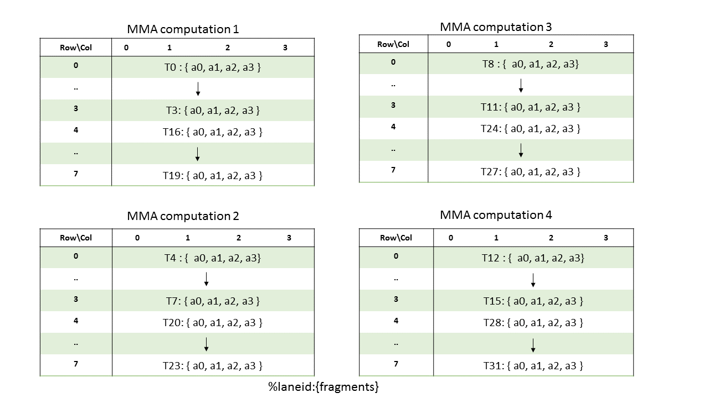

从上图可以看到，一个 MMA 中 A 的大小是 8 行 4 列。在 MMA1 中，一个 warp 中的 0-3 号线程处理前 4 行，16-19 号线程处理后 4 行，一个线程处理一行的 4 个元素。

当线程使用 column-major 的方式加载矩阵 A 时，每个线程和元素的对应关系会变成下面的样子。

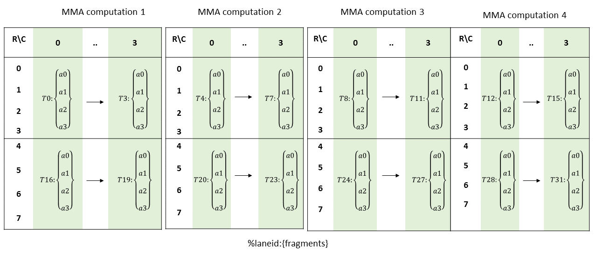

以 MMA1 为例，A 的 shape 还是 8×4，0-3 和 16-19 这 8 个线程处理第一个 MMA1，但是每个线程处理的数据分布变了。

在上图中，0 号线程处理第一列的前 4 个元素，然后是 16 号线程处理后续 4 个元素，此时第一列的 8 个元素分配完毕，然后 1 号线程处理第二列的前 4 个元素，17 号线程处理第二列的后 4 个元素。2 号和 18 号处理第三列，3 号和 19 号处理第四列。

当线程使用 row-major 的方式加载数据时，指令里对应的 alayout 需要为 .row。当使用 column-major 的方式加载线程时，alayout 需要设为 .col。

需要注意的是，这里提到的 row-major 和 column-major 是线程的布局，和数据的布局无关。即使矩阵的数据分布是 column-major，线程也可以按照 row-major 的方式进行加载，只要 alayout 设置正确即可。

#### 矩阵 B

矩阵 B 的 shape 是 4×8，当数据类型是 fp16 时，一个寄存器保存两个 fp16，一个线程分配两个寄存器加载 B 中的元素，因此可以加载 4 个元素。

当线程使用 row-major 的方式加载数据时，线程和元素的对应关系如下：

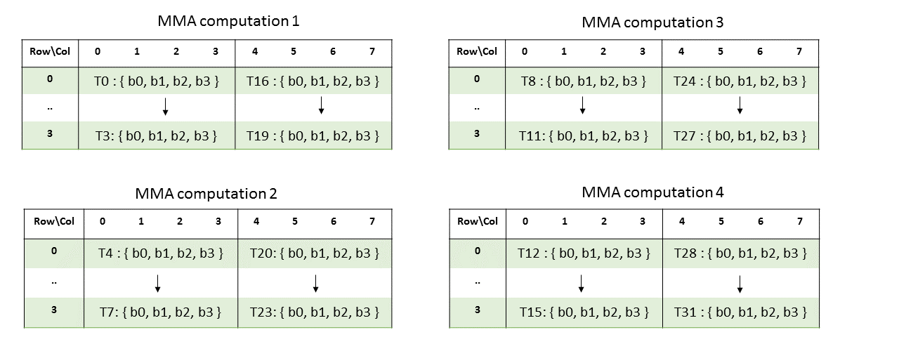

以 MMA1 为例，0 号线程加载第一行的 4 个连续元素，16 号线程加载第一行的后四个元素，然后 1 号线程和 17 号线程加载第二行，以此类推。

当线程使用 column-major 的方式加载数据时，线程和元素的对应关系如下：

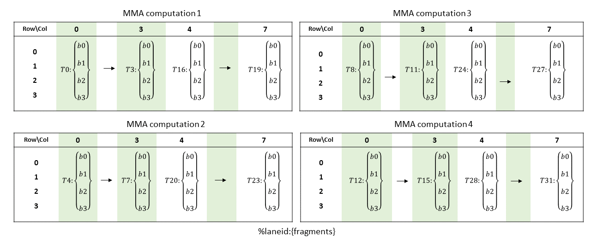

在 MM1 中，一个线程加载一列中的四个元素，0-3 和 16-19 线程依次加载全部的 8 列元素。

与矩阵 A 类似，线程布局和数据无关。当线程使用 row-major 的方式加载数据时，指令里对应的 blayout 需要为 .row。当使用 column-major 的方式加载线程时，blayout 需要设为 .col。

#### 矩阵C

矩阵 C（或矩阵 D）中的元素可以是 fp16 或 fp32。当数据类型是 fp16 时，一个线程用 4 个寄存器处理 C 中的元素，一个寄存器可以容纳 2 个 fp16，所以一个线程可以处理 8 个元素。当数据类型是 fp32 时，一个寄存器容纳一个 fp32，一个线程会用 8 个寄存器保存 C 中的 8 个元素。

当 C 中元素是 fp16 时，每个线程和 C 中元素的对应关系如下：

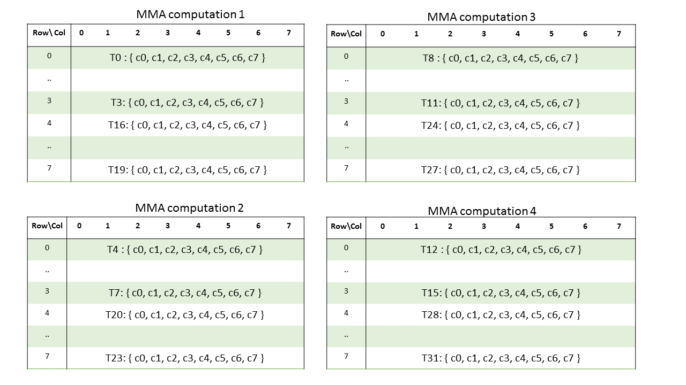


矩阵 C 的形状是 8×8 大小，此时在 MMA1 中，0-3 和 16-19 这 8 个线程一个线程处理一行的 8 个元素。4-7 和 20-23 这 8 个线程按照同样的方式处理 MMA2 中的 8 行元素。MMA3 和 MMA4 同上。

当C中的元素是 fp32 时，线程与元素的对应关系有些复杂，如下图所示。

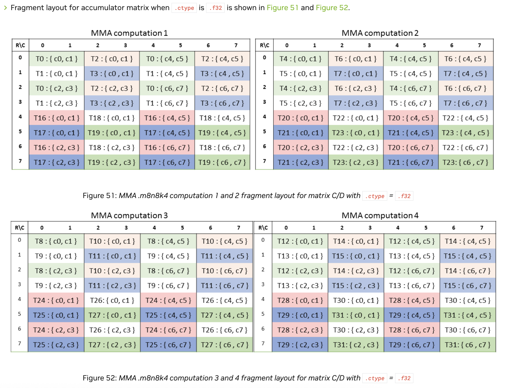

以 MM1 为例，0-3 和 16-19 这 8 个线程和每个线程对应的 8 个元素交错分布，共同处理 MM1 中的 64 个元素。

### 代码测试

下面用实际代码验证 m8n8k4，A = fp16，B = fp16，C/D = fp32 情况下的计算过程。

假设我们有两个矩阵 A 和 B，其中 A 的大小是 8×4，B 的大小是 4×8，相乘之后得到 8×8 的矩阵 C。

#### 数据初始化

首先对矩阵 A，B 和 C 进行随机初始化

```cpp
int M = 8, N = 8, K = 4;

int A_size = M * K;
int B_size = K * N;
int C_size = M * N;

using TA = cute::half_t;
using TB = cute::half_t;
using TC = float;

thrust::host_vector<TA> h_A(A_size);
thrust::host_vector<TB> h_B(B_size);
thrust::host_vector<TC> h_C(C_size);

for (int j = 0; j < A_size; ++j)
    h_A[j] = static_cast<TA>(rand() % 9 + 1);
for (int j = 0; j < B_size; ++j)
    h_B[j] = static_cast<TB>(rand() % 9 + 1);
for (int j = 0; j < C_size; ++j)
    h_C[j] = static_cast<TC>(0);

thrust::device_vector<TA> d_A = h_A;
thrust::device_vector<TB> d_B = h_B;
thrust::device_vector<TC> d_C = h_C;
```

A 和 B 的随机初始化结果为：

```cpp
m = 8, n = 8, k = 4
The physical order of A:
 1  3  1  4  5  4  8  9  6  5  7  7  2  3  1  6  6  5  8  4  3  9  9  2  8  4  2  8  7  9  3  7
The physical order of B:
 2  1  9  4  4  7  3  7  9  1  5  8  3  3  4  8  5  1  3  8  9  9  7  5  1  6  1  8  5  4  3  4
 ```

为了简单起见，block 数设为 1，包含 32 个线程，正好对应一个 warp。一个 warp 可以处理 4 个 m8n8k4 大小的 MMA，我们只使用其中的 0-3 线程和 16-19 线程计算一个 MMA。

```cpp
dim3 blocks(1);
dim3 threads(32);
mma_kernel_tn<<<blocks, threads>>>(d_A.data().get(), d_B.data().get(), d_C.data().get(), M, N, K);
```

__.row.col__

首先使用 row-major 的方式加载矩阵 A，column-major 的方式加载矩阵 B。此时 mma 的指令参数要设置成 .row.col。

对于核函数 mma_kernel_tn，首先定义每个线程需要加载的 A，B 和 C 矩阵的元素的个数。从上面的介绍中可以知道，一个线程加载 4 个 A 和 B 中的 fp16 元素，8 个 C 和 D 中的 fp32 元素。因此初始化可以写成下面这样。C 和 D 用 float 数组表示，A 和 B 用 uint32_t 数组表示。

>tn 中的 t 表示 transpose，n 表示 not transpose。 在矩阵运算中，矩阵 A 的大小是 M×K，如果 A 在 M 方向上连续就说明矩阵 A 是 not transpose，如果 A 在 K 方向上连续就说明 A 是 transpose 的。同理，矩阵 B 的大小是 K×N，如果 B 在 K 方向上连续说明矩阵 B 是 not transpose，如果 B 在 N 方向上连续就说明 B 是transpose 的。因此 TN 就代表矩阵 A 和 B 都是在 K 方向上连续。


```cpp
uint32_t a[2];
uint32_t b[2];
float c[8] = {0.0f};
float d[8] = {0.0f};
```

然后处理每个线程与矩阵之间的对应关系。我们假设矩阵 A 是 row-major 的矩阵，矩阵 B 是 column-major。这里的 row-major 和 column-major 是矩阵数据的布局。

从上面可知，在 .row.col 参数下，一个线程对应 A 中的一行和 B 中的一列，0-3 对应 A 中的前 4 行和 B 中的前 4 列，16-19 对应 A 中的后 4 行和 B 中的后 4 列。

这里可以写成下面这样，首先根据线程 id 判断每个线程应该处理的行数和列数，这里线程 id 小于 16 的会处理前 4 行，大于 16 的会处理后 4 行。
这里其实只需要 0-3 和 16-19 就可以了，现在这样其他线程也会从 A 和 B 中加载数据计算，但是不影响计算结果。

每个线程根据行号或列号从矩阵中获取数据。由于 A 在行方向是连续的，B 在列方向是连续的，因此可以写成下面这样。

```cpp
int tid = threadIdx.x;

int row_a = 0, col_b = 0;
if (tid < 16)
{
    row_a = tid % 4;
    col_b = tid % 4;
}
else
{
    row_a = tid % 4 + 4;
    col_b = tid % 4 + 4;
}

a[0] = *reinterpret_cast<uint32_t *>(A + row_a * 4 + 0);
a[1] = *reinterpret_cast<uint32_t *>(A + row_a * 4 + 2);
b[0] = *reinterpret_cast<uint32_t *>(B + col_b * 4 + 0);
b[1] = *reinterpret_cast<uint32_t *>(B + col_b * 4 + 2);
```

因为矩阵 A 的数据是在行方向上连续，所以一个线程加载一个 uint32 大小的数据就包括两个连续的 fp16 数据。矩阵 B 也同理。如果矩阵 A 是 column-major 的话，线程也可以使用 row-major 的方式进行加载，只不过数据在列方向上连续，加载一行的数据比较麻烦。

此时每个线程和其对应的矩阵 A，矩阵 B 的元素如下所示：

矩阵 A：

| Row\Col | 0 | 1 | 2 | 3 |
|:-------:|:-:|:-:|:-:|:-:|
| 0 (T0)  | 1 | 3 | 1 | 4 |
| 1 (T1)  | 5 | 4 | 8 | 9 |
| 2 (T2)  | 6 | 5 | 7 | 7 |
| 3 (T3)  | 2 | 3 | 1 | 6 |
| 4 (T16) | 6 | 5 | 8 | 4 |
| 5 (T17) | 3 | 9 | 9 | 2 |
| 6 (T18) | 8 | 4 | 2 | 8 |
| 7 (T19) | 7 | 9 | 3 | 7 |

矩阵 B：

| RowCol | 0 (T0) | 1 (T1) | 2 (T2) | 3 (T3) | 4 (T16) | 5 (T17) | 6 (T18) | 7 (T19) |
|:------:|:------:|:------:|:------:|:------:|:-------:|:-------:|:-------:|:-------:|
| 0      | 2      | 4      | 9      | 3      | 5       | 9       | 1       | 5       |
| 1      | 1      | 7      | 1      | 3      | 1       | 9       | 6       | 4       |
| 2      | 9      | 3      | 5      | 4      | 3       | 7       | 1       | 3       |
| 3      | 4      | 7      | 8      | 8      | 8       | 5       | 8       | 4       |


处理好每个线程与数据的对应关系后，就可以使用 mma 指令进行计算了。由于 A 是按照 row-major，B 是按照 column-major 的方式加载的数据，因此指令里使用 .row.col。

```cpp
asm volatile("mma.sync.aligned.m8n8k4.row.col.f32.f16.f16.f32"
                "{%0,  %1,  %2,  %3,  %4,  %5,  %6,  %7},"
                "{%8,  %9},"
                "{%10, %11},"
                "{%12, %13, %14, %15, %16, %17, %18, %19};\n"
                : "=f"(d[0]), "=f"(d[1]), "=f"(d[2]), "=f"(d[3]),
                "=f"(d[4]), "=f"(d[5]), "=f"(d[6]), "=f"(d[7])
                : "r"(a[0]), "r"(a[1]),
                "r"(b[0]), "r"(b[1]),
                "f"(c[0]), "f"(c[1]), "f"(c[2]), "f"(c[3]),
                "f"(c[4]), "f"(c[5]), "f"(c[6]), "f"(c[7]));
```

计算完成后将 D 中的结果保存到全局内存中。根据 fp32 数据类型的保存方式，可以写成下面这样。

```cpp
for (int i = 0; i < 8; ++i)
{
    int row = (tid & 0b1) + (i & 0b10);
    if (tid > 16)
    {
        row += 4;
    }
    int col = (i & 0b100) + (tid & 0b10) + (i & 0b1);
    C[row * 8 + col] = d[i];
}
```

代码完成之后，编译运行。

```cpp
nvcc mma_ptx.cu -o 111 --std=c++17 -I include/ -I tools/util/include/ -arch=sm_70
```

上述代码使用的 cutlass 和 cute 的头文件，其实也可以不用。-arch 要大于等于 sm_70 才能使用 mma 指令。

运行的结果如下：

```cpp
m = 8, n = 8, k = 4
The physical order of A:
 1  3  1  4  5  4  8  9  6  5  7  7  2  3  1  6  6  5  8  4  3  9  9  2  8  4  2  8  7  9  3  7
The physical order of B:
 2  1  9  4  4  7  3  7  9  1  5  8  3  3  4  8  5  1  3  8  9  9  7  5  1  6  1  8  5  4  3  4

The logical shape of A:
 1  3  1  4
 5  4  8  9
 6  5  7  7
 2  3  1  6
 6  5  8  4
 3  9  9  2
 8  4  2  8
 7  9  3  7

The logical shape of B:
 2  4  9  3  5  9  1  5
 1  7  1  3  1  9  6  4
 9  3  5  4  3  7  1  3
 4  7  8  8  8  5  8  4

The result of C:
  30   56   49   48   43   63   52   36
 122  135  161  131  125  182  109  101
 108  129  150  117  112  183   99   99
  40   74   74   67   64   82   69   49
 105  111  131   97   91  175   76   90
 104  116   97   88   67  181   82   86
  70  122  150  108  114  162   98   94
  78  149  143  116  109  200  120  108

```

可以看到，计算结果符合预期。

如果 A 是 column-major 矩阵，B 是 row-major 矩阵，仍然按照 row-major 的方式加载 A，column-major 的方式加载 B 的话，则需要对上面的代码做相应的修改。

先定义 fp16 和 uint32_t 转换的函数。

```cpp
union Half2Uint32 {
    struct {
        uint16_t a;
        uint16_t b;
    };
    uint32_t packed;
};

__device__ uint32_t pack_half_to_uint32(half_t a, half_t b) {
    Half2Uint32 converter;
    converter.a = a.storage;
    converter.b = b.storage;
    return converter.packed;
}
```

然后修改加载部分的代码。每个线程仍按照行读取 A，按列读取 B。但是此时一个线程对应的 A 中的元素和 B 中的元素已经不连续了。

```cpp
int tid = threadIdx.x;

int row_a = 0, col_b = 0;
if (tid < 16)
{
    row_a = tid % 4;
    col_b = tid % 4;
}
else
{
    row_a = tid % 4 + 4;
    col_b = tid % 4 + 4;
}

a[0] = pack_half_to_uint32(A[row_a + 1 * 8], A[row_a + 0 * 8]);
a[1] = pack_half_to_uint32(A[row_a + 3 * 8], A[row_a + 2 * 8]);

b[0] = pack_half_to_uint32(B[col_b + 1 * 8], B[col_b + 0 * 8]);
b[1] = pack_half_to_uint32(B[col_b + 3 * 8], B[col_b + 2 * 8]);
```

指令计算部分代码不用修改，运行结果如下：

```cpp
The physical order of A:
 1  3  1  4  5  4  8  9  6  5  7  7  2  3  1  6  6  5  8  4  3  9  9  2  8  4  2  8  7  9  3  7
The physical order of B:
 2  1  9  4  4  7  3  7  9  1  5  8  3  3  4  8  5  1  3  8  9  9  7  5  1  6  1  8  5  4  3  4


The logical shape of A:
    1.00    6.00    6.00    8.00
    3.00    5.00    5.00    4.00
    1.00    7.00    8.00    2.00
    4.00    7.00    4.00    8.00
    5.00    2.00    3.00    7.00
    4.00    3.00    9.00    9.00
    8.00    1.00    9.00    3.00
    9.00    6.00    2.00    7.00

The logical shape of B:
    2.00    1.00    9.00    4.00    4.00    7.00    3.00    7.00
    9.00    1.00    5.00    8.00    3.00    3.00    4.00    8.00
    5.00    1.00    3.00    8.00    9.00    9.00    7.00    5.00
    1.00    6.00    1.00    8.00    5.00    4.00    3.00    4.00

The result of C:
      94       61       65      164      116      111       93      117
      80       37       71      124       92       97       76      102
     107       28       70      140      107      108       93      111
      99       63       91      168      113      117       92      136
      50       52       71      116       88       96       65       94
      89       70       87      184      151      154      114      133
      73       36      107      136      131      152      100      121
      89       59      124      156      107      127       86      149
```

可以看到，此时 A 是 column-major 矩阵，B 是 row-major 矩阵，计算结果符合预期。因此，只要正确处理好线程加载数据的方式和在指令中使用对应的布局就可以得到正确的结果。

__.col.row__

当使用 column-major 的方式加载矩阵 A，row-major 的方式加载 B 时，mma 指令的参数需要设置成 .col.row。

假设此时矩阵 A 是 column-major 矩阵，矩阵 B 是 row-major 矩阵，此时线程加载 A 和 B 中数据的方式会变成下面这样。

```cpp
int tid = threadIdx.x;

int col_a = tid % 4;
if (tid < 16)
{
    a[0] = *reinterpret_cast<uint32_t *>(A + col_a * 8 + 0);
    a[1] = *reinterpret_cast<uint32_t *>(A + col_a * 8 + 2);
}
else
{
    a[0] = *reinterpret_cast<uint32_t *>(A + col_a * 8 + 4);
    a[1] = *reinterpret_cast<uint32_t *>(A + col_a * 8 + 6);
}

int row_b = tid % 4;
if (tid < 16)
{
    b[0] = *reinterpret_cast<uint32_t *>(B + row_b * 8 + 0);
    b[1] = *reinterpret_cast<uint32_t *>(B + row_b * 8 + 2);
}
else
{
    b[0] = *reinterpret_cast<uint32_t *>(B + row_b * 8 + 4);
    b[1] = *reinterpret_cast<uint32_t *>(B + row_b * 8 + 6);
}
```

每个线程和需要处理的矩阵 A 矩阵 B 中的元素如下所示：

矩阵 A：

| Row/Col | 0     | 1     | 2     | 3     |
|:-------:|:-----:|:-----:|:-----:|:-----:|
|         | (T0)  | (T1)  | (T2)  | (T3)  |
| 0       | 1     | 6     | 6     | 8     |
| 1       | 3     | 5     | 5     | 4     |
| 2       | 1     | 7     | 8     | 2     |
| 3       | 4     | 7     | 4     | 8     |
|         | (T16) | (T17) | (T18) | (T19) |
| 4       | 5     | 2     | 3     | 7     |
| 5       | 4     | 3     | 9     | 9     |
| 6       | 8     | 1     | 9     | 3     |
| 7       | 9     | 6     | 2     | 7     |


矩阵 B：

| Row/Col |       | 0   | 1   | 2   | 3      |      |4    | 5   | 6   | 7   |
|:-------:|:-----:|:---:|:---:|:---:|:------:|:----:|:---:|:---:|:---:|:---:|
| 0       | (T0)  | 2   | 1   | 9   | 4      | (T16)| 4   | 7   | 3   | 7   |
| 1       | (T1)  | 9   | 1   | 5   | 8      | (T17)| 3   | 3   | 4   | 8   |
| 2       | (T2)  | 5   | 1   | 3   | 8      | (T18)| 9   | 9   | 7   | 5   |
| 3       | (T3)  | 1   | 6   | 1   | 8      | (T19)| 5   | 4   | 3   | 4   |

对应的指令中 alayout 和 blayout 修改成 .col.row。

```cpp
asm volatile("mma.sync.aligned.m8n8k4.col.row.f32.f16.f16.f32"
                "{%0,  %1,  %2,  %3,  %4,  %5,  %6,  %7},"
                "{%8,  %9},"
                "{%10, %11},"
                "{%12, %13, %14, %15, %16, %17, %18, %19};\n"
                : "=f"(d[0]), "=f"(d[1]), "=f"(d[2]), "=f"(d[3]),
                "=f"(d[4]), "=f"(d[5]), "=f"(d[6]), "=f"(d[7])
                : "r"(a[0]), "r"(a[1]),
                "r"(b[0]), "r"(b[1]),
                "f"(c[0]), "f"(c[1]), "f"(c[2]), "f"(c[3]),
                "f"(c[4]), "f"(c[5]), "f"(c[6]), "f"(c[7]));
```

最终的计算结果为：

```cpp
m = 8, n = 8, k = 4
The physical order of A:
 1  3  1  4  5  4  8  9  6  5  7  7  2  3  1  6  6  5  8  4  3  9  9  2  8  4  2  8  7  9  3  7
The physical order of B:
 2  1  9  4  4  7  3  7  9  1  5  8  3  3  4  8  5  1  3  8  9  9  7  5  1  6  1  8  5  4  3  4
 
The logical shape of A:
 1  6  6  8
 3  5  5  4
 1  7  8  2
 4  7  4  8
 5  2  3  7
 4  3  9  9
 8  1  9  3
 9  6  2  7

The logical shape of B:
 2  1  9  4  4  7  3  7
 9  1  5  8  3  3  4  8
 5  1  3  8  9  9  7  5
 1  6  1  8  5  4  3  4

The result of C:
  94   61   65  164  116  111   93  117
  80   37   71  124   92   97   76  102
 107   28   70  140  107  108   93  111
  99   63   91  168  113  117   92  136
  50   52   71  116   88   96   65   94
  89   70   87  184  151  154  114  133
  73   36  107  136  131  152  100  121
  89   59  124  156  107  127   86  149
```

同样的我们还可以使用类似 .row.row 和 .col.col 的方式进行计算，只要确保线程与元素之间正确的对应关系即可。

## m16n8k8

m16n8k8 是 mma 指令支持的另一种矩阵运算的形状，该形状支持 fp16，bf16，tf32 和 fp64 的数据格式。下面以 fp16/bf16 数据类型为例，分析该形状下每个线程与矩阵数据的对应关系。

### 线程与数据的对应关系

对于矩阵 A，A 的 shape 是 16×8，一共 128 个数据。一个 warp 有 32 个线程，所以一个线程需要处理 4 个 fp16 数据。假设这 4 个数据分别是 a0，a1，a2，a3，线程与数据的对应关系如下图所示。

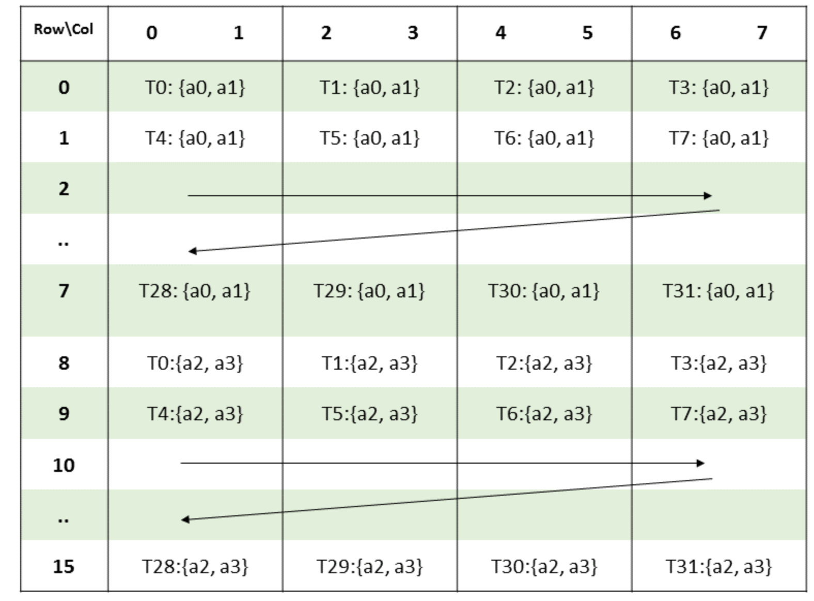

0-31 个线程每个先分别加载前 8 行的两个数据，然后再加载后 8 行的两个数据，这样每个线程就加载了 4 个数据。

对于矩阵 B，B 的 shape 是 8×8，一共 64 个数据，因此一个 warp 中的 32 个线程每个只需要加载两个 fp16 数据即可，假设这两个数据是 b0，b1。线程与数据的对应关系如下图所示。

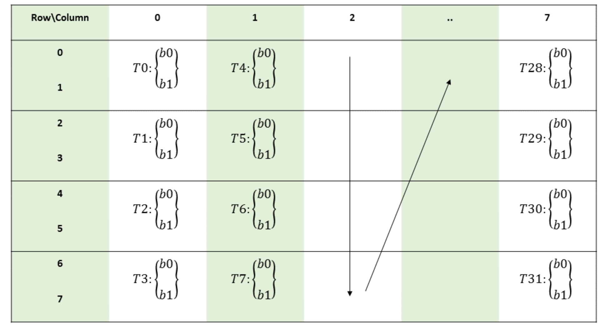

0-31 个线程每个线程沿着列方向加载两个数据，直到 64 个数据全部被加载完成。

这个 shape 只有上面一种方式加载矩阵 A 和 B 中的数据，因此 mma 中的参数 alayout 和 blayout 固定为 .row.col，修改成其他会报错。

对于矩阵 C/D，shape 是 16×8，一共 128 个数据。与矩阵 A 相同，一个线程也需要加载 4 个数据。当 C/D 的数据类型是 fp16 时，一个线程需要 2 个寄存器。当数据类型是 fp32 时，一个线程需要 4 个寄存器。线程与数据的对应关系如下。

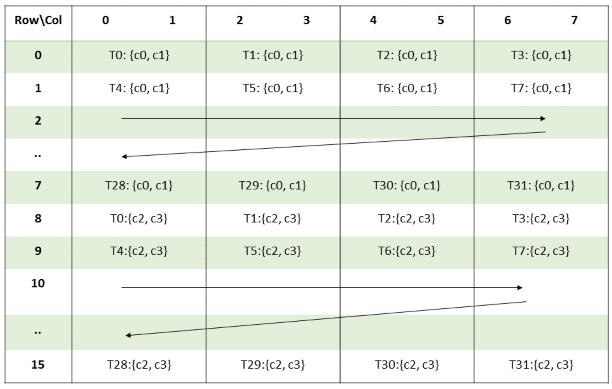


### 代码测试

m16n8k8 对应的计算代码如下。

```cpp
template <class TA, class TB, class TC>
__global__ void mma_kernel_m16n8k8_tn(TA *A, TB *B, TC *C, int num_tiles)
{
    using DRegisters = float[4];
    using ARegisters = uint32_t[2];
    using BRegisters = uint32_t[1];
    using CRegisters = float[4];

    ARegisters a;
    BRegisters b;
    CRegisters c = {0.0f};
    DRegisters d = {0.0f};

    int tid = threadIdx.x;

    int row_a = tid >> 2;
    int col_a = tid % 4 * 2;
    a[0] = *reinterpret_cast<uint32_t *>(A + row_a * 8 + col_a);
    a[1] = *reinterpret_cast<uint32_t *>(A + (row_a + 8) * 8 + col_a);

    int row_b = tid % 4 * 2;
    int col_b = tid >> 2;

    b[0] = *reinterpret_cast<uint32_t *>(B + col_b * 8 + row_b);

    asm volatile(
        "mma.sync.aligned.m16n8k8.row.col.f32.f16.f16.f32 "
        "{%0,  %1,  %2,  %3},"
        "{%4,  %5},"
        "{%6},"
        "{%7,  %8,  %9,  %10};\n"
        : "=f"(d[0]), "=f"(d[1]), "=f"(d[2]), "=f"(d[3])
        : "r"(a[0]), "r"(a[1]),
          "r"(b[0]),
          "f"(c[0]), "f"(c[1]), "f"(c[2]), "f"(c[3]));

    C[row_a * 8 + col_a + 0] = d[0];
    C[row_a * 8 + col_a + 1] = d[1];
    C[(row_a + 8) * 8 + col_a + 0] = d[2];
    C[(row_a + 8) * 8 + col_a + 1] = d[3];
}
```

由于线程与数据的对应关系变了，所以需要修改每一个线程从原始矩阵中加载数据的方式。然后使用 `mma.sync.aligned.m16n8k8.row.col.f32.f16.f16.f32` 内联汇编指令进行计算。

最终在根据矩阵 C 的加载方式将计算结果保存到 C 中。

计算结果如下：

```cpp
The physical order of A:
1.00    3.00    1.00    4.00    5.00    4.00    8.00    9.00    6.00    5.00    7.00    7.00    2.00    3.00    1.00    6.00    6.00    5.00    8.00    4.00    3.00    9.00    9.00    2.00    8.00    4.00    2.00    8.00    7.00    9.00    3.00    7.00    2.00    1.00    9.00    4.00    4.00    7.00    3.00    7.00    9.00    1.00    5.00    8.00    3.00    3.00    4.00    8.00    5.00    1.00    3.00    8.00    9.00    9.00    7.00    5.00    1.00    6.00    1.00    8.00    5.00    4.00    3.00    4.00    2.00    9.00    8.00    6.00    4.00    1.00    1.00    2.00    1.00    3.00    9.00    2.00    3.00    4.00    7.00    8.00    4.00    9.00    4.00    1.00    7.00    8.00    5.00    7.00    2.00    5.00    3.00    4.00    6.00    4.00    7.00    8.00    3.00    5.00    2.00    5.00    4.00    9.00    6.00    2.00    3.00    5.00    3.00    3.00    8.00    1.00    1.00    9.00    7.00    4.00    9.00    2.00    9.00    2.00    9.00    1.00    7.00    9.00    4.00    1.00    3.00    2.00    8.00    4.00

The physical order of B:
4.00    7.00    8.00    5.00    7.00    4.00    7.00    7.00    6.00    9.00    9.00    3.00    7.00    1.00    2.00    3.00    2.00    9.00    4.00    2.00    1.00    3.00    2.00    5.00    1.00    4.00    6.00    3.00    5.00    2.00    4.00    6.00    7.00    9.00    2.00    4.00    3.00    8.00    1.00    7.00    5.00    7.00    9.00    1.00    5.00    1.00    3.00    7.00    7.00    6.00    6.00    8.00    9.00    5.00    1.00    7.00    8.00    4.00    9.00    3.00    4.00    2.00    7.00    1.00

The logical shape of A:
    1.00    3.00    1.00    4.00    5.00    4.00    8.00    9.00
    6.00    5.00    7.00    7.00    2.00    3.00    1.00    6.00
    6.00    5.00    8.00    4.00    3.00    9.00    9.00    2.00
    8.00    4.00    2.00    8.00    7.00    9.00    3.00    7.00
    2.00    1.00    9.00    4.00    4.00    7.00    3.00    7.00
    9.00    1.00    5.00    8.00    3.00    3.00    4.00    8.00
    5.00    1.00    3.00    8.00    9.00    9.00    7.00    5.00
    1.00    6.00    1.00    8.00    5.00    4.00    3.00    4.00
    2.00    9.00    8.00    6.00    4.00    1.00    1.00    2.00
    1.00    3.00    9.00    2.00    3.00    4.00    7.00    8.00
    4.00    9.00    4.00    1.00    7.00    8.00    5.00    7.00
    2.00    5.00    3.00    4.00    6.00    4.00    7.00    8.00
    3.00    5.00    2.00    5.00    4.00    9.00    6.00    2.00
    3.00    5.00    3.00    3.00    8.00    1.00    1.00    9.00
    7.00    4.00    9.00    2.00    9.00    2.00    9.00    1.00
    7.00    9.00    4.00    1.00    3.00    2.00    8.00    4.00

The logical shape of B:
    4.00    6.00    2.00    1.00    7.00    5.00    7.00    8.00
    7.00    9.00    9.00    4.00    9.00    7.00    6.00    4.00
    8.00    9.00    4.00    6.00    2.00    9.00    6.00    9.00
    5.00    3.00    2.00    3.00    4.00    1.00    8.00    3.00
    7.00    7.00    1.00    5.00    3.00    5.00    9.00    4.00
    4.00    1.00    3.00    2.00    8.00    1.00    5.00    2.00
    7.00    2.00    2.00    4.00    1.00    3.00    1.00    7.00
    7.00    3.00    5.00    6.00    7.00    7.00    7.00    1.00

The result of C:
     223      136      119      150      170      155      199      134
     225      202      142      145      202      193      246      179
     277      219      155      167      223      206      247      247
     271      211      151      167      273      196      316      196
     233      176      123      160      177      187      229      171
     240      188      123      152      207      191      265      199
     274      191      122      172      223      177      291      203
     194      150      119      124      173      130      209      118
     218      220      148      142      170      189      220      169
     249      183      138      172      164      205      205      184
     281      232      183      180      260      227      271      193
     250      180      141      166      194      187      231      164
     208      151      122      124      194      134      204      155
     216      185      127      150      180      187      234      130
     279      251      128      174      170      227      250      263
     241      213      158      145      203      204      208      207

```

## m16n8k16

m16n8k16 是 mma 指令支持的另一种矩阵运算的形状，该形状支持 fp64，fp16/bf16，u8/s8，e4m3/e5m2 的数据格式。下面以 fp16/bf16 数据类型为例，分析该形状下每个线程与矩阵数据的对应关系。

### 线程与数据对应关系

对于矩阵 A，A 的 shape 是 16×16，一共 256 个数据。一个 warp有32个线程，所以一个线程需要使用4个寄存器处理8个fp16数据。假设这8个数据分别是a0，a1，a2，a3，a4，a5，a6，a7，线程与数据的对应关系如下图所示。

矩阵A：16×16 可以看成 4 个 8×8 的矩阵，每个线程在一个 8×8 矩阵中处理 2 个元素，4 个矩阵正好处理 8 个元素。

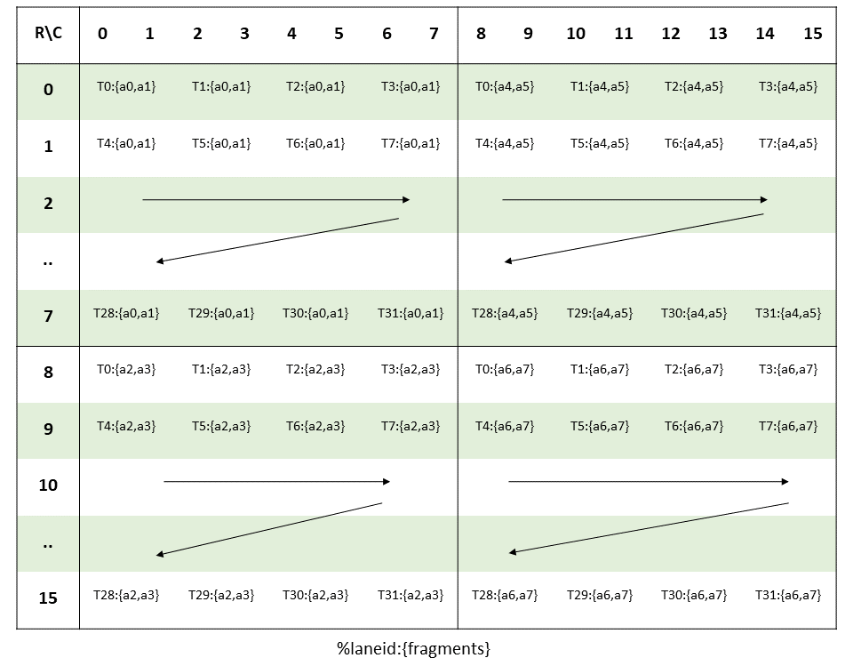


对于矩阵 B，B 的 shape 是 16×8，一共 128 个数据。一个线程需要用 2 个寄存器处理 4 个 fp16 数据。假设这 4 个数据分别是 b0，b1，b2，b3，则线程与数据之间的对应关系如下图所示。

矩阵B：16×8 可以看成 2 个 8×8 矩阵，每个线程按照下图中的顺序处理一个 8×8 矩阵中的 2 个数据，2 个矩阵正好处理 4 个数据。

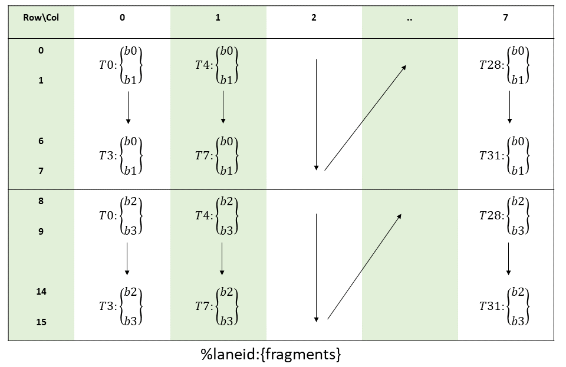

对于矩阵 C/D，shape 是 16×8，一共 128 个数据。与矩阵 B 相同，一个线程也需要加载 4 个 fp16 数据。当 C/D 的数据类型是 fp16 时，一个线程需要 2 个寄存器。当数据类型是 fp32 时，一个线程需要 4 个寄存器。线程与数据的对应关系如下。

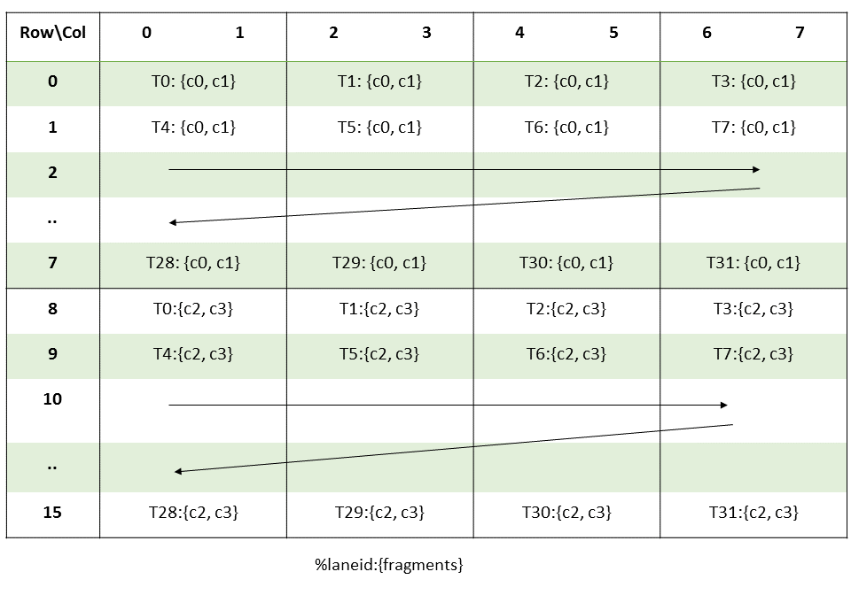

### 代码测试

m16n8k16 对应的计算代码如下。

```cpp
template <class TA, class TB, class TC>
__global__ void mma_kernel_m16n8k16_tn(TA *A, TB *B, TC *C, int M, int N, int K)
{
    uint32_t a[4];
    uint32_t b[2];
    float c[4] = {0.0f};
    float d[4] = {0.0f};

    int tid = threadIdx.x;

    int row_a = tid >> 2;
    int col_a = tid % 4 * 2;
    a[0] = *reinterpret_cast<uint32_t *>(A + row_a * 16 + col_a);
    a[1] = *reinterpret_cast<uint32_t *>(A + (row_a + 8) * 16 + col_a);
    a[2] = *reinterpret_cast<uint32_t *>(A + row_a * 16 + col_a + 8);
    a[3] = *reinterpret_cast<uint32_t *>(A + (row_a + 8) * 16 + col_a + 8);

    int row_b = tid % 4 * 2;
    int col_b = tid >> 2;

    b[0] = *reinterpret_cast<uint32_t *>(B + col_b * 16 + row_b);
    b[1] = *reinterpret_cast<uint32_t *>(B + col_b * 16 + row_b + 8);

    asm volatile(
        "mma.sync.aligned.m16n8k16.row.col.f32.f16.f16.f32 "
        "{%0,  %1,  %2,  %3},"
        "{%4,  %5,  %6,  %7},"
        "{%8,  %9},"
        "{%10, %11, %12, %13};\n"
        : "=f"(d[0]), "=f"(d[1]), "=f"(d[2]), "=f"(d[3])
        : "r"(a[0]), "r"(a[1]), "r"(a[2]), "r"(a[3]),
          "r"(b[0]), "r"(b[1]),
          "f"(c[0]), "f"(c[1]), "f"(c[2]), "f"(c[3]));

    C[row_a * 8 + col_a + 0] = d[0];
    C[row_a * 8 + col_a + 1] = d[1];
    C[(row_a + 8) * 8 + col_a + 0] = d[2];
    C[(row_a + 8) * 8 + col_a + 1] = d[3];
}
```

由于在这种 shape 中线程只有一种加载数据的方式，所以 alayout 和 blayout 固定为 .row.col，修改成其他会报错。

最终在根据矩阵 C 的加载方式将计算结果保存到 C 中。
计算结果如下：

```cpp
m = 16, n = 8, k = 16
The physical order of A:
 1  3  1  4  5  4  8  9  6  5  7  7  2  3  1  6  6  5  8  4  3  9  9  2  8  4  2  8  7  9  3  7  2  1  9  4  4  7  3  7  9  1  5  8  3  3  4  8  5  1  3  8  9  9  7  5  1  6  1  8  5  4  3  4  2  9  8  6  4  1  1  2  1  3  9  2  3  4  7  8  4  9  4  1  7  8  5  7  2  5  3  4  6  4  7  8  3  5  2  5  4  9  6  2  3  5  3  3  8  1  1  9  7  4  9  2  9  2  9  1  7  9  4  1  3  2  8  4  4  7  8  5  7  4  7  7  6  9  9  3  7  1  2  3  2  9  4  2  1  3  2  5  1  4  6  3  5  2  4  6  7  9  2  4  3  8  1  7  5  7  9  1  5  1  3  7  7  6  6  8  9  5  1  7  8  4  9  3  4  2  7  1  1  8  4  2  4  2  8  6  6  7  6  2  5  8  8  3  5  2  8  2  6  8  8  5  1  5  5  4  4  2  4  5  7  5  4  1  6  2  7  2  6  3  3  8  9  8  1  4  9  6  3  6  3  8  8  3  1  3  4  5  3  7  9  9

The physical order of B:
 2  3  1  5  2  7  4  5  7  5  3  6  1  2  7  1  7  7  4  7  5  2  7  6  2  1  1  4  7  7  4  6  7  2  1  6  6  3  1  3  7  3  7  7  2  2  5  9  9  8  4  2  7  2  5  7  2  3  1  7  9  2  3  4  1  2  9  6  4  9  7  8  1  2  5  2  3  8  8  9  6  3  2  2  4  6  6  3  9  4  9  6  6  3  1  6  4  7  1  5  7  7  3  5  8  5  6  8  3  3  8  7  5  9  8  6  3  2  8  9  5  8  6  1  8  4  5  9

The logical shape of A:
 1  3  1  4  5  4  8  9  6  5  7  7  2  3  1  6
 6  5  8  4  3  9  9  2  8  4  2  8  7  9  3  7
 2  1  9  4  4  7  3  7  9  1  5  8  3  3  4  8
 5  1  3  8  9  9  7  5  1  6  1  8  5  4  3  4
 2  9  8  6  4  1  1  2  1  3  9  2  3  4  7  8
 4  9  4  1  7  8  5  7  2  5  3  4  6  4  7  8
 3  5  2  5  4  9  6  2  3  5  3  3  8  1  1  9
 7  4  9  2  9  2  9  1  7  9  4  1  3  2  8  4
 4  7  8  5  7  4  7  7  6  9  9  3  7  1  2  3
 2  9  4  2  1  3  2  5  1  4  6  3  5  2  4  6
 7  9  2  4  3  8  1  7  5  7  9  1  5  1  3  7
 7  6  6  8  9  5  1  7  8  4  9  3  4  2  7  1
 1  8  4  2  4  2  8  6  6  7  6  2  5  8  8  3
 5  2  8  2  6  8  8  5  1  5  5  4  4  2  4  5
 7  5  4  1  6  2  7  2  6  3  3  8  9  8  1  4
 9  6  3  6  3  8  8  3  1  3  4  5  3  7  9  9

The logical shape of B:
 2  7  7  9  1  6  4  5
 3  7  2  8  2  3  7  9
 1  4  1  4  9  2  1  8
 5  7  6  2  6  2  5  6
 2  5  6  7  4  4  7  3
 7  2  3  2  9  6  7  2
 4  7  1  5  7  6  3  8
 5  6  3  7  8  3  5  9
 7  2  7  2  1  9  8  5
 5  1  3  3  2  4  5  8
 3  1  7  1  5  9  6  6
 6  4  7  7  2  6  8  1
 1  7  2  9  3  6  3  8
 2  7  2  2  8  3  3  4
 7  4  5  3  8  1  8  5
 1  6  9  4  9  6  7  9

The result of C:
 298  330  339  325  381  381  414  438
 353  465  392  436  506  469  489  542
 316  344  379  335  454  395  442  447
 316  392  348  387  429  361  429  426
 227  339  324  305  401  300  383  463
 312  416  353  430  468  380  476  522
 252  338  308  333  371  357  382  432
 297  367  347  377  405  378  424  507
 325  402  368  427  436  440  463  581
 207  287  250  294  315  273  327  403
 302  354  373  373  390  406  456  510
 349  392  414  401  425  411  495  506
 311  383  307  357  427  364  429  518
 271  343  304  352  434  353  379  446
 252  399  327  412  344  395  391  439
 331  453  398  405  503  396  479  511
```
