# wgmma 指令

[Asynchronous Warpgroup Level Matrix Multiply-Accumulate Instructions](https://docs.nvidia.com/cuda/parallel-thread-execution/index.html?highlight=mma%2520sync%2520aligned%2520m8n8k4#asynchronous-warpgroup-level-matrix-instructions)

## wgmma

wgmma 是 warpgroup 级别的矩阵乘加指令。一个 warpgroup 是连续的四个 warp 形成的集合，共 128 个线程。

warpgroup 级别的矩阵乘加有下面两种形式，可以通过参数来控制使用哪一种形式。

$D = A × B + D$

$D = A × B$

通过 wgmma 指令可以使用一个 warpgroup 中的所有线程共同执行矩阵乘加操作。具体的计算流程如下：

1. 加载矩阵 A，B 中的数据到寄存器或共享内存中。

2. 执行 wgmma.fence 操作。wgmma.fence 用来确保寄存器可用。

3. 使用 wgmma.mma_async 发射异步矩阵乘加操作。

4. 通过 wgmma.commit_group 指令创建一个 wgmma-group 并把之前的 wgmma.mma_sync 全部提交进去。

5. 通过 wgmma.wait 等待所需的 wgmma-group 中的计算完成。


wgmma 的使用格式如下：以 fp16 为例。

```cpp
wgmma.mma_async.sync.aligned.shape.dtype.f16.f16  d, a-desc, b-desc, scale-d, imm-scale-a, imm-scale-b, imm-trans-a, imm-trans-b;
```

开头固定 `wgmma.mma_async`。

`.sync` 表明 `wgmma.mma_async` 指令将使执行线程进入等待状态，直至 warp 内所有线程都完成相同 `wgmma.mma_async` 指令的执行后才会继续。

`.aligned` 表示 warpgroup 中所有线程必须执行相同的 `wgmma.mma_async` 指令。

`shape` 和 `dtype` 表示指令对应的形状和数据类型。

`d` 代表矩阵 D 对应的寄存器。

`a-desc` 和 `b-desc` 是一个 64 位的寄存器，表示矩阵 A 和 B 在共享内存中的描述符。只有从共享内存中加载矩阵时需要描述符。描述符记录了 wgmma 如何加载共享内存中的 A 和 B。

`b-desc` 是必须的，因为 B 必须从共享内存加载。`a-desc` 是可选的，矩阵 A 可以从寄存器中读取也可以从共享内存中读取。

`scale-d` 表示是否需要累加器 D，`scale-d` 的取值为 0 或 1，等于 0 时按照 $D = A × B$ 计算，等于 1 时按照 $D = A × B + D$ 计算。

`imm-scale-a`, `imm-scale-b` 表示是否对矩阵 A 和 B 进行取反，取值为 -1 和 1，1 不取反，-1 取反。取反就是 -1 × A。

`imm-trans-a`, `imm-trans-b` 表示是否对矩阵 A 和 B 进行转置操作。取值为 0 和 1，0 表示不转置，1 表示转置。

wgmma 支持 fp16，bf16，tf32，e4m3/e5m2，u8/s8 和 b1 等多种数据类型，不同的数据类型有不同的计算形状。

对于 fp16 和 bf16 的数据类型，计算的形状是 __m64nNk16__，其中，N 是以 8 为步长，从 8-256 的整数。

矩阵 A 的数据可以来自寄存器或共享内存，矩阵 B 的数据必须来自共享内存。当矩阵的地址在共享内存中时，必须对齐 16 字节。

## 线程与数据

wgmma 指令可以从寄存器或共享内存中加载数据。从寄存器中加载数据时，每个线程需要按照特定的布局加载原始矩阵的数据到寄存器中，每个线程拥有的数据称为原始矩阵的一个 fragments。从共享内存中加载数据时，需要一个 64 位的描述符来描述数据在共享内存中的组织形式。

### 从寄存器加载

#### 矩阵 A

由于 wgmma 在半精度时 shape 固定是 __m64nNk16__，所以矩阵 A 的 shape 固定是 64×16。一个 warpgroup 中的线程都持有矩阵 A 的一个 fragment。

此时一个线程需要 4 个寄存器，每个寄存器包含 2 个半精度元素，所以一个线程可以加载 8 个矩阵 A 中的元素。

128 个线程与元素的对应关系如下，一个 warp 的线程负责 16 行 16 列数据，4 个 warp 正好对应 64 行 16 列。而且单个 warp 的加载方式与 mma 指令 [m16nNk16](./mma.md) 的形状相同。

<div align="center">
    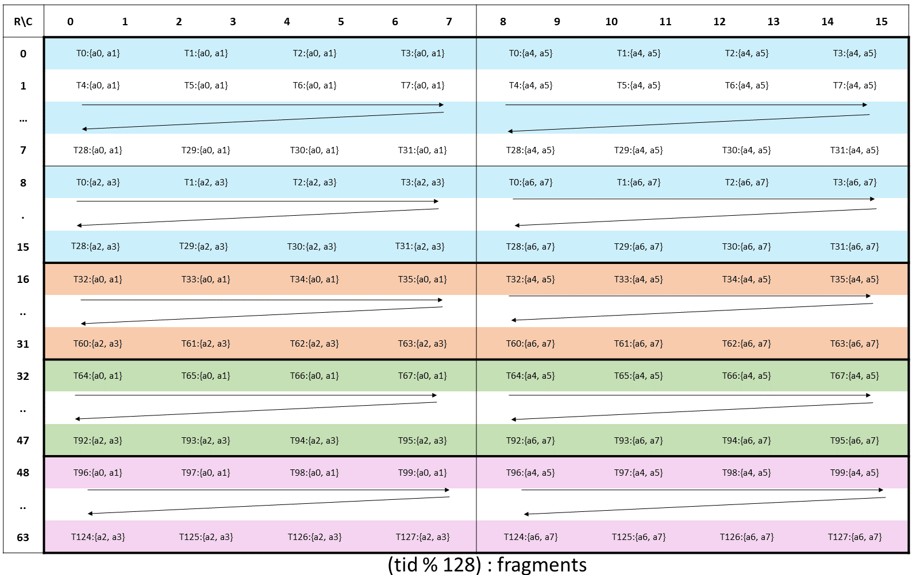<br>
    <small>wgmma A</small>
</div>
<br>

#### 矩阵 D

矩阵 D 是累加矩阵，shape 是 64×N，所以每个线程需要的寄存器数量与 N 有关，而且数据类型可以是 fp16 或 fp32。

当数据类型是 fp16 时，一个线程包含 N/4 个寄存器，每个寄存器保存 2 个半精度元素。当数据类型是 fp32 时，一个线程包含 N/2 个寄存器，一个寄存器包含一个 fp32 元素。

128 个线程的对应关系如下，可以看到 8 列为一组，需要的寄存器的数量随着 N 的增多而增多。当 N 等于 8 时，一个 warp 的线程和数据的对应关系也和 mma 指令的 [m16nNk16](./mma.md) 的 D 矩阵类似。

<div align="center">
    <br>
    <small>wgmma D</small>
</div>
<br>

其他的 shape 对应其他的数据类型，就不一一介绍了，具体可以参考，[Register Fragments and Shared Memory Matrix Layouts](https://docs.nvidia.com/cuda/parallel-thread-execution/index.html?highlight=mma%2520sync%2520aligned%2520m8n8k4#asynchronous-warpgroup-level-matrix-fragment)

### 从共享内存中加载

wgmma 支持直接从共享内存中加载数据。其中矩阵 A 可以从共享内存中加载数据也可以从寄存器中加载数据，但是矩阵 B 必须从共享内存中加载数据。

wgmma 从共享内存中加载数据时的计算流程如下：

1. 根据矩阵乘规模选择合适的 swizzle 模式。

2. 通过 swizzle 的 layout 对 shared memory 进行 tiling，并把数据按照 tiling 后的 layout 保存到 shared memory 中。

3. 选择合适的 wgmma 指令。

4. 根据共享内存使用的 swizzle 模式和 wgmma 的大小创建矩阵描述符。

5. 使用 wgmma 指令计算。

6. 写回计算结果。

#### Swizzle 模式

访问共享内存时可能出现 bank conflicts，可以通过 swizzle 避免 bank conflicts。所以 wgmma 在加载共享内存的数据时需要使用 swizzle 模式。Bank conflicts 和 swizzle 的详细介绍可以参考[这篇](https://zhuanlan.zhihu.com/p/1906737849576953561)文章。

wgmma 支持 4 种 swizzle 模式：__None__，__32B Swizzle Mode__，__64B Swizzle Mode__ 和 __128B Swizzle Mode__。不同的模式对应不同大小的数据布局，称为 __swizzle atom layout__。而且根据数据的主序不同，swizzle layout 的布局也不一样。

下面介绍不同 swizzle 模式在不同主序下的 atom layout。因为 swizzle 都是以 __128bit__ 大小为基本单位的，因此为了方便说明，后面 swizzle 模式的图片中的元素都是 __128bit__。

> 矩阵相乘有 MNK 三个维度，如果数据在 MNK 三个方向连续分别被称为 M-major，N-major，K-major，因为 MN 类似，所以一般称为 MN-major。

__None swizzle__

None swizzle 就是不使用 swizzle 的模式。

在 K-major 下，none swizzle 的 atom layout 是 `(8,1):(1,1)`，大小为 8 行 1 列。如下所示。

<div align="center">
    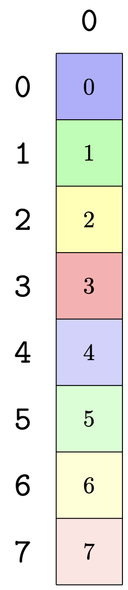<br>
    <small>none swizzle k-major</small>
</div>
<br>

在 MN-major 下，none swizzle 的 Layout atom 是 `(1,8):(1,1)`，大小为 1 行 8 列。如下所示。

<div align="center">
    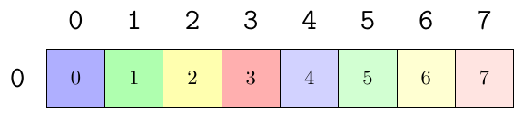<br>
    <small>none swizzle mn-major</small>
</div>
<br>

在上图中一个色块代表 128bit 大小的数据。因为 swizzle 是以 128bit 为基本数据单元进行的。针对具体的数据类型需要根据数据类型的长度进行 recast。比如对于 half 类型，一个元素有 16bit，所以 8 个元素组成一个 swizzle 数据单元，此时 K-major 和 MN-major 的数据布局就会变成下面这样。上面的是 K-major，数据在 K 方向是连续的，包含 128 / 16 = 8 个元素；下面是 MN-major，数据在 MN 方向是连续的，也包含 8 个元素。


<div align="center">
    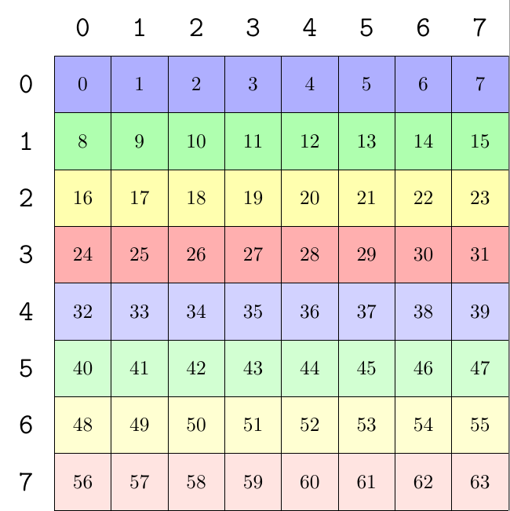<br>
    <small>none swizzle k-major 16bit</small>
</div>
<br>
<div align="center">
    <br>
    <small>none swizzle mn-major 16bit</small>
</div>
<br>

__32B swizzle__

32B swizzle mode 下一行有 32 bytes 的数据参与 swizzle。数据布局如下。

在 K-major 下，32B swizzle layout 是 `Sw<1,0,3> o (8,2):(2,1)`，大小是 8 行 2 列。

<div align="center">
    <br>
    <small>32B swizzle k-major</small>
</div>
<br>

在 MN-major 下，32B swizzle 的 layout 是 `Sw<1,0,3> o (2,8):(1,2)`，大小为 2 行 8 列。

<div align="center">
    <br>
    <small>32B swizzle mn-major</small>
</div>
<br>

Sw\<B,M,S\> 是用于描述 swizzle 方式的模板，B 表示一个 swizzle pattern 有 $ 2^B $ 行；M 表示 $ 2^M $ 个元素作为 swizzle 的一个基本元素；S 表示 swizzle pattern 有 $ 2^S $ 列。以 32B swizzle 为例，Sw<1,0,3> 表示 swizzle pattern 有 2 行 8 列，1 个元素就是 swizzle 的基本元素。

__64B swizzle__

64B swizzle mode 下一行有 64 bytes 的数据参与 swizzle。数据布局如下。

在 K-major 下，64B swizzle layout 是 `Sw<2,0,3> o (8,4):(4,1)`，大小是 8 行 4 列。

<div align="center">
    <br>
    <small>64B swizzle k-major</small>
</div>
<br>

在 MN-major 下，64B swizzle 的 layout 是 `Sw<2,0,3> o (4,8):(1,4)`，大小为 4 行 8 列。

<div align="center">
    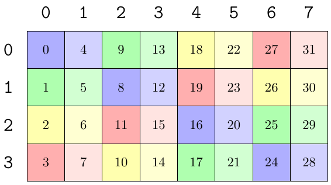<br>
    <small>64B swizzle mn-major</small>
</div>
<br>

__128B swizzle__

128B swizzle mode 下一行有 128 bytes 的数据参与 swizzle。数据布局如下。

在 K-major 下，128B swizzle layout 是 `Sw<3,0,3> o (8,8):(8,1)`，大小是 8 行 8 列。

<div align="center">
    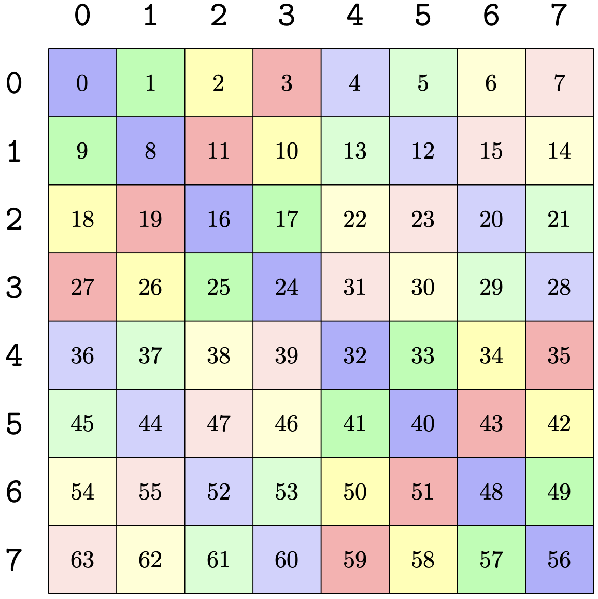<br>
    <small>128B swizzle k-major</small>
</div>
<br>

在 MN-major 下，128B swizzle 的 layout 是 `Sw<3,0,3> o (8,8):(1,8)`，大小为 8 行 8 列。

<div align="center">
    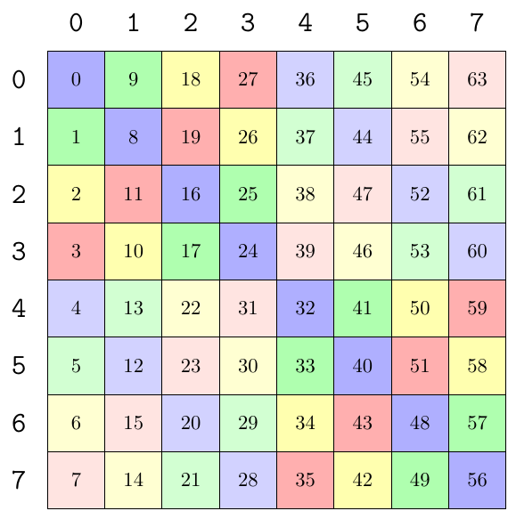<br>
    <small>128B swizzle mn-major</small>
</div>
<br>

如果是 half 类型，128B swizzle 在 K-major 下的 layout 为 `Sw<3,3,3> o (8,64):(64,1)`，如下如所示。

<div align="center">
    <br>
    <small>128B swizzle k-major 16bit</small>
</div>
<br>

#### tile_to_shape

当一块共享内存的大小很大时，如果要应用 swizzle mode，就需要把 swizzle mode 对应的 pattern layout 对 smem 的 shape 做 tiling。

tiling 过程如下所示：假如 swizzle pattern 的大小是 m,n，smem 的大小是 M，N。因此 smem 可以被 swizzle pattern 在 M 方向分成 M/m 份，在 N 方向上分成 N/n 份。此时 smem 的布局就是用 swizzle pattern tiling 后的布局了。

<div align="center">
    <br>
    <small>tile_to_shape</small>
</div>
<br>

__例 1__

假设 shared memory 的大小是 16×64，数据类型是 fp16。

使用 none swizzle pattern k-major 进行 tiling，会得到下图这样。为了方便起见，下图已经把 fp16 recast到 128bit 了，所以 smem 的 shape 变成了 16×8。

<div align="center">
    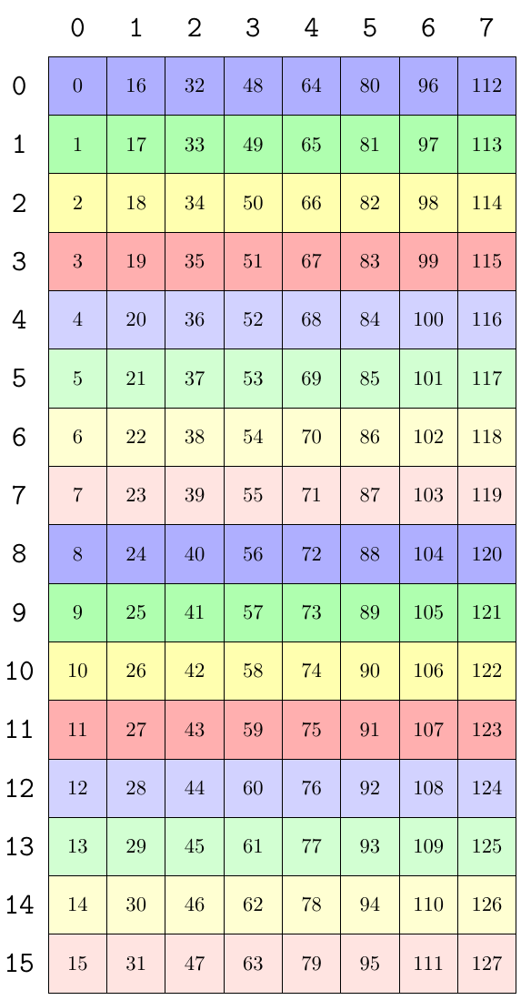<br>
    <small>none swizzle pattern k-major tiling result</small>
</div>
<br>

可以看到，整个 smem 以 none swizzle K-major 的 pattern 大小为单位，在列方向上分成了 2 份，在行方向上分成了 8 份。

使用 32B swizzle pattern k-major 进行分区会得到下面这样。可以看到，整个 smem 以 32B swizzle K-major 的 pattern 大小为单位，在列方向上分成了 2 份，在行方向上分成了 4 份。

<div align="center">
    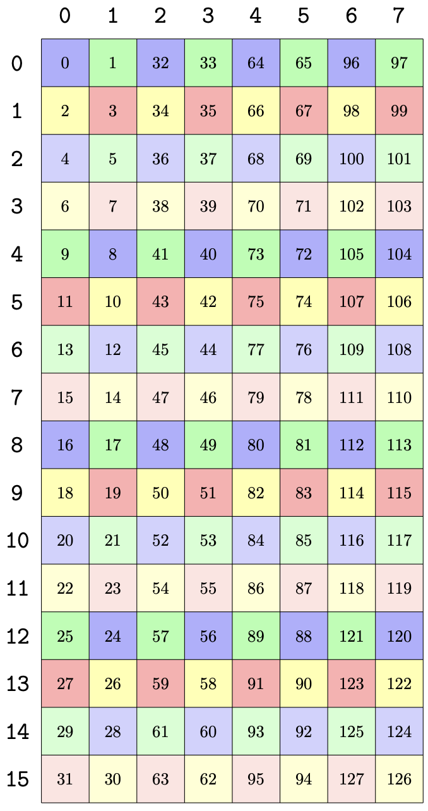<br>
    <small>32B swizzle pattern k-major tiling result</small>
</div>
<br>

__例 2__

假设 shared memory 的大小是 128×16，数据类型是 fp16。

使用 none swizzle pattern MN-major 进行分区得到下面的 layout。 为了方便起见，下图已经把 fp16 recast到 128bit 了，所以 smem 的 shape 变成了 16×16。

<div align="center">
    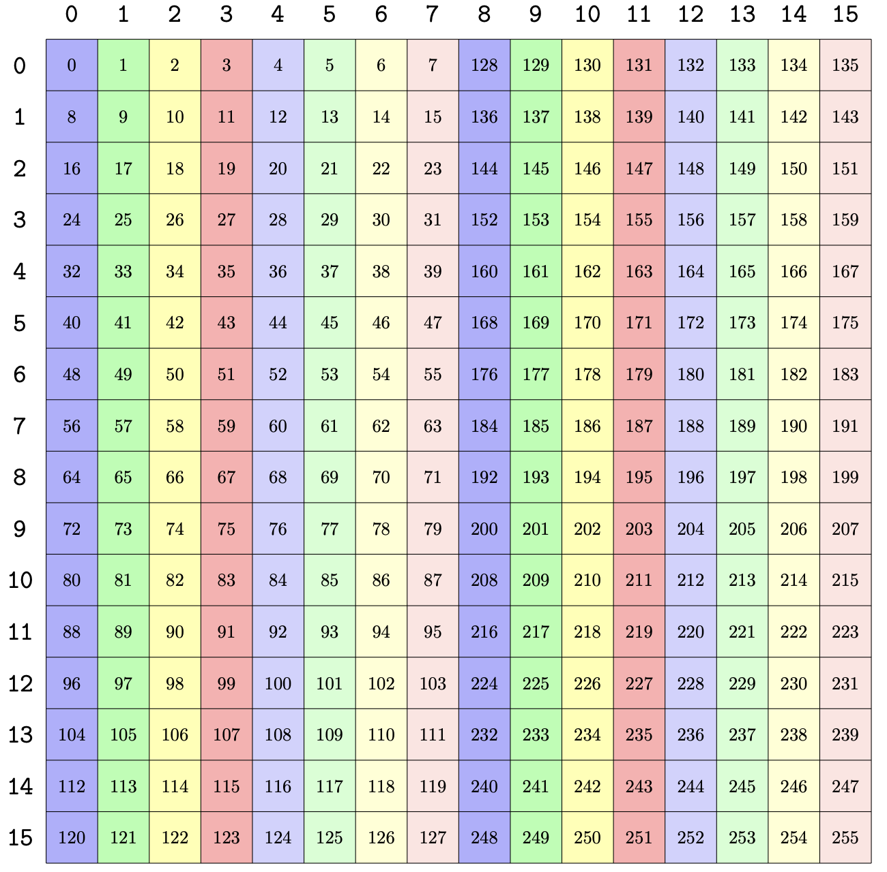<br>
    <small>none swizzle pattern mn-major tiling result</small>
</div>
<br>

可以看到，整个 smem 在列方向上分成了 16 份，在行方向上分成了 2 份。

使用 128B swizzle pattern MN-major 对该 smem 进行分区，会得到下面这样，整个 smem 以 128B swizzle MN-major 的 pattern 大小为单位，在列方向上分成了 2 块，在行方向上分成了 2 块。

<div align="center">
    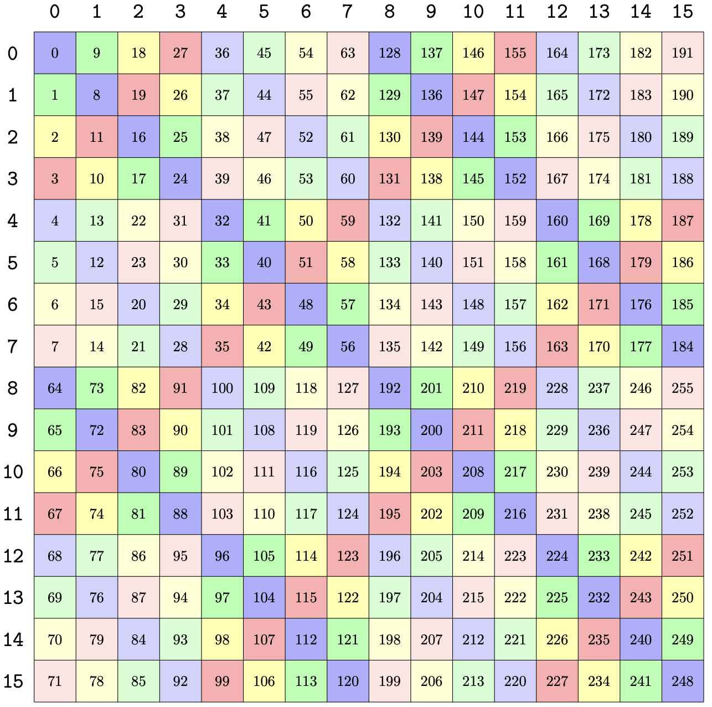<br>
    <small>128B swizzle pattern mn-major tiling result</small>
</div>
<br>

#### LBO & SBO

因为 shared memory 会被 swizzle pattern 分成多份，为了描述 pattern 之间的关系，引入了两个变量，`Leading dimension byte offset` 和 `Stride dimension byte offset`，简称 `LBO` 和 `SBO`。

LBO 就是 swizzle pattern 在主序方向上的 offset，SBO 是在非主序方向上的 offset。(MN-major 的 none swizzle 除外，这个是反过来的)。

按照 PTX 文档的描述，LBO 和 SBO 用来描述 pattern 间在两个维度的偏移量。具体如下：

>在计算 LBO 和 SBO 时默认元素大小为 128bit。

对于 Leading dimension byte offset

- K-major 时：

    - 如果是 none swizzle，LBO 是两列之间的 offset。

    - 如果有 swizzle，LBO 默认是 1。因为两列之间是连续的。

-  MN-major 时：

    - 如果是 none swizzle，LBO 是前 8 列到后 8 列的 offset。这里有些特殊，虽然是 MN-major，但是 LBO 却是行方向上的 offset。

    - 如果有 swizzle，LBO 是前 swizzle-byte-size / 16 行间的 offset。也就是 swizzle 的宽度。

<div align="center">
    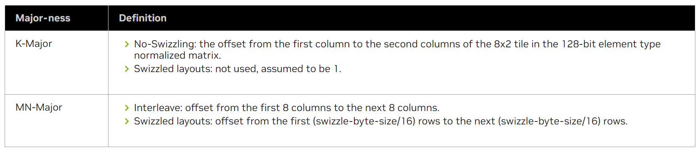<br>
    <small>Leading dimension byte offset</small>
</div>
<br>

对于 Stride dimension byte offset

- K-major 时：

    - 不管有没有 swizzle，LBO 都是前 8 行到后 8 行的 offset。

- MN-major时：

    - 如果是 none swizzle，SBO 是第一行到第二行的 offset。(这里也有些特殊，SBO 是 MN-major 上的 offset)。

    - 如果有 swizzle，SBO 是前 8 列到次 8 列的 offset。

<div align="center">
    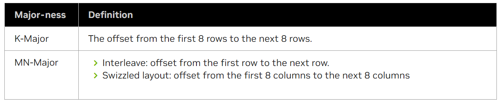<br>
    <small>Stride dimension byte offset</small>
</div>
<br>

以 tile_to_shape 中的例子为例：

- 第一个图是 K-major none swizzle，可以看到，LBO 是两列之间的 offset，大小是 16。SBO 是前 8 行和后 8 行之间的 offset，大小是 8。

- 第二个图是 K-major 32B swizzle，LBO 是两列之间的 offset。因为 wgmma fp16 在 K 方向固定是 16，也就是一个 wgmma 只会计算 128bit 下 K 方向的两列，因此所有的 swizzle 下，两列间 offset 都是 1。SBO 是 前 8 行到后 8 行的offset，这里是 16。

- 第三个图是 MN-major 下 none swizzle。这里跟其他情况不同，LBO 是 前 8 列到后 8 列，等于 128。SBO 是第一行到第二行的 offset，等于 8。

- 第三个图是 MN-major 下 128B swizzle。这种情况下 LBO 和 swizzle pattern 的宽度有关。128B 是前 8 行到后 8 行，等于 64。SBO 是前 8 列到后 8 列，等于 128。

#### canonical layout

使用 swizzle pattern 对 smem 进行 tiling 后的布局可以用 canonical layout 表示。通过计算 canonical layout 的 stride 可以方便的获取 LBO 和 SBO。不同的 swizzle 模式对应的 canonical layout。如下所示：

<div align="center">
    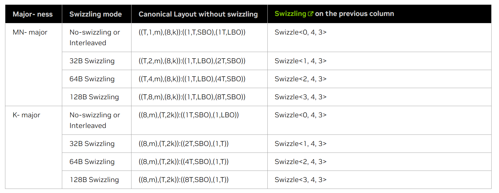<br>
    <small>canonical_layout</small>
</div>
<br>

上图是 PTX 中介绍的 canonical layout，比较复杂。cutlass 中针对 fp16 简化成了下面这样。

```cpp
    /* In units of uint128_t, each GmmaDescriptor Major-MN describes a canonical layout of the form
     *
     * LayoutType::INTERLEAVE         : Swizzle<0,4,3> o smem_ptr o ((1,n),(8,k)):((X,SBO),(1,LBO))
     * LayoutType::B32                : Swizzle<1,4,3> o smem_ptr o ((2,n),(8,k)):((1,LBO),(2,SBO))
     * LayoutType::B64                : Swizzle<2,4,3> o smem_ptr o ((4,n),(8,k)):((1,LBO),(4,SBO))
     * LayoutType::B128               : Swizzle<3,4,3> o smem_ptr o ((8,n),(8,k)):((1,LBO),(8,SBO))
     */
    /* In units of uint128_t, each GmmaDescriptor Major-K describes a canonical layout of the form
     *
     * LayoutType::INTERLEAVE    : Swizzle<0,4,3> o smem_ptr o ((8,n),2):((1,SBO),LBO)
     * LayoutType::B32           : Swizzle<1,4,3> o smem_ptr o ((8,n),2):((2,SBO),1)
     * LayoutType::B64           : Swizzle<2,4,3> o smem_ptr o ((8,n),2):((4,SBO),1)
     * LayoutType::B128          : Swizzle<3,4,3> o smem_ptr o ((8,n),2):((8,SBO),1)
     */
```

对于 MN-major，canonical layout 的 shape 是 `(W,n),(8,k)`，其中 W 是 swizzle 的宽度，分别是 1，2，4，8。n 是 MN 方向被 swizzle 的宽度分成了几块。K 方向上是 (8,k)，8 代表一个 swizzle pattern 的列数，因为 wgmma 只支持 K=16，所以 k 固定是 2。

再看 stride，除了 none swizzle 是 `(X,SBO),(1,LBO)`，其余都是 `(1,LBO),(W,SBO)`。在 none swizzle 中，因为第一维的 shape 是 1，所以对应的 stride 是 X，表示没有意义。对于其他的 swizzle，因为是 MN-major，所以 MN 方向的 stride 内部是 1，外部是 LBO，也就是整个 swizzle pattern 的个数。K 方向上第一个维度的 stride 是 swizzle 对应的宽度，第二个维度就是 SBO 了。

对于 K-major 比较简单，因为 swizzle pattern 都是 8 行，所以 MN 方向上的内部 shape 都是 8，n 是 MN 方向被分成了几块。K 方向因为是 16，对于128bit 就是 2。再看 stride，MN 方向上的内部 stride 和 swizzle 的宽度有关，外部 stride 就是整个 pattern 的大小。K 方向除了 none swizzle，其他的 LBO 都是 1。

#### 矩阵描述符

从共享内存中加载需要一个 64 位的矩阵描述符来描述矩阵的信息。矩阵描述符指明了矩阵在共享内存中的属性，是一个 64bit 的寄存器，由下面几个部分组成：

1. 矩阵的起始地址，14 位，占用 16 位。

2. leading dimension byte offset 的大小，14 位，占用 16 位。

3. stride dimension byte offset的大小，14 位，占用 16 位。

4. matrix base offset，默认为 0，3 位，占用 8 位。

5. swizzling mode，2 位，占用 8 位。0 没有 swizzle，1 是 128B swizzle，2 是 64B swizzle，3 是32B swizzle。

<div align="center">
    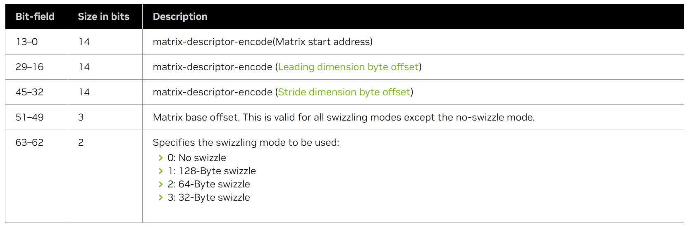<br>
    <small>wgmma_desc</small>
</div>
<br>

可以看到，在矩阵描述符中有 5 个变量需要设置，其中矩阵的起始地址就是当前 wgmma 指令处理的数据所在共享内存的地址，matrix base offset 默认为 0，所以主要看 swizzling mode，leading dimension byte offset（LBO）和 stride dimension byte offset（SBO）这三个值是怎么设置的。


## m64n32k16

下面以 shape m64n32k16 为例介绍 wgmma 指令的使用方法。

- 例 1：矩阵 A 和矩阵 B 都是 K-major，none-swizzle。

- 例 2：矩阵 A 是 M-major，64B swizzle。矩阵 B 是 N-major，none swizzle。

- 例 3：矩阵 A 是 M-major，128B swizzle。矩阵 B 是 K-major，32B swizzle。

- 例 4：矩阵 A 从寄存器中加载数据，矩阵 B 是 N-major，64B swizzle。


从共享内存加载矩阵元素需要考虑矩阵的主序和转置问题。一个矩阵有 row-major 和 column-major 两种形式。row-major 表示矩阵元素在行方向上连续，column-major 表示矩阵元素在列方向上连续。因为矩阵 A 的形状是 M×K，矩阵 B 的形状是 N×K，所以又可以称为 M-major，N-major 或 K-major。

前面提到，指令中的 imm-trans-a, imm-trans-b 参数表示是否对矩阵 A 和 B 进行转置操作。当矩阵 A 是 K-major 时，imm-trans-a 需要设为 0，当矩阵 A 是 M-major 时，imm-trans-a 需要设为 1。同样的，当矩阵 B 是 K-major 时，imm-trans-b 需要设为 0，当矩阵 B 是 N-major 时，imm-trans-b 需要设为 1。简言之就是 K-major 不需要设置转置，MN-major 需要设置转置。具体为什么可以参考最后附录的分析。

### AB K-major，none-swizzle

以 m64n32k16，A=fp16，B=fp16，C=fp32 为例。

首先初始化数据

```cpp
int main()
{
    srand(1234);

    int M = 64, N = 32, K = 16;

    int A_size = M * K;
    int B_size = K * N;
    int C_size = M * N;

    using TA = cute::half_t;
    using TB = cute::half_t;
    using TC = float;

    thrust::host_vector<TA> h_A(A_size);
    thrust::host_vector<TB> h_B(B_size);
    thrust::host_vector<TC> h_C(C_size);

    for (int i = 0; i < A_size; ++i) h_A[i] = static_cast<TA>(i);
    for (int i = 0; i < B_size; ++i) h_B[i] = static_cast<TB>(i);

    thrust::device_vector<TA> d_A = h_A;
    thrust::device_vector<TB> d_B = h_B;
    thrust::device_vector<TC> d_C = h_C;
    thrust::host_vector<TC> cute_result;

    dim3 blocks(1);
    dim3 threads(128);

    wgmma_kernel_m64n32k16_ss<TA, TB, TC><<<blocks, threads>>>(d_A.data().get(), d_B.data().get(), d_C.data().get(), M, N, K);
    
    return 0;
}
```

当 A 和 B 从 shared memory 中加载时需要描述符。下面的描述符参考 cute 中的定义。

```cpp
union GmmaDesc
{
    uint64_t desc_;

    // Bitfield implementation avoids the need for shifts in assignment
    struct
    {
        // start_address, bit [0,14), 4LSB not included
        uint16_t start_address_ : 14, : 2; // 14 bits [0,14), 2 bits unused
        // leading dimension byte offset, bit [16,30), 4LSB not included
        // For N: This is the stride from the first col to the second col of the 8x2 brick in INTERLEAVED
        //   Unused for all SWIZZLE_* layouts (and assumed to be 1)
        // For T: This is the stride from the first 8 rows to the next 8 rows.
        uint16_t leading_byte_offset_ : 14, : 2; // 14 bits [0,14), 2 bits unused
        // stride dimension byte offset, bit [32,46), 4LSB not included
        // For N: This is the stride from the first 8 rows to the next 8 rows.
        // For T: This is the stride fro mthe first 8 cols to the next 8 cols.
        uint16_t stride_byte_offset_ : 14, : 2; // 14 bits [0,14), 2 bits unused
        // base_offset, bit [49,52)
        // Valid only for SWIZZLE_128B and SWIZZLE_64B
        uint8_t : 1, base_offset_ : 3, : 4; // 1 bit unused, 3 bits [1,4), 4 bits unused
        // layout type, bit [62,64)
        // SWIZZLE_NONE = 0, SWIZZLE_32B = 3, SWIZZLE_64B = 2, SWIZZLE_128B = 1
        uint8_t : 6, layout_type_ : 2; // 6 bits unused, 2 bits [6,8)
    } bitfield;
};
```

先确定 A 和 B 矩阵的描述符。

__矩阵 A__

当 A 是 K-major 时。因为是none-swizzle。所以此时 swizzle 的基本 layout 是 `(8,1):(1,1)`。其中，一个元素是 128bit。

假设 A 矩阵在 shared memory 中的大小是 64×16，所以，通过 none swizzle 的 pattern 对 smem A 做 tiling 可以知道，在 M 维度上 64 被分成 8 份，因此 M 方向的 shape 是（8，8），K 方向上是（1，2）。

half：Layout: Sw<0,4,3> o smem_ptr16b o ((8,8),(8,2)):((8,64),(1,512))。

128bit：Layout: Sw<0,4,3> o smem_ptr128b o ((8,8),(1,2)):((1,8),(1,64))。

所以 pattern 在主序方向 LBO = 64，在 stride 方向 SBO = 8。LAYOUT_TYPE = 0，而且 K-major 不需要转置，tnspA = 0。

__矩阵 B__

因为矩阵 B 也需要从共享内存中加载，所以也需要一个描述符。

K-major，none-swizzle 下，所以 swizzle 的基本 layout 是 `(8,1):(1,1)`。其中，一个元素是 128bit。

假设 B 矩阵的 smem 大小就是 32×16，所以在 N 方向上 32 被分成 4 份，K 方向大小是 16，等于有 2 个 128bit 元素。因此 tiling 后 layout 分别是：

half：Sw<0,4,3> o smem_ptr16b o ((8,4),(8,2)):((8,64),(1,256))。

128bit：Sw<0,4,3> o smem_ptr128b o ((8,4),(1,2)):((1,8),(1,32))。

所以 LAYOUT_TYPE = 0，sbo = 8，lbo = 32。而且 K-major 不需要转置，tnspB = 0。

> 这个布局是 N×K 的，但是矩阵 B 实际计算时是按照 K×N 计算的。

知道 A 和 B 的布局和两者的描述符参数后就可以开始写代码了。首先定义核函数 `wgmma_kernel_m64n32k16_ss`。

```cpp
template <class TA, class TB, class TC>
__global__ void wgmma_kernel_m64n32k16_ss(TA *A, TB *B, TC *C, int M, int N, int K)
{
    // 申请矩阵描述符和累加器所需的寄存器
    uint64_t desc_a;
    uint64_t desc_b;
    float d[16] = {0.0f};

    // 设置矩阵描述符参数
    const int scale_D = 0;
    const int scaleA = 1;
    const int scaleB = 1;
    const int tnspA = 0;
    const int tnspB = 0;

    int tid = threadIdx.x;
    int warp_id = threadIdx.x / 32;
    int lane_id = threadIdx.x % 32;
    
    ...
}
```

定义两个 64 位变量 desc_a 和 desc_b 作为矩阵 A 和 B 的描述符。16 个 float 保存 D 的计算结果。

scale_D = 0 表示不需要累加器 D；A 和 B 不需要取反，scaleA = 1，scaleB = 1。A 和 B 不需要转置，tnspA = 0，tnspB = 0。

然后将矩阵 A 和矩阵 B 中的元素加载到共享内存中。

这里需要把数据按照用 swizzle tiling 后的 layout 进行保存。这样数据会根据 swizzle 的结果保存到 swizzle 后的 index 上，避免 bank conflict。

因为前面已经设置了使用 none swizzle，所以这里也要用 none swizzle 的 pattern 对 smem 进行 tiling。

```cpp
    using swizzle_layout = Layout<Shape<_8, _8>, Stride<_8, _1>>; // K-major none swizzle

    // 使用 swizzle atom layout 对 smem 进行 tiling，得到 smem 对应的 layout
    auto sA_layout = tile_to_shape(swizzle_layout{}, make_shape(64, 16));
    auto sB_layout = tile_to_shape(swizzle_layout{}, make_shape(32, 16));

    __shared__ TA smemA[64 * 16];
    auto smemA_cute = make_tensor(make_smem_ptr(smemA), sA_layout); // 根据 smem 的layout 创建对应视图的 tensor

    if (tid < 64)
    {
        for (int j = 0; j < 16; ++j)
        {
            smemA_cute(make_coord(tid, j)) = A[tid * 16 + j]; // 按照 K-major 的方式把数据从 gmem 复制到 smem
        }
    }

    __shared__ TB smemB[32 * 16];
    auto smemB_cute = make_tensor(make_smem_ptr(smemB), sB_layout);
    if (tid < 32)
    {
        for (int j = 0; j < 16; ++j)
        {
            smemB_cute(make_coord(tid, j)) = B[tid * 16 + j];
        }
    }

    __syncthreads();
```

A 个 B 加载完成后，初始化两个描述符。变量按照上面分析的写。

```cpp
    GmmaDesc descA;
    descA.bitfield.layout_type_ = 0; // none swizzle
    descA.bitfield.start_address_ = static_cast<uint16_t>(cast_smem_ptr_to_uint(smemA) >> 4);
    descA.bitfield.base_offset_ = 0;
    descA.bitfield.stride_byte_offset_ = 8;   // SBO
    descA.bitfield.leading_byte_offset_ = 64; // LBO
    desc_a = descA.desc_;

    GmmaDesc descB;
    descB.bitfield.layout_type_ = 0;
    descB.bitfield.start_address_ = static_cast<uint16_t>(cast_smem_ptr_to_uint(smemB) >> 4);
    descB.bitfield.base_offset_ = 0;
    descB.bitfield.stride_byte_offset_ = 8;
    descB.bitfield.leading_byte_offset_ = 32;
    desc_b = descB.desc_;
```

开始计算。wgmma 计算时还需要 `wgmma.fence`，`wgmma.commit_group` 和 `wgmma.wait_group` 这三个指令。

`wgmma.fence` 用来确保读取寄存器结果是有效的。

`wgmma.commit_group` 用来把前面发起的 wgmma 指令提交到一个 group 中。

`wgmma.wait_group` 用来确保前面的 group 中的 wgmma 计算完成。

```cpp
    asm volatile("wgmma.fence.sync.aligned;\n" ::: "memory");
    asm volatile(
        "{\n"
        ".reg .pred p;\n"
        "setp.ne.b32 p, %18, 0;\n"
        "wgmma.mma_async.sync.aligned.m64n32k16.f32.f16.f16 "
        "{%0,  %1,  %2,  %3,  %4,  %5,  %6,  %7,  "
        " %8,  %9,  %10, %11, %12, %13, %14, %15},"
        " %16,"
        " %17,"
        " p,   %19, %20, %21, %22;\n"
        "}\n"
        : "+f"(d[0]), "+f"(d[1]), "+f"(d[2]), "+f"(d[3]),
          "+f"(d[4]), "+f"(d[5]), "+f"(d[6]), "+f"(d[7]),
          "+f"(d[8]), "+f"(d[9]), "+f"(d[10]), "+f"(d[11]),
          "+f"(d[12]), "+f"(d[13]), "+f"(d[14]), "+f"(d[15])
        : "l"(desc_a),
          "l"(desc_b),
          "r"(int32_t(scale_D)), "n"(int32_t(scaleA)), "n"(int32_t(scaleB)), "n"(int32_t(tnspA)), "n"(int32_t(tnspB)));

    asm volatile("wgmma.commit_group.sync.aligned;\n" ::: "memory");
    asm volatile("wgmma.wait_group.sync.aligned %0;\n" ::"n"(0) : "memory");
    
    __syncthreads();
```

保存结果到 C，C 的结果可以直接按照前面的布局从寄存器中保存到结果矩阵 C 中。

```cpp
    int row_c = lane_id / 4 + warp_id * 16;
    int col_c = lane_id % 4 * 2;

    for (int i = 0; i < 4; i++)
    {
        C[row_c * N + col_c + 8 * i + 0] = d[i * 4 + 0];
        C[row_c * N + col_c + 8 * i + 1] = d[i * 4 + 1];
        C[(row_c + 8) * N + col_c + 8 * i + 0] = d[i * 4 + 2];
        C[(row_c + 8) * N + col_c + 8 * i + 1] = d[i * 4 + 3];
    }
```

上面 wgmma 的计算结果就是这两个矩阵相乘的结果。

完整代码参考 [wgmma_ptx](./wgmma_ptx.cu) 实现。

### A M-major 64B swizzle，B N-major none swizzle

还是以 m64n32k16，A=fp16，B=fp16，C=fp32 为例。

初始化与上面相同，不同的是 A 和 B 的描述符参数。

__矩阵 A__

当 A 是 M-major，64B-swizzle 时。pattern 的 layout 是 `Sw<2,0,3> o (4,8):(1,4)`，一个元素 128bit。

使用这个 layout 对 64×16 的 shape 进行 tiling 会得到:

half：Sw<2,4,3> o smem_ptr16b o ((32,2),(8,2)):((1,256),(32,512))

128bit：Sw<2,4,3> o smem_ptr128b o ((4,2),(8,2)):((1,32),(4,64))

所以在 M 方向上被 swizzle pattern 分成 2 份，K 方向上被 8 列分成了 2 份。所以这里 LBO = 32，SBO = 64。而且 MN-major 需要转置，tnspA = 1，LAYOUT_TYPE = 2。

__矩阵 B__

因为矩阵 B 也需要从共享内存中加载，所以也需要一个描述符。

当 B 是 N-major，none-swizzle 时，pattern 的 layout 是 `(1,8):(1,1)`，一个元素 128bit。

使用这个 pattern 对 32×16 进行 tiling 会得到：

half：Sw<0,4,3> o smem_ptr16b o ((8,4),(8,2)):((1,64),(8,256))

128bit：Sw<0,4,3> o smem_ptr128b o ((1,4),(8,2)):((1,8),(1,32))

所以在 N 方向上被分成 4 份，K 方向上被 8 列分成了 2 份。这里 LBO = 32，SBO = 8。而且 N-major 需要转置，tnspB = 1。LAYOUT_TYPE = 0。

知道 A 和 B 的布局和两者的描述符参数后就可以开始写代码了。

完整代码参考 [wgmma_ptx](./wgmma_ptx.cu) 实现。

### A M-major 128B swizzle，B K-major 32B swizzle

还是以 m64n32k16，A=fp16，B=fp16，C=fp32 为例。

初始化与上面相同，不同的是 A 和 B 的描述符参数。

__矩阵 A__

当 A 是 M-major，128B-swizzle 时，pattern 的 layout是 `Sw<3,0,3> o (8,8):(1,8)`，一个元素 128bit。

使用这个 layout 对 64×16 的 shape 进行 tiling 会得到：

half：Sw<3,4,3> o smem_ptr16b o ((64,1),(8,2)):((1,512),(64,512))

128bit：Sw<3,4,3> o smem_ptr128b o ((8,1),(8,2)):((1,64),(8,64))

所以在 M 方向上被 swizzle pattern 分成 1 份，所以这里 stride 不起作用，所以 LBO 可以随便设置。SBO = 64。tnspA = 1，LAYOUT_TYPE = 1。

__矩阵 B__

当 B 是 K-major，32B-swizzle 时，pattern 的 layout 是 `Sw<1,0,3> o (8,2):(2,1)`，一个元素 128bit。

使用这个 pattern 对 32×16 进行 tiling 会得到：

half：Sw<1,4,3> o smem_ptr16b o ((8,4),(16,1)):((16,128),(1,512))

128bit：Sw<1,4,3> o smem_ptr128b o ((8,4),(2,1)):((2,16),(1,64))

所以在 N 方向上被 8 分成 4 份，在 K 方向上包含两个 128bit 的元素。所以 LBO = 1，SBO = 16。tnspB = 0。LAYOUT_TYPE = 3。

完整代码参考 [wgmma_ptx](./wgmma_ptx.cu) 实现。

### A register，B N-major 64B swizzle

当 A 从寄存器中加载数据时就很简单了，只要确保每个线程加载到正确的数据就行。

但是矩阵 B 从共享内存中加载还是需要一个矩阵描述符。

__矩阵 B__

当 B 是 N-major，64B-swizzle 时，pattern 的 layout 是 `Sw<2,0,3> o (4,8):(1,4)`，一个元素 128bit。

使用这个 pattern 对 32×16 进行 tiling 会得到：

half：Sw<2,4,3> o smem_ptr16b o ((32,1),(8,2)):((1,256),(32,256))

128bit：Sw<2,4,3> o smem_ptr128b o ((4,1),(8,2)):((1,32),(4,32))

所以在 N 方向上被 4 分成 1 份，所以这里 stride 不起作用，LBO 可以随便设置。在 K 方向上包含两个 128bit 的元素。所以 SBO = 32。tnspB = 1。LAYOUT_TYPE = 2。

完整代码参考 [wgmma_ptx](./wgmma_ptx.cu) 实现。


## wgmma.fence

在 wgmma。mma_async 操作和其他操作之间建立寄存器访问顺序。确保 wgmma 使用的寄存器数据是有效的。

```cpp
wgmma.fence.sync.aligned;
```

当多个 wgmma.mma_async 访问相同的寄存器时，需要通过该指令创建一个访问顺序。只有累加寄存器和矩阵 A 对应的寄存器才需要此顺序。

wgmma.fence 指令必须由一个 warpgroup 中所有的 warp 在以下位置进行发射：

- 在 warpgroup 中第一个 wgmma.mma_async 之前。

- 在 warpgroup 中某个线程的寄存器访问与任何访问相同寄存器（作为累加器或包含矩阵 A 片段的输入寄存器）的 wgmma.mma_async 指令之间，除非这些累加器寄存器访问是跨多个相同形状的 wgmma.mma_async 指令进行的。在后一种情况下，默认提供顺序保证。

async proxy fence 必须被使用来建立对共享内存矩阵的先前写入与对相同矩阵的后续读取之间建立顺序。

```cpp
// Example 1, first use example:
wgmma.fence.sync.aligned;    // Establishes an ordering w.r.t. prior accesses to the registers s32d<0-3>
wgmma.mma_async.sync.aligned.m64n8k32.s32.u8.u8  {s32d0, s32d1, s32d2, s32d3},
                                                  descA, descB, scaleD;
wgmma.commit_group.sync.aligned;
wgmma.wait_group.sync.aligned 0;

// Example 2, use-case with the input value updated in between:
wgmma.fence.sync.aligned;
wgmma.mma_async.sync.aligned.m64n8k32.s32.u8.u8  {s32d0, s32d1, s32d2, s32d3},
                                                  descA, descB, scaleD;
...
mov.b32 s32d0, new_val;
wgmma.fence.sync.aligned;
wgmma.mma_async.sync.aligned.m64n8k32.s32.u8.u8  {s32d4, s32d5, s32d6, s32d7},
                                                 {s32d0, s32d1, s32d2, s32d3},
                                                  descB, scaleD;
wgmma.commit_group.sync.aligned;
wgmma.wait_group.sync.aligned 0;
```

## wgmma.commit_group

将所有先前未提交的 wgmma.mma_async 操作提交到 wgmmagroup 中。

```cpp
wgmma.commit_group.sync.aligned;
```

wgmma.commit_group 指令会为每个 warpgroup 创建一个新的 wgmma-group，并将所有先前由正在执行的 warp 发起但尚未提交给任何 wgmma-group 的 wgmma.mma_async 指令批量添加到新的 wgmma-group 中。如果没有未提交的 wgmma.mma_async 指令，则 wgmma.commit_group 会生成一个空的 wgmma-group。

执行线程可以使用 wgmma.wait_group 等待 wgmma-group 中所有 wgmma.mma_async 操作完成。

## wgmma.wait_group

发出信号通知前一个 warpgroup 操作已完成。

```cpp
wgmma.wait_group.sync.aligned N;
```

wgmma.wait_group 指令将导致执行线程等待，直到最近的 wgmma 组中只有 N 个或更少的 wgmma 组处于待处理状态，并且执行线程提交的所有先前 wgmma 组均已完成。例如，当 N 为 0 时，执行线程将等待所有先前的 wgmma 组完成。操作数 N 是一个整数常量。

访问包含 wgmma.mma_async 指令的矩阵 A 片段的累加器寄存器或输入寄存器时，如果未先执行等待 wgmma 组（包括该 wgmma.mma_async 指令）的 wgmma.wait_group 指令，则属于未定义行为。

## 附录

>为什么 K-major 不需要转置，MN-major 需要转置。

首先回顾一下前面介绍的 ldmatrix 指令和 mma 指令。

ldmatrix 指令是从共享内存加载数据到寄存器中的指令，虽然 wgmma 不需要这个指令，但是 wgmma 从共享内存加载数据的方式与 ldmatrix 类似。

ldmatrix 指令一次可以读取 16 bytes，也就是 128 bits 的数据，然后将读取的数据分发到不同的线程的寄存器中。

<div align="center">
    <br>
    <small>ldmatrix</small>
</div>
<br>

上图是加载 8×8 矩阵时线程和数据的对应关系，矩阵是 row-major，0-7 号线程一个加载 128 bits 数据，然后分发到 32 个线程中。

当指令使用可选的限定符 .trans 时，线程与元素的对应关系会变成下面这样。

<div align="center">
    <br>
    <small>ldmatrix trans</small>
</div>
<br>

矩阵还是 row-major，0-7 号线程还是会一次加载一行的 128 bits 数据，但是会按照转置的形式分发到每个线程中，最终看起来线程是按照转置的形式加载矩阵中的数据。

mma 指令都是从寄存器中获取计算数据的，以 m16n8k16 指令为例。

矩阵 A 的 shape 是 16×8，线程与数据的关系如下，可以看到与 wgmma 的 A 矩阵的单个 warp 的对应关系相同。

<div align="center">
    <br>
    <small>mma_m16n8k16_A</small>
</div>
<br>

矩阵 C 和 D 的 shape 是 16×16，线程与数据的关系如下，可以看到与 wgmma 的 D 矩阵的单个 warp 对应的关系相同。

<div align="center">
    <br>
    <small>mma_m16n8k16_C</small>
</div>
<br>

矩阵 B 的 shape 是 8×16，线程与数据的关系如下。

<div align="center">
    <br>
    <small>mma_m16n8k16_B</small>
</div>
<br>

虽然 wgmma 没有说明矩阵 B 从共享内存中加载数据后是怎么处理的，但是猜测也是按照这种方式把数据存放到寄存器中然后再计算的。


### ldmatrix 指令和 mma 指令结合

ldmatrix 指令和 mma 指令两者结合起来就可以知道矩阵 A 和 B 是如何从共享内存中加载数据的。

__矩阵 A__

对于矩阵 A，假设矩阵 A 中的数据是 row-major，因为矩阵 A 是 M×K，所以又可以称为 K-major。

此时 ldmatrix 根据矩阵 A 中每一行的首地址加载一行的 128 bits 数据，并按照上图的方式分发数据到 32 个线程中。这种分发方式刚好对应 mma 需要的布局，所以 mma 可以直接使用计算。

当矩阵 A 的数据时 column-major，也就是 M-major。由于数据在列方向是连续的，所以 ldmatrix 指令需要根据每一列的首地址加载一列中的 128 bits 的元素。

但是按列加载的数据与 mma 需要的分布不同，所以 ldmatrix 还需要打开 trans，将加载后的数据进行转置分布，这样就和 mma 指令需要的 A 矩阵的分布相同了。

__矩阵 B__

矩阵 B 的 shape 是 K×N。当 B 矩阵中的数据时 row-major 时，可以称为 N-major。

此时 ldmatrix 加载矩阵 B 中的每一行的 128 bits 元素，然后再按照转置的方式分发元素，这样就和 mma 指令需要的矩阵 B 的分布相同了。

当矩阵 B 是 column-major，也就是 K-major。此时 ldmatrix 指令加载矩阵 B 中的每一列的 128 bits 元素，分发的结果天然与 mma 指令需要的 B 矩阵的分布相同。

所以总结就是，当矩阵是 K-major 时，不需要转置；是 MN-major 时需要转置。
