# wgmma desc

当从共享内存中加载数据时，wgmma 需要设置一个 64 位的描述符用来描述数据在共享内存中的组织形式。

```cpp
  // Bitfield implementation avoids the need for shifts in assignment
  struct {
    // start_address, bit [0,14), 4LSB not included
    uint16_t start_address_ : 14, : 2;        // 14 bits [0,14), 2 bits unused
    // leading dimension byte offset, bit [16,30), 4LSB not included
    // For N: This is the stride from the first col to the second col of the 8x2 brick in INTERLEAVED
    //   Unused for all SWIZZLE_* layouts (and assumed to be 1)
    // For T: This is the stride from the first 8 rows to the next 8 rows.
    uint16_t leading_byte_offset_ : 14, : 2;  // 14 bits [0,14), 2 bits unused
    // stride dimension byte offset, bit [32,46), 4LSB not included
    // For N: This is the stride from the first 8 rows to the next 8 rows.
    // For T: This is the stride fro mthe first 8 cols to the next 8 cols.
    uint16_t stride_byte_offset_ : 14, : 2;   // 14 bits [0,14), 2 bits unused
    // base_offset, bit [49,52)
    // Valid only for SWIZZLE_128B and SWIZZLE_64B
    uint8_t : 1, base_offset_ : 3, : 4;       // 1 bit unused, 3 bits [1,4), 4 bits unused
    // layout type, bit [62,64)
    // SWIZZLE_NONE = 0, SWIZZLE_32B = 3, SWIZZLE_64B = 2, SWIZZLE_128B = 1
    uint8_t : 6, layout_type_ : 2;            // 6 bits unused, 2 bits [6,8)
  } bitfield;
```

如上所示，描述符中包含：

1. 共享内存的起始地址，16位。
2. leading_byte_offset_，16位。
3. stride_byte_offset_，16位。
4. base_offset_ ，8位。
5. layout_type_，8位。

其中 layout type 表示共享内存中的数据使用的是哪种 swizzle 方式。有 4 种可选，分别是 none，32B，64B 和 128B。
leading_byte_offset_ 和 stride_byte_offset_ 简称 LBO 和 SBO，代表 swizzle pattern 在两个方向上的 offset。

下面分别验证在 cutlass 中，不同配置下 desc 是怎么确定的。

## K-Major

cutlass 中提前确定了不同 swizzle 的 pattern layout。k-major如下：

```cpp
// K-major GMMA layouts in units of bits
using Layout_K_INTER_Atom_Bits  = ComposedLayout<Swizzle<0,4,3>, smem_ptr_flag, Layout<Shape<_8, _128>,Stride< _128,_1>>>;
using Layout_K_SW32_Atom_Bits   = ComposedLayout<Swizzle<1,4,3>, smem_ptr_flag, Layout<Shape<_8, _256>,Stride< _256,_1>>>;
using Layout_K_SW64_Atom_Bits   = ComposedLayout<Swizzle<2,4,3>, smem_ptr_flag, Layout<Shape<_8, _512>,Stride< _512,_1>>>;
using Layout_K_SW128_Atom_Bits  = ComposedLayout<Swizzle<3,4,3>, smem_ptr_flag, Layout<Shape<_8,_1024>,Stride<_1024,_1>>>;
```

这里的 shape 是以 bit 为单位，针对具体的数据类型会进行 recast。比如使用 half 时进行 recast 会得到：

```cpp
using Layout_K_INTER_Atom = decltype(upcast<sizeof_bits<Type>::value>(Layout_K_INTER_Atom_Bits{}));
using Layout_K_SW32_Atom  = decltype(upcast<sizeof_bits<Type>::value>(Layout_K_SW32_Atom_Bits{}));
using Layout_K_SW64_Atom  = decltype(upcast<sizeof_bits<Type>::value>(Layout_K_SW64_Atom_Bits{}));
using Layout_K_SW128_Atom = decltype(upcast<sizeof_bits<Type>::value>(Layout_K_SW128_Atom_Bits{}));

Layout_K_INTER_Atom = Sw<0,4,3> o smem_ptr[32b](unset) o (_8,_8):(_8,_1)
Layout_K_SW32_Atom  = Sw<1,4,3> o smem_ptr[32b](unset) o (_8,_16):(_16,_1)
Layout_K_SW64_Atom  = Sw<2,4,3> o smem_ptr[32b](unset) o (_8,_32):(_32,_1)
Layout_K_SW128_Atom = Sw<3,4,3> o smem_ptr[32b](unset) o (_8,_64):(_64,_1)
```

分别打印这 4 个layout如下：

### Layout_K_INTER_Atom

- 128bit：Layout: (_8,_1):(_1,_1)

<div align="center">
    <br>
    <small>Layout_K_INTER_Atom_128bit</small>
</div>
<br>

- half：Layout: (_8,_8):(_8,_1)

<div align="center">
    <br>
    <small>Layout_K_INTER_Atom_half</small>
</div>
<br>

### Layout_K_SW32_Atom  

- 128bit：Sw<1,0,3> o _0 o (_8,_2):(_2,_1)

<div align="center">
    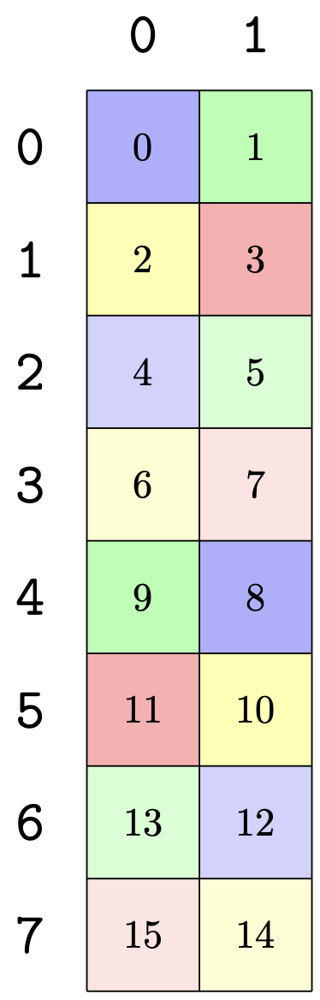<br>
    <small>Layout_K_INTER_Atom_128bit</small>
</div>
<br>

- half：Layout: Sw<1,3,3> o _0 o (_8,_16):(_16,_1)

<div align="center">
    <br>
    <small>Layout_K_INTER_Atom_128bit</small>
</div>
<br>

### Layout_K_SW64_Atom

- 128bit：Layout: Sw<2,0,3> o _0 o (_8,_4):(_4,_1)

<div align="center">
    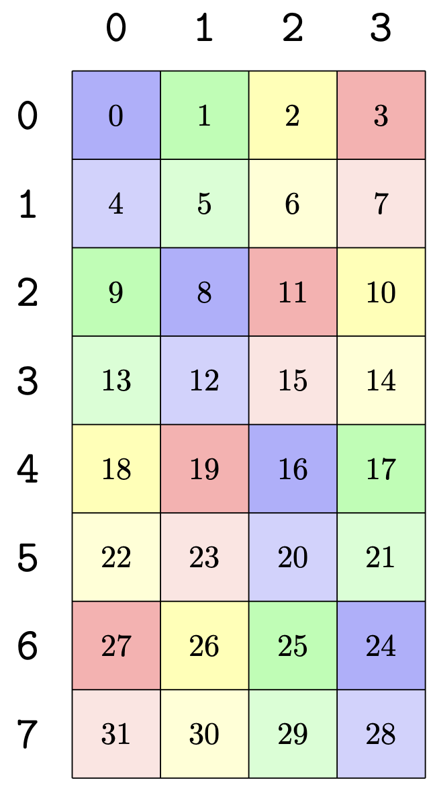<br>
    <small>Layout_K_INTER_Atom_128bit</small>
</div>
<br>

- half：Layout: Sw<2,3,3> o _0 o (_8,_32):(_32,_1)

<div align="center">
    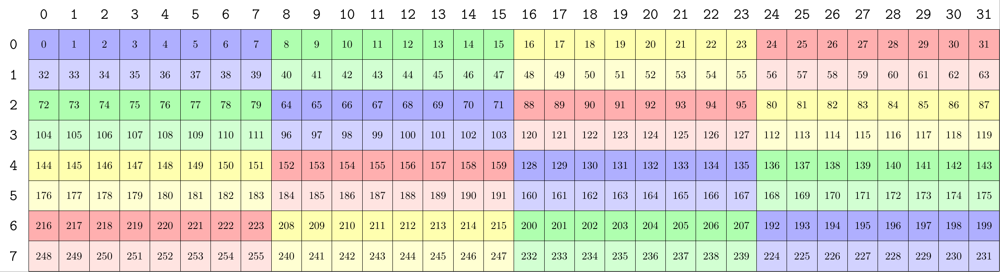<br>
    <small>Layout_K_INTER_Atom_128bit</small>
</div>
<br>

### Layout_K_SW128_Atom 

- 128bit：Layout: Sw<3,0,3> o _0 o (_8,_8):(_8,_1)

<div align="center">
    <br>
    <small>Layout_K_INTER_Atom_128bit</small>
</div>
<br>

- half：Layout: Sw<3,3,3> o _0 o (_8,_64):(_64,_1)

<div align="center">
    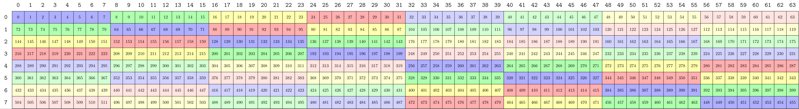<br>
    <small>Layout_K_INTER_Atom_128bit</small>
</div>
<br>

### tile_to_shape

shared memory 的大小一般都比 swizzle pattern 大，因此需要使用 swizzle pattern 对整个 shared memory 进行 tiling。tiling 的方向可以根据需要选择列方向或行方向。

以 128B swizzle 为例，在 half 数据类型下它的大小是 8×64。当使用它对 128×128 大小的 smem 进行 tiling 时，结果如下。

```cpp
auto sA = tile_to_shape(Layout_K_SW128_Atom{}, make_shape(128, 128), Step<_1, _2>{});
auto sA1 = recast_layout<half, uint128_t>(sA);
print_latex(sA1);print("\n");
```

<div align="center">
    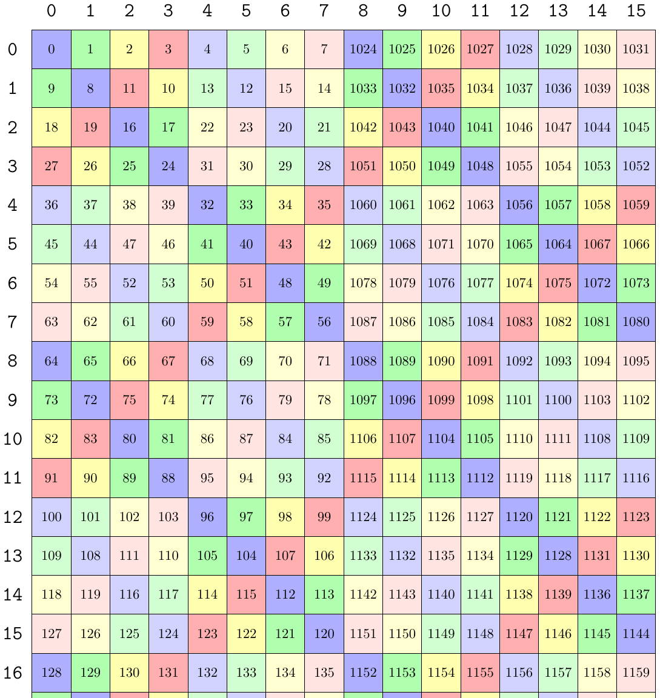<br>
    <small>128B swizzle col-major tiling</small>
</div>
<br>

```cpp
auto sA = tile_to_shape(Layout_K_SW128_Atom{}, make_shape(128, 128), Step<_2, _1>{});
auto sA1 = recast_layout<half, uint128_t>(sA);
print_latex(sA1);print("\n");
```

<div align="center">
    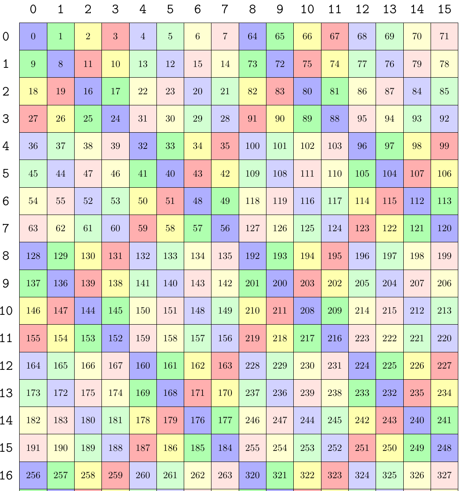<br>
    <small>128B swizzle row-major tiling</small>
</div>
<br>


### make_gemm_desc

假设 shared memory 的大小是 128×64。使用的 wgmma op 是 `SM90_64x64x16_F16F16F16_SS<GMMA::Major::K, GMMA::Major::K>{}`。

因为 wgmma 只支持 64×N×16 的形状，所以单次计算加载的矩阵 A 和 B 的 K 都是 16，矩阵 A 的 M 是 64。

```cpp
TiledMMA tiled_mma = make_tiled_mma(SM90_64x64x16_F16F16F16_SS<GMMA::Major::K, GMMA::Major::K>{});

Tensor sA = make_tensor(make_smem_ptr(smem.A.begin()), ASmemLayout{});

ThrMMA thr_mma = mma.get_slice(threadIdx.x);
Tensor tCsA = thr_mma.partition_A(sA);

Tensor tCrA = thr_mma.make_fragment_A(tCsA);
```

make_gemm_desc 会在 make_fragment_A 时进行。

cutlass 中 make_gemm_desc 的代码如下，首先会把原始的 tensor recast 为 128bit 的 tensor。

根据 smem 的 swizzle 格式确定是哪种 layout 类型。根据 smem 的起始地址确定描述符的起始地址。base_offset 默认设为 0。这三个变量和 swizzle 的方式无关。最后会根据 MN-major 还是 K-major 确定不同 swizzle 方式的 LBO 和 SBO。

```cpp
template <Major MajorMode, class TEngine, class TLayout>
CUTE_HOST_DEVICE constexpr
GmmaDescriptor
make_gmma_desc(Tensor<TEngine,TLayout> const& tensor)
{
  static_assert(is_smem<TEngine>::value, "GMMA Descriptors can only be constructed on smem.");
  static_assert(TLayout::rank == 2, "GMMA Descriptors can only be constructed on rank-2 tensors.");
  using value_type = typename TEngine::value_type;

  Tensor u128_tensor = recast<uint128_t const>(tensor);

  // Result
  GmmaDescriptor desc;

  // Layout type
  constexpr LayoutType LAYOUT_TYPE = layout_type(u128_tensor);
  desc.bitfield.layout_type_ = uint8_t(LAYOUT_TYPE);

  // Start address (4LSB not included)
  uint32_t start_address = cast_smem_ptr_to_uint(raw_pointer_cast(u128_tensor.data()));
  desc.bitfield.start_address_ = static_cast<uint16_t>(start_address >> 4);

  constexpr uint8_t base_offset = 0;
  desc.bitfield.base_offset_ = base_offset;

  // LayoutType meta
  constexpr int W = LAYOUT_TYPE == LayoutType::INTERLEAVE ? 1 :
                    LAYOUT_TYPE == LayoutType::B32        ? 2 :
                    LAYOUT_TYPE == LayoutType::B64        ? 4 :
                    LAYOUT_TYPE == LayoutType::B128       ? 8 : -1;

  if constexpr (MajorMode == Major::MN)
  {
    /* In units of uint128_t, each GmmaDescriptor Major-MN describes a canonical layout of the form
     *
     * LayoutType::INTERLEAVE         : Swizzle<0,4,3> o smem_ptr o ((1,n),(8,k)):((X,SBO),(1,LBO))
     * LayoutType::B32                : Swizzle<1,4,3> o smem_ptr o ((2,n),(8,k)):((1,LBO),(2,SBO))
     * LayoutType::B64                : Swizzle<2,4,3> o smem_ptr o ((4,n),(8,k)):((1,LBO),(4,SBO))
     * LayoutType::B128               : Swizzle<3,4,3> o smem_ptr o ((8,n),(8,k)):((1,LBO),(8,SBO))
     */
    static_assert(size<1>(u128_tensor) == Int<(256 / cute::sizeof_bits<value_type>::value)>{} || // A and B in dense MMA
                  size<1>(u128_tensor) == Int<(128 / cute::sizeof_bits<value_type>::value)>{} || // A in sparse MMA
                  size<1>(u128_tensor) == Int<(512 / cute::sizeof_bits<value_type>::value)>{},   // B in sparse MMA
                         "Not a canonical GMMA_MN Layout: Expected K-size 256/sizeof_bits<T> for dense or (128|512)/sizeof_bits<T> for sparse.");

    // Construct the canonical GMMA T Layout with shape ((W,n),(8,2))
    Layout canonical_layout = logical_divide(layout(u128_tensor), Tile<Layout<Int<W>,_1>,Layout<Int<8>,_1>>{});

    // Check profile of canonical
    CUTE_STATIC_ASSERT_V(congruent(canonical_layout, Shape<Shape<_1,_1>,Shape<_1,_1>>{}), "Not a canonical GMMA_MN Layout: Expected profile failure.");
    // Check canonical mode strides
    constexpr uint32_t stride_00 = stride<0,0>(canonical_layout);
    constexpr uint32_t expected_stride_00 = LAYOUT_TYPE == LayoutType::INTERLEAVE ? stride<0,0>(canonical_layout) : 1;
    static_assert(stride_00 == expected_stride_00, "Not a canonical GMMA_MN Layout: Expected stride failure.");
    constexpr uint32_t stride_10 = stride<1,0>(canonical_layout);
    constexpr uint32_t expected_stride_10 = W;
    static_assert(stride_10 == expected_stride_10, "Not a canonical GMMA_MN Layout: Expected stride failure.");

    // stride dimension byte offset and leading dimension byte offset (4LSB not included == uint128_t units)
    constexpr uint32_t stride_01 = stride<0,1>(canonical_layout);
    constexpr uint32_t stride_11 = stride<1,1>(canonical_layout);

    desc.bitfield.stride_byte_offset_  = (LAYOUT_TYPE == LayoutType::INTERLEAVE) ? stride_01 : stride_11;
    desc.bitfield.leading_byte_offset_ = (LAYOUT_TYPE == LayoutType::INTERLEAVE) ? stride_11 : stride_01;
  }
  else if constexpr (MajorMode == Major::K)
  {
    /* In units of uint128_t, each GmmaDescriptor Major-K describes a canonical layout of the form
     *
     * LayoutType::INTERLEAVE    : Swizzle<0,4,3> o smem_ptr o ((8,n),2):((1,SBO),LBO)
     * LayoutType::B32           : Swizzle<1,4,3> o smem_ptr o ((8,n),2):((2,SBO),1)
     * LayoutType::B64           : Swizzle<2,4,3> o smem_ptr o ((8,n),2):((4,SBO),1)
     * LayoutType::B128          : Swizzle<3,4,3> o smem_ptr o ((8,n),2):((8,SBO),1)
     */
    CUTE_STATIC_ASSERT_V(size<0>(u128_tensor) % Int<8>{} == Int<0>{},          // N|M size
                         "Not a canonical GMMA_K Layout: Expected MN-size multiple of 8.");
    CUTE_STATIC_ASSERT_V(size<1>(u128_tensor) == Int<2>{} || size<1>(u128_tensor) == Int<4>{},      // K   size
                         "Not a canonical GMMA_K Layout: Expected K-size 2 for dense or 4 for sparse (in units of uint128_t).");

    // Construct the canonical GMMA N Layout with shape ((8,n),(2,1))
    Layout canonical_layout = logical_divide(layout(u128_tensor), Tile<Layout<_8,_1>,Layout<_2,_1>>{});

    // Check profile of canonical
    CUTE_STATIC_ASSERT_V(congruent(canonical_layout, Shape<Shape<_1,_1>,Shape<_1,_1>>{}), "Not a canonical GMMA_K Layout: Expected profile failure.");
    // Check canonical mode strides
    constexpr uint32_t stride_00 = stride<0,0>(canonical_layout);
    constexpr uint32_t expected_stride_00 = W;
    static_assert(stride_00 == expected_stride_00, "Not a canonical GMMA_K Layout: Expected stride failure.");
    constexpr uint32_t stride_10 = stride<1,0>(canonical_layout);
    constexpr uint32_t expected_stride_10 = (LAYOUT_TYPE == LayoutType::INTERLEAVE) ? stride<1,0>(canonical_layout) : 1;
    static_assert(stride_10 == expected_stride_10, "Not a canonical GMMA_K Layout: Expected stride failure.");

    // stride dimension byte offset and leading dimension byte offset (4LSB not included == uint128_t units)
    constexpr uint32_t stride_01 = stride<0,1>(canonical_layout);

    desc.bitfield.stride_byte_offset_  = stride_01;
    desc.bitfield.leading_byte_offset_ = stride_10;

  } else {
    static_assert(MajorMode != Major::MN && MajorMode != Major::K, "Unrecognized MajorMode!");
  }
  return desc;
}
```

下面先介绍 K-major 下不同 swizzle 的 LBO 和 SBO 的确定方式。

#### none swizzle

假设 smem 的大小是 128×64，数据类型是 half。对于原始的 half tensor，128×64 的矩阵被 none swizzle 分块后得到的 layout 是 `Sw<0,4,3> o smem_ptr16b o ((_8,16),(_8,8)):((_8,_64),(_1,1024))`。

然后与 wgmma 的 ALayout 进行组合运算，转换成 tv-layout。wgmma 的 LayoutA_TV 是 `(_128,(_64,_16)):(_0,(_1,_64))`。表示有 128 个线程，每个线程都会访问 (64,16) 大小的数据。

组合后的结果是 `((_64,(_8,_2)),_2,_4):((_8,(_1,_1024)),_512,_2048)`。

这个 layout 表示 128×64 的 smem，被 wgmma（64×16）在行方向上分了 2 块，在列方向上被分了 4 块，其中列方向的每一块大小是 16，在 none swizzle 下包含了 2 个 pattern。

然后创建每一块 tensor 的描述符。创建描述符的时候传进 make_gmma_desc 函数的是 `smem_ptr16b o (_64,(_8,_2)):(_8,(_1,_1024))`，也就是 1 块的 layout。不同块的描述符的区别主要是地址，后面会根据索引对地址计算 offset。

input tensor：`smem_ptr16b o (_64,(_8,_2)):(_8,(_1,_1024))` 经过 recast 为 128bit 后变成 `smem_ptr128b o (_64,(_1,_2)):(_1,(_1,_128))`。也就是原本的 8 个 half 变成了一个 128bit 元素。

在计算 LBO 和 SBO 时会先做一个 assert，因为 swizzle pattern 的行都是 8，所以第一个维度需要能被 8 整除。又因为 wgmma 的 K 在 half 类型 dense 数据下固定是 16，也就是两个 128bit，所以 tensor 的第二个维度必须是 2。

然后进一步把 128bit tensor 分成 8×N 行和 2 块。这里的 8 应该是因为 swizzle pattern 是 8 行，2 是因为一个 128bit tensor 在列方向上包含 2 个元素。

分完之后得到 `canonical_layout = ((_8,_8),(_2,_1)):((_1,_8),(_128,_0))`。

有了 canonical_layout 后就可以计算 LBO 和 SBO 了。

`stride_00 = stride<0,0>(canonical_layout) = 1`。因为是 none swizzle，128 bit 下大小是 8×1, 所以行之间的 stride 就是 1。

`stride_10 = stride<1,0>(canonical_layout) = 128`。none swizzle 下，两列之间是不连续的，所以 stride = smem 的行数，也就是 128。如果是其他的 swizzle 模式，这里因为是连续的，所以 stride = 1。

`stride_01 = stride<0,1>(canonical_layout) = 8`。这里是因为 none swizzle 的大小是 8×1, 64 行被分成了 8×8，所以外层的 stride 就是 8。对于其余的 swizzle pattern，`stride01 = 8 * swizzle bytes / 16`。

最终
- desc.bitfield.stride_byte_offset_  = stride_01 = 8。
- desc.bitfield.leading_byte_offset_ = stride_10 = 128。


none swizzle 对 128×64 smem 的 tiling 结果如下图所示，图片中已经被 recast 成了 128bit，而且只截取了前 16 行，完整的有 128 行。

上面的计算过程是 cutlass 中程序化的流程。因为 lbo 是 swizzle pattern 在主序方向上的 offset，也就是 K 方向，sbo 是 swizzle pattern 在非主序方向上的 offset，也就是 M 方向。所以可以直接从图中看到 lbo = 128，sbo = 8。

<div align="center">
    <br>
    <small>none k-major swizzle tiling 128×64</small>
</div>
<br>


下面是打印不同块上的描述符的结果。

因为 wgmma 的计算大小是 64×16，所以 128×64 的 smem 被分为 2×4 块。块之间的 sbo 和 lbo 都相同，主要的区别是 smem 的地址不一样。

第一块的起始地址就是 smem 的起始地址，为 0x0040。行方向第二块和第一块的起始地址差了 64，所以地址变成了 0x0080。列方向第二块和第一块相差了 256，所以地址变成了 0x0140。在实际计算的过程中，会根据块的位置对描述符中的地址进行修改。
```log
GMMA::DescriptorIterator o (_1,_2,_4):(_0,_64,_256):
  GmmaDescriptor: 0x0000000800800040
  start_addr :  0x0040
  leading_off:  0x0080 (128)
  stride_off :  0x0008 (8)
  base_offset:  0x0
  layout_type:  0x0 (INTERLEAVE)
  GmmaDescriptor: 0x0000000800800080
  start_addr :  0x0080
  leading_off:  0x0080 (128)
  stride_off :  0x0008 (8)
  base_offset:  0x0
  layout_type:  0x0 (INTERLEAVE)

----------
  GmmaDescriptor: 0x0000000800800140
  start_addr :  0x0140
  leading_off:  0x0080 (128)
  stride_off :  0x0008 (8)
  base_offset:  0x0
  layout_type:  0x0 (INTERLEAVE)
  GmmaDescriptor: 0x0000000800800180
  start_addr :  0x0180
  leading_off:  0x0080 (128)
  stride_off :  0x0008 (8)
  base_offset:  0x0
  layout_type:  0x0 (INTERLEAVE)

----------
  GmmaDescriptor: 0x0000000800800240
  start_addr :  0x0240
  leading_off:  0x0080 (128)
  stride_off :  0x0008 (8)
  base_offset:  0x0
  layout_type:  0x0 (INTERLEAVE)
  GmmaDescriptor: 0x0000000800800280
  start_addr :  0x0280
  leading_off:  0x0080 (128)
  stride_off :  0x0008 (8)
  base_offset:  0x0
  layout_type:  0x0 (INTERLEAVE)

----------
  GmmaDescriptor: 0x0000000800800340
  start_addr :  0x0340
  leading_off:  0x0080 (128)
  stride_off :  0x0008 (8)
  base_offset:  0x0
  layout_type:  0x0 (INTERLEAVE)
  GmmaDescriptor: 0x0000000800800380
  start_addr :  0x0380
  leading_off:  0x0080 (128)
  stride_off :  0x0008 (8)
  base_offset:  0x0
  layout_type:  0x0 (INTERLEAVE)
```

#### 32B swizzle

还是以 128×64 大小的 K-major half tensor 为例。32B swizzle k-major 的 layout 为 `Sw<1,4,3> o smem_ptr16b o (_8,_16):(_16,_1)`。

因此整个 shared memory 被分成 `Sw<1,4,3> o smem_ptr16b o ((_8,_16),(_16,_4)):((_16,_128),(_1,_2048))`。

与 wgmma 的 `LayoutA_TV: (_128,(_64,_16)):(_0,(_1,_64))` 组合后得到 `Sw<1,4,3>_smem_ptr16b o ((_64,_16),_2,_4):((_16,_1),_1024,_2048)`。

然后创建 tensor 描述符。创建描述符的时候传进 make_gmma_desc 函数的是 `Sw<1,4,3>_smem_ptr16b o (_64,_16):(_16,_1)`。

recast 为 128bit 后变成 `Sw<1,4,3>_smem_ptr128b o (_64,_2):(_2,_1)`。也就是原本的 8 个 half 变成了一个 128bit 元素。

设置 layout_type 为 32B，起始地址为 smem 的地址，base_offset = 0。然后计算 LBO 和 SBO。

把 uint128 tensor 按照 (8，2) 分块不难得到 `canonical_layout = ((_8,_8),(_2,_1)):((_2,_16),(_1,_0))`。

stride_00 = 2。stride_10 = 1。stride_01 = 16。

所以：
- desc.bitfield.stride_byte_offset_  = stride_01 = 16。
- desc.bitfield.leading_byte_offset_ = stride_10 = 1。

下图是 32B swizzle k-major 对 128×64 tiling 的结果。图中只截取的前 17 行。

因为 lbo 是 swizzle pattern 在主序方向上的 offset，也就是 K 方向，sbo 是 swizzle pattern 在非主序方向上的 offset，也就是 M 方向。从图中也可以直接看到 sbo = 16，lbo = 1。

<div align="center">
    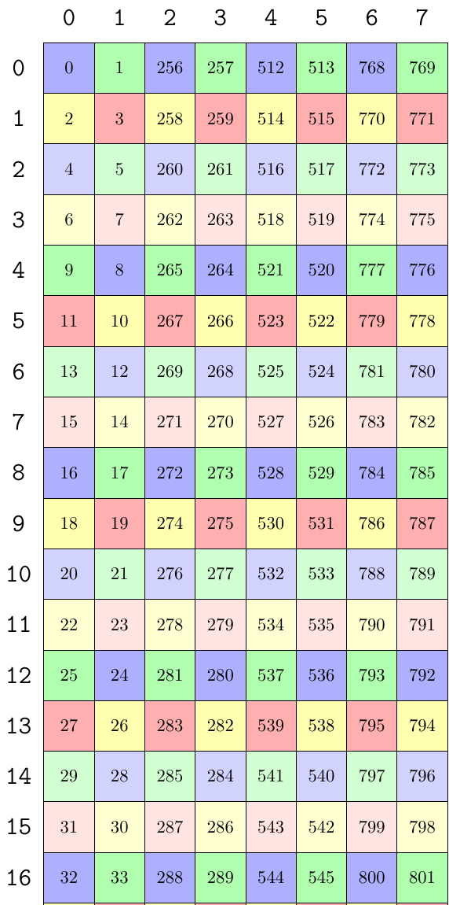<br>
    <small>32B k-major swizzle tiling 128×64</small>
</div>
<br>


下面是打印不同块上的描述符的结果。
跟前面一样，因为 wgmma 的计算大小是 64×16，所以 128×64 的 smem 被分为 2×4 块。第一块的起始地址就是 smem 的起始地址，为 0x0040。行方向第二块和第一块的起始地址差了 64×2 = 128，所以地址变成了 0x00c0。列方向第二块和第一块相差了 128×2 = 256，所以地址变成了 0x0140。

```log
GMMA::DescriptorIterator o (_1,_2,_4):(_0,_128,_256):
  GmmaDescriptor: 0xc000001000010040
  start_addr :  0x0040
  leading_off:  0x0001 (1)
  stride_off :  0x0010 (16)
  base_offset:  0x0
  layout_type:  0x3 (B32)
  GmmaDescriptor: 0xc0000010000100c0
  start_addr :  0x00c0
  leading_off:  0x0001 (1)
  stride_off :  0x0010 (16)
  base_offset:  0x0
  layout_type:  0x3 (B32)

----------
  GmmaDescriptor: 0xc000001000010140
  start_addr :  0x0140
  leading_off:  0x0001 (1)
  stride_off :  0x0010 (16)
  base_offset:  0x0
  layout_type:  0x3 (B32)
  GmmaDescriptor: 0xc0000010000101c0
  start_addr :  0x01c0
  leading_off:  0x0001 (1)
  stride_off :  0x0010 (16)
  base_offset:  0x0
  layout_type:  0x3 (B32)

----------
  GmmaDescriptor: 0xc000001000010240
  start_addr :  0x0240
  leading_off:  0x0001 (1)
  stride_off :  0x0010 (16)
  base_offset:  0x0
  layout_type:  0x3 (B32)
  GmmaDescriptor: 0xc0000010000102c0
  start_addr :  0x02c0
  leading_off:  0x0001 (1)
  stride_off :  0x0010 (16)
  base_offset:  0x0
  layout_type:  0x3 (B32)

----------
  GmmaDescriptor: 0xc000001000010340
  start_addr :  0x0340
  leading_off:  0x0001 (1)
  stride_off :  0x0010 (16)
  base_offset:  0x0
  layout_type:  0x3 (B32)
  GmmaDescriptor: 0xc0000010000103c0
  start_addr :  0x03c0
  leading_off:  0x0001 (1)
  stride_off :  0x0010 (16)
  base_offset:  0x0
  layout_type:  0x3 (B32)
```

#### 64B swizzle

还是以 128×64 大小的 K-major half tensor 为例。64B swizzle k-major 的 layout 为 `Sw<2,4,3> o smem_ptr16b o (_8,_32):(_32,_1)`。

因此整个 shared memory 被分成 `Sw<2,4,3> o smem_ptr16b o ((_8,_16),(_32,_2)):((_32,_256),(_1,_4096))`。

与 wgmma 的 `LayoutA_TV: (_128,(_64,_16)):(_0,(_1,_64))` 组合后得到 `Sw<2,4,3>_smem_ptr16b o ((_64,_16),_2,(_2,_2)):((_32,_1),_2048,(_16,_4096))`。

然后创建 tensor 描述符。创建描述符的时候传进 make_gmma_desc 函数的是 `Sw<2,4,3>_smem_ptr16b o (_64,_16):(_32,_1)`。

recast 为 128bit 后变成 `Sw<2,4,3>_smem_ptr128b o (_64,_2):(_4,_1)`。

把 uint128 tensor按 (8，2) 进行分块，不难得到 `canonical_layout = ((_8,_8),(_2,_1)):((_4,_32),(_1,_0))`。

stride_00 = 4。stride_10 = 1。stride_01 = 32。

所以：
- desc.bitfield.stride_byte_offset_  = stride_01 = 32。
- desc.bitfield.leading_byte_offset_ = stride_10 = 1。

下图是 64B swizzle k-major 对 128×64 tiling 的结果。图中只截取的前 16 行。

因为 lbo 是 swizzle pattern 在主序方向上的 offset，也就是 K 方向，sbo 是 swizzle pattern 在非主序方向上的 offset，也就是 M 方向。从图中也可以直接看到 sbo = 32，lbo = 1。

<div align="center">
    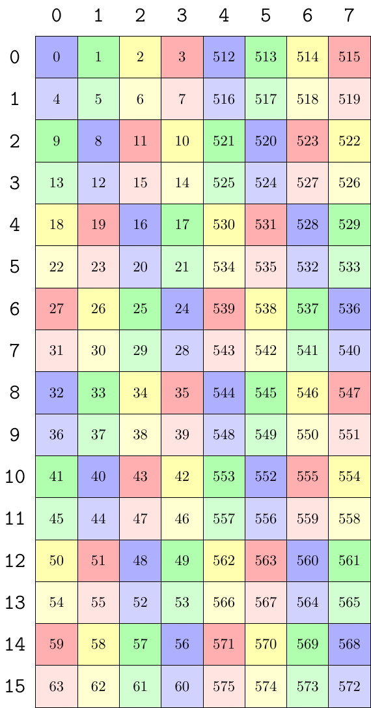<br>
    <small>64B k-major swizzle tiling 128×64</small>
</div>
<br>


下面是打印不同块上的描述符的结果。

因为 wgmma 的计算大小是 64×16，所以 128×64 的 smem 被分为 2×4 块。第一块的起始地址就是 smem 的起始地址，为 0x0040。行方向第二块和第一块的起始地址差了 64×4 = 256，所以地址变成了 0x0140。列方向第二块和第一块相差了 2，所以地址变成了 0x0042。

```log
GMMA::DescriptorIterator o (_1,_2,(_2,_2)):(_0,_256,(_2,_512)):
  GmmaDescriptor: 0x8000002000010040
  start_addr :  0x0040
  leading_off:  0x0001 (1)
  stride_off :  0x0020 (32)
  base_offset:  0x0
  layout_type:  0x2 (B64)
  GmmaDescriptor: 0x8000002000010140
  start_addr :  0x0140
  leading_off:  0x0001 (1)
  stride_off :  0x0020 (32)
  base_offset:  0x0
  layout_type:  0x2 (B64)

----------
  GmmaDescriptor: 0x8000002000010042
  start_addr :  0x0042
  leading_off:  0x0001 (1)
  stride_off :  0x0020 (32)
  base_offset:  0x0
  layout_type:  0x2 (B64)
  GmmaDescriptor: 0x8000002000010142
  start_addr :  0x0142
  leading_off:  0x0001 (1)
  stride_off :  0x0020 (32)
  base_offset:  0x0
  layout_type:  0x2 (B64)

----------
  GmmaDescriptor: 0x8000002000010240
  start_addr :  0x0240
  leading_off:  0x0001 (1)
  stride_off :  0x0020 (32)
  base_offset:  0x0
  layout_type:  0x2 (B64)
  GmmaDescriptor: 0x8000002000010340
  start_addr :  0x0340
  leading_off:  0x0001 (1)
  stride_off :  0x0020 (32)
  base_offset:  0x0
  layout_type:  0x2 (B64)

----------
  GmmaDescriptor: 0x8000002000010242
  start_addr :  0x0242
  leading_off:  0x0001 (1)
  stride_off :  0x0020 (32)
  base_offset:  0x0
  layout_type:  0x2 (B64)
  GmmaDescriptor: 0x8000002000010342
  start_addr :  0x0342
  leading_off:  0x0001 (1)
  stride_off :  0x0020 (32)
  base_offset:  0x0
  layout_type:  0x2 (B64)
```

#### 128B swizzle

还是以 128×64 大小的 K-major half tensor 为例。128B swizzle k-major 的 layout 为 `Sw<3,4,3> o smem_ptr16b o (_8,_64):(_64,_1)`。

因此整个 shared memory 被分成 `Sw<3,4,3> o smem_ptr16b o ((_8,_16),(_64,_1)):((_64,_512),(_1,_0))`。

与 wgmma 的 `LayoutA_TV: (_128,(_64,_16)):(_0,(_1,_64))` 组合后得到 `Sw<3,4,3>_smem_ptr16b o ((_64,_16),_2,_4):((_64,_1),_4096,_16)`。

然后创建 tensor 描述符。创建描述符的时候传进 make_gmma_desc 函数的是 `Sw<3,4,3>_smem_ptr16b o (_64,_16):(_64,_1)`。

recast 为 128bit 后变成 `Sw<3,4,3>_smem_ptr128b o (_64,_2):(_8,_1)`。

把 uint128 tensor 按 (8，2) 进行分块，得到 `canonical_layout = ((_8,_8),(_2,_1)):((_8,_64),(_1,_0))`。

stride_00 = 8。stride_10 = 1。stride_01 = 64。

所以：
- desc.bitfield.stride_byte_offset_  = stride_01 = 64。
- desc.bitfield.leading_byte_offset_ = stride_10 = 1。


下图是 128B swizzle k-major 对 128×64 tiling 的结果。图中只截取的前 16 行。

因为 lbo 是 swizzle pattern 在主序方向上的 offset，也就是 K 方向，sbo 是 swizzle pattern 在非主序方向上的 offset，也就是 M 方向。从图中也可以直接看到 sbo = 64，lbo = 1。

<div align="center">
    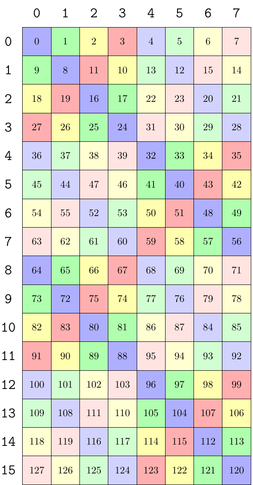<br>
    <small>128B k-major swizzle tiling 128×64</small>
</div>
<br>


下面是打印不同块上的描述符的结果。

因为 wgmma 的计算大小是 64×16，所以 128×64 的 smem 被分为 2×4 块。

第一块的起始地址就是 smem 的起始地址，为 0x0040。行方向第二块和第一块的起始地址差了 64×8 = 512，所以地址变成了 0x0240。列方向第二块和第一块相差了 2，所以地址变成了 0x0042。

```log
GMMA::DescriptorIterator o (_1,_2,_4):(_0,_512,_2):
  GmmaDescriptor: 0x4000004000010040
  start_addr :  0x0040
  leading_off:  0x0001 (1)
  stride_off :  0x0040 (64)
  base_offset:  0x0
  layout_type:  0x1 (B128)
  GmmaDescriptor: 0x4000004000010240
  start_addr :  0x0240
  leading_off:  0x0001 (1)
  stride_off :  0x0040 (64)
  base_offset:  0x0
  layout_type:  0x1 (B128)

----------
  GmmaDescriptor: 0x4000004000010042
  start_addr :  0x0042
  leading_off:  0x0001 (1)
  stride_off :  0x0040 (64)
  base_offset:  0x0
  layout_type:  0x1 (B128)
  GmmaDescriptor: 0x4000004000010242
  start_addr :  0x0242
  leading_off:  0x0001 (1)
  stride_off :  0x0040 (64)
  base_offset:  0x0
  layout_type:  0x1 (B128)

----------
  GmmaDescriptor: 0x4000004000010044
  start_addr :  0x0044
  leading_off:  0x0001 (1)
  stride_off :  0x0040 (64)
  base_offset:  0x0
  layout_type:  0x1 (B128)
  GmmaDescriptor: 0x4000004000010244
  start_addr :  0x0244
  leading_off:  0x0001 (1)
  stride_off :  0x0040 (64)
  base_offset:  0x0
  layout_type:  0x1 (B128)

----------
  GmmaDescriptor: 0x4000004000010046
  start_addr :  0x0046
  leading_off:  0x0001 (1)
  stride_off :  0x0040 (64)
  base_offset:  0x0
  layout_type:  0x1 (B128)
  GmmaDescriptor: 0x4000004000010246
  start_addr :  0x0246
  leading_off:  0x0001 (1)
  stride_off :  0x0040 (64)
  base_offset:  0x0
  layout_type:  0x1 (B128)
```

## MN-major

cutlass 中提前确定了不同 swizzle 的 pattern layout。MN-major 如下：

```cpp
// M|N-major GMMA layouts in units of bits
using Layout_MN_INTER_Atom_Bits = ComposedLayout<Swizzle<0,4,3>, smem_ptr_flag, Layout<Shape< _128,_8>,Stride<_1, _128>>>;
using Layout_MN_SW32_Atom_Bits  = ComposedLayout<Swizzle<1,4,3>, smem_ptr_flag, Layout<Shape< _256,_8>,Stride<_1, _256>>>;
using Layout_MN_SW64_Atom_Bits  = ComposedLayout<Swizzle<2,4,3>, smem_ptr_flag, Layout<Shape< _512,_8>,Stride<_1, _512>>>;
using Layout_MN_SW128_Atom_Bits = ComposedLayout<Swizzle<3,4,3>, smem_ptr_flag, Layout<Shape<_1024,_8>,Stride<_1,_1024>>>;
```

这里是以 bit 为单位，如果我们使用 half 进行 recast 后会得到：

```cpp
// M|N-major layouts in units of Type
using Layout_MN_INTER_Atom = decltype(upcast<sizeof_bits<Type>::value>(Layout_MN_INTER_Atom_Bits{}));
using Layout_MN_SW32_Atom  = decltype(upcast<sizeof_bits<Type>::value>(Layout_MN_SW32_Atom_Bits{}));
using Layout_MN_SW64_Atom  = decltype(upcast<sizeof_bits<Type>::value>(Layout_MN_SW64_Atom_Bits{}));
using Layout_MN_SW128_Atom = decltype(upcast<sizeof_bits<Type>::value>(Layout_MN_SW128_Atom_Bits{}));

Layout_K_INTER_Atom = Sw<0,4,3> o smem_ptr[32b](unset) o (_8,_8):(_8,_1)
Layout_K_SW32_Atom  = Sw<1,4,3> o smem_ptr[32b](unset) o (_8,_16):(_16,_1)
Layout_K_SW64_Atom  = Sw<2,4,3> o smem_ptr[32b](unset) o (_8,_32):(_32,_1)
Layout_K_SW128_Atom = Sw<3,4,3> o smem_ptr[32b](unset) o (_8,_64):(_64,_1)
```

分别打印这 4 个 layout 如下：

### Layout_MN_INTER_Atom

- 128bit： Layout: (_1,_8):(_1,_1)

- half：Layout: (_8,_8):(_1,_8)

### Layout_MN_SW32_Atom

- 128bit：Layout: Sw<1,0,3> o _0 o (_2,_8):(_1,_2)

- half：Layout: Sw<1,3,3> o _0 o (_16,_8):(_1,_16)


### Layout_MN_SW64_Atom

- 128bit：Layout: Sw<2,0,3> o _0 o (_4,_8):(_1,_4)

- half：Layout: Sw<2,3,3> o _0 o (_32,_8):(_1,_32)

### Layout_MN_SW128_Atom

- 128bit：Layout: Sw<3,0,3> o _0 o (_8,_8):(_1,_8)

- half：Layout: Sw<3,3,3> o _0 o (_64,_8):(_1,_64)


### tile_to_shape

shared memory 的大小一般都比 swizzle pattern 大，因此需要使用 swizzle pattern 对整个 shared memory 进行 tiling。tiling 的方向可以根据需要选择列方向或行方向。

以 128B swizzle 为例，在 half 数据类型下它的大小是 64×8。当使用它对 128×16 大小的 smem 进行 tiling 时，结果如下。

```cpp
auto sA = tile_to_shape(Layout_MN_SW128_Atom{}, make_shape(128, 16), Step<_1, _2>{});
auto sA1 = recast_layout<half, uint128_t>(sA);
print_latex(sA1);print("\n");
```

<div align="center">
    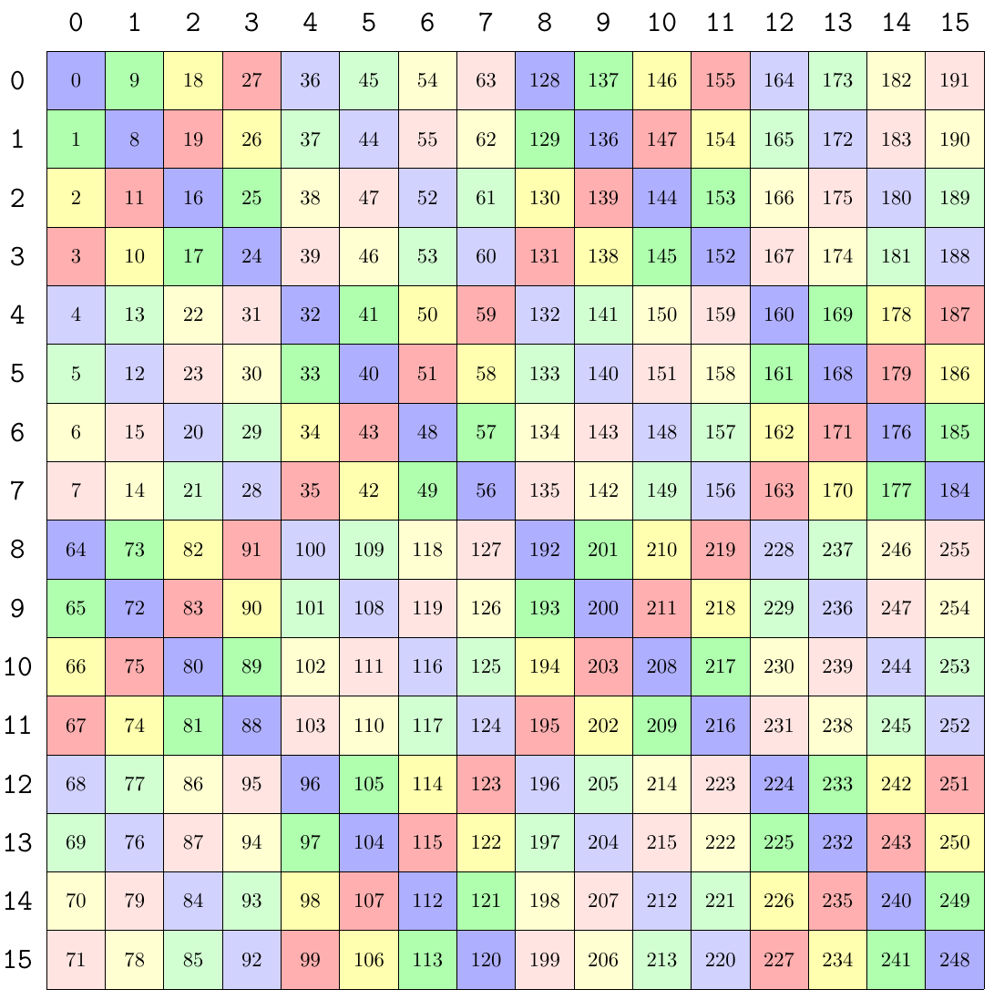<br>
    <small>128B swizzle col-major tiling</small>
</div>
<br>

```cpp
auto sA = tile_to_shape(Layout_MN_SW128_Atom{}, make_shape(128, 16), Step<_2, _1>{});
auto sA1 = recast_layout<half, uint128_t>(sA);
print_latex(sA1);print("\n");
```

<div align="center">
    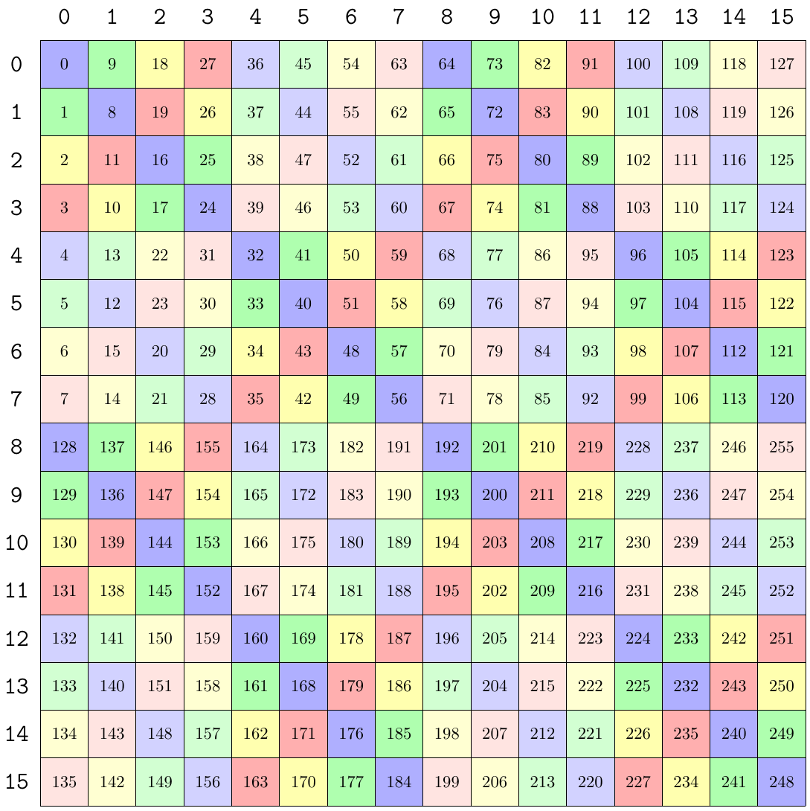<br>
    <small>128B swizzle row-major tiling</small>
</div>
<br>


### make_gemm_desc

假设 shared memory 的大小是 128×64。使用的 wgmma op 是 `SM90_64x64x16_F16F16F16_SS<GMMA::Major::MN, GMMA::Major::MN>{}`。

因为 wgmma 只支持 64×N×16 的形状，所以 K 都是 16，A 的 M = 64。

```cpp
TiledMMA tiled_mma = make_tiled_mma(SM90_64x64x16_F16F16F16_SS<GMMA::Major::MN, GMMA::Major::MN>{});

Tensor sA = make_tensor(make_smem_ptr(smem.A.begin()), ASmemLayout{});

ThrMMA thr_mma = mma.get_slice(threadIdx.x);
Tensor tCsA = thr_mma.partition_A(sA);

Tensor tCrA = thr_mma.make_fragment_A(tCsA);
```

make_gemm_desc 会在 make_fragment_A 时进行。make_gemm_desc 的代码如下：

首先会把原始的 tensor recast 为 128bit 的 tensor。

根据 smem 的 swizzle 格式确定是哪种 layout 类型。根据 smem 的起始地址确定描述符的起始地址。base_offset 默认设为 0。这三个变量和 swizzle 的方式无关。

最后会根据 MN-major 还是 K-major 确定不同 swizzle 方式的 LBO 和 SBO。

```cpp
template <Major MajorMode, class TEngine, class TLayout>
CUTE_HOST_DEVICE constexpr
GmmaDescriptor
make_gmma_desc(Tensor<TEngine,TLayout> const& tensor)
{
  static_assert(is_smem<TEngine>::value, "GMMA Descriptors can only be constructed on smem.");
  static_assert(TLayout::rank == 2, "GMMA Descriptors can only be constructed on rank-2 tensors.");
  using value_type = typename TEngine::value_type;

  Tensor u128_tensor = recast<uint128_t const>(tensor);

  // Result
  GmmaDescriptor desc;

  // Layout type
  constexpr LayoutType LAYOUT_TYPE = layout_type(u128_tensor);
  desc.bitfield.layout_type_ = uint8_t(LAYOUT_TYPE);

  // Start address (4LSB not included)
  uint32_t start_address = cast_smem_ptr_to_uint(raw_pointer_cast(u128_tensor.data()));
  desc.bitfield.start_address_ = static_cast<uint16_t>(start_address >> 4);

  constexpr uint8_t base_offset = 0;
  desc.bitfield.base_offset_ = base_offset;

  // LayoutType meta
  constexpr int W = LAYOUT_TYPE == LayoutType::INTERLEAVE ? 1 :
                    LAYOUT_TYPE == LayoutType::B32        ? 2 :
                    LAYOUT_TYPE == LayoutType::B64        ? 4 :
                    LAYOUT_TYPE == LayoutType::B128       ? 8 : -1;

  if constexpr (MajorMode == Major::MN)
  {
    /* In units of uint128_t, each GmmaDescriptor Major-MN describes a canonical layout of the form
     *
     * LayoutType::INTERLEAVE         : Swizzle<0,4,3> o smem_ptr o ((1,n),(8,k)):((X,SBO),(1,LBO))
     * LayoutType::B32                : Swizzle<1,4,3> o smem_ptr o ((2,n),(8,k)):((1,LBO),(2,SBO))
     * LayoutType::B64                : Swizzle<2,4,3> o smem_ptr o ((4,n),(8,k)):((1,LBO),(4,SBO))
     * LayoutType::B128               : Swizzle<3,4,3> o smem_ptr o ((8,n),(8,k)):((1,LBO),(8,SBO))
     */
    static_assert(size<1>(u128_tensor) == Int<(256 / cute::sizeof_bits<value_type>::value)>{} || // A and B in dense MMA
                  size<1>(u128_tensor) == Int<(128 / cute::sizeof_bits<value_type>::value)>{} || // A in sparse MMA
                  size<1>(u128_tensor) == Int<(512 / cute::sizeof_bits<value_type>::value)>{},   // B in sparse MMA
                         "Not a canonical GMMA_MN Layout: Expected K-size 256/sizeof_bits<T> for dense or (128|512)/sizeof_bits<T> for sparse.");

    // Construct the canonical GMMA T Layout with shape ((W,n),(8,2))
    Layout canonical_layout = logical_divide(layout(u128_tensor), Tile<Layout<Int<W>,_1>,Layout<Int<8>,_1>>{});

    // Check profile of canonical
    CUTE_STATIC_ASSERT_V(congruent(canonical_layout, Shape<Shape<_1,_1>,Shape<_1,_1>>{}), "Not a canonical GMMA_MN Layout: Expected profile failure.");
    // Check canonical mode strides
    constexpr uint32_t stride_00 = stride<0,0>(canonical_layout);
    constexpr uint32_t expected_stride_00 = LAYOUT_TYPE == LayoutType::INTERLEAVE ? stride<0,0>(canonical_layout) : 1;
    static_assert(stride_00 == expected_stride_00, "Not a canonical GMMA_MN Layout: Expected stride failure.");
    constexpr uint32_t stride_10 = stride<1,0>(canonical_layout);
    constexpr uint32_t expected_stride_10 = W;
    static_assert(stride_10 == expected_stride_10, "Not a canonical GMMA_MN Layout: Expected stride failure.");

    // stride dimension byte offset and leading dimension byte offset (4LSB not included == uint128_t units)
    constexpr uint32_t stride_01 = stride<0,1>(canonical_layout);
    constexpr uint32_t stride_11 = stride<1,1>(canonical_layout);

    desc.bitfield.stride_byte_offset_  = (LAYOUT_TYPE == LayoutType::INTERLEAVE) ? stride_01 : stride_11;
    desc.bitfield.leading_byte_offset_ = (LAYOUT_TYPE == LayoutType::INTERLEAVE) ? stride_11 : stride_01;
  }
  else if constexpr (MajorMode == Major::K)
  {
    /* In units of uint128_t, each GmmaDescriptor Major-K describes a canonical layout of the form
     *
     * LayoutType::INTERLEAVE    : Swizzle<0,4,3> o smem_ptr o ((8,n),2):((1,SBO),LBO)
     * LayoutType::B32           : Swizzle<1,4,3> o smem_ptr o ((8,n),2):((2,SBO),1)
     * LayoutType::B64           : Swizzle<2,4,3> o smem_ptr o ((8,n),2):((4,SBO),1)
     * LayoutType::B128          : Swizzle<3,4,3> o smem_ptr o ((8,n),2):((8,SBO),1)
     */
    CUTE_STATIC_ASSERT_V(size<0>(u128_tensor) % Int<8>{} == Int<0>{},          // N|M size
                         "Not a canonical GMMA_K Layout: Expected MN-size multiple of 8.");
    CUTE_STATIC_ASSERT_V(size<1>(u128_tensor) == Int<2>{} || size<1>(u128_tensor) == Int<4>{},      // K   size
                         "Not a canonical GMMA_K Layout: Expected K-size 2 for dense or 4 for sparse (in units of uint128_t).");

    // Construct the canonical GMMA N Layout with shape ((8,n),(2,1))
    Layout canonical_layout = logical_divide(layout(u128_tensor), Tile<Layout<_8,_1>,Layout<_2,_1>>{});

    // Check profile of canonical
    CUTE_STATIC_ASSERT_V(congruent(canonical_layout, Shape<Shape<_1,_1>,Shape<_1,_1>>{}), "Not a canonical GMMA_K Layout: Expected profile failure.");
    // Check canonical mode strides
    constexpr uint32_t stride_00 = stride<0,0>(canonical_layout);
    constexpr uint32_t expected_stride_00 = W;
    static_assert(stride_00 == expected_stride_00, "Not a canonical GMMA_K Layout: Expected stride failure.");
    constexpr uint32_t stride_10 = stride<1,0>(canonical_layout);
    constexpr uint32_t expected_stride_10 = (LAYOUT_TYPE == LayoutType::INTERLEAVE) ? stride<1,0>(canonical_layout) : 1;
    static_assert(stride_10 == expected_stride_10, "Not a canonical GMMA_K Layout: Expected stride failure.");

    // stride dimension byte offset and leading dimension byte offset (4LSB not included == uint128_t units)
    constexpr uint32_t stride_01 = stride<0,1>(canonical_layout);

    desc.bitfield.stride_byte_offset_  = stride_01;
    desc.bitfield.leading_byte_offset_ = stride_10;

  } else {
    static_assert(MajorMode != Major::MN && MajorMode != Major::K, "Unrecognized MajorMode!");
  }
  return desc;
}
```

下面先介绍 MN-major 下不同 swizzle 的 LBO 和 SBO 的确定方式。

### none swizzle

对于原始的 half tensor，128×64 的矩阵被 none swizzle 分块后得到的 layout 是 `Sw<0,4,3> o smem_ptr16b o ((_8,_16),(_8,_8)):((_1,_64),(_8,_1024))`。

然后与 wgmma 的 ALayout 进行组合运算，转换成 tv-layout。wgmma 的 `LayoutA_TV: (_128,(_64,_16)):(_0,(_1,_64))`。

组合后的结果是：`smem_ptr16b o (((_8,_8),(_8,_2)),_2,_4):(((_1,_64),(_8,_1024)),_512,_2048)`。

这个 layout 表示 128×64 的 smem，被 wgmma（64×16）在行方向上分了 2 块，在列方向上被分了 4 块，其中行方向包含 8 个 pattern，列方向包含 2 个pattern。

然后创建每一块 tensor 的描述符。创建描述符的时候传进 make_gmma_desc 函数的是 `smem_ptr16b o ((_8,_8),(_8,_2)):((_1,_64),(_8,_1024))`，也就是 1 块的 layout。不同块的描述符的区别主要是地址，后面会根据索引对地址计算 offset。

recast 为 128bit 后变成 `smem_ptr128b o ((_1,_8),(_8,_2)):((_1,_8),(_1,_128))`。也就是原本的 8 个 half 变成了一个 128bit 元素。

然后进一步把 128bit tensor 按照 （W，8）进行分块。这里 W 就是 swizzle pattern 的宽度，none = 1，32B = 2，64B = 4，128B = 8。

分完之后得到 `canonical_layout = ((_1,_8),(_8,_2)):((_8,_8),(_1,_128))`。

有了 canonical_layout 后就可以计算 LBO 和 SBO 了。

stride_00 = stride<0,0>(canonical_layout) = 8。这里因为对应的 shape 是 1，所以 stride00 没有意义。

stride_10 = stride<1,0>(canonical_layout) = 1。stride10 应该和 swizzle pattern 的宽度相等。

stride_01 = stride<0,1>(canonical_layout) = 8。因为是 none swizzle，所以一个 pattern 有 8 个元素。

stride_11 = stride<1,1>(canonical_layout) = 128。因为是 none swizzle，所以两列之间的 stride = 16 * 8 = 128。

最终

```cpp
desc.bitfield.stride_byte_offset_  = (LAYOUT_TYPE == LayoutType::INTERLEAVE) ? stride_01 : stride_11 = 8。
desc.bitfield.leading_byte_offset_ = (LAYOUT_TYPE == LayoutType::INTERLEAVE) ? stride_11 : stride_01 = 128。
```
不知道为什么这里 none swizzle 的 LBO 和 SBO 会反过来。

直接从图中也可以看到

<div align="center">
    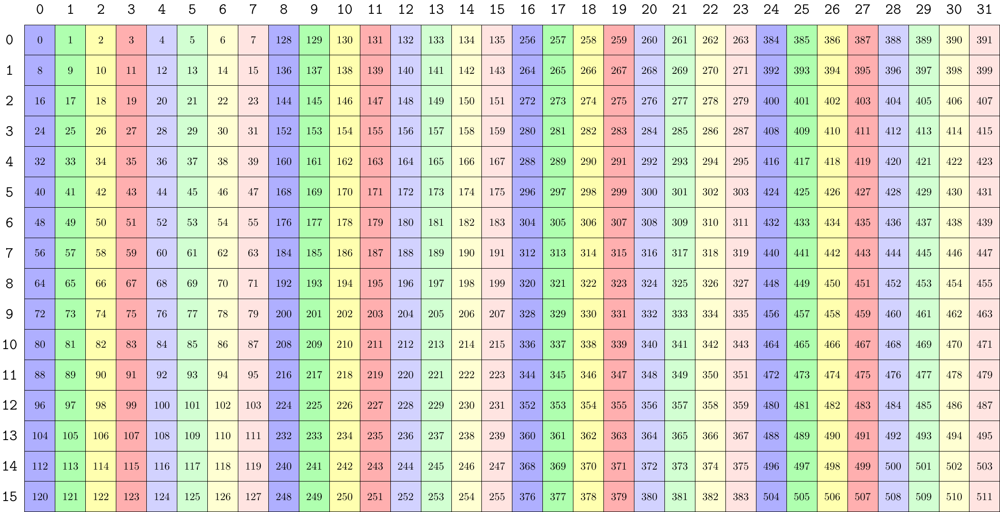<br>
    <small>mn-major none swizzle tiling 128×64</small>
</div>
<br>


下面是打印不同块上的描述符的结果。一共有 2×4 块。可以看到主要的区别是 smem 的起始地址不一样。

第一块的起始地址就是 smem 的起始地址，为 0x0040。行方向第二块和第一块的起始地址差了 8×8 = 64，所以地址变成了 0x0080。列方向第二块和第一块相差了 16×16 = 256，所以地址变成了 0x0140。
```log
GMMA::DescriptorIterator o (_1,_2,_4):(_0,_64,_256):
  GmmaDescriptor: 0x0000000800800040
  start_addr :  0x0040
  leading_off:  0x0080 (128)
  stride_off :  0x0008 (8)
  base_offset:  0x0
  layout_type:  0x0 (INTERLEAVE)
  GmmaDescriptor: 0x0000000800800080
  start_addr :  0x0080
  leading_off:  0x0080 (128)
  stride_off :  0x0008 (8)
  base_offset:  0x0
  layout_type:  0x0 (INTERLEAVE)

----------
  GmmaDescriptor: 0x0000000800800140
  start_addr :  0x0140
  leading_off:  0x0080 (128)
  stride_off :  0x0008 (8)
  base_offset:  0x0
  layout_type:  0x0 (INTERLEAVE)
  GmmaDescriptor: 0x0000000800800180
  start_addr :  0x0180
  leading_off:  0x0080 (128)
  stride_off :  0x0008 (8)
  base_offset:  0x0
  layout_type:  0x0 (INTERLEAVE)

----------
  GmmaDescriptor: 0x0000000800800240
  start_addr :  0x0240
  leading_off:  0x0080 (128)
  stride_off :  0x0008 (8)
  base_offset:  0x0
  layout_type:  0x0 (INTERLEAVE)
  GmmaDescriptor: 0x0000000800800280
  start_addr :  0x0280
  leading_off:  0x0080 (128)
  stride_off :  0x0008 (8)
  base_offset:  0x0
  layout_type:  0x0 (INTERLEAVE)

----------
  GmmaDescriptor: 0x0000000800800340
  start_addr :  0x0340
  leading_off:  0x0080 (128)
  stride_off :  0x0008 (8)
  base_offset:  0x0
  layout_type:  0x0 (INTERLEAVE)
  GmmaDescriptor: 0x0000000800800380
  start_addr :  0x0380
  leading_off:  0x0080 (128)
  stride_off :  0x0008 (8)
  base_offset:  0x0
  layout_type:  0x0 (INTERLEAVE)
```

### 32B swizzle

还是以 128×64 大小的 MN-major half tensor 为例。32B swizzle MN-major 的 layout 为 `Sw<1,3,3> o _0 o (_16,_8):(_1,_16)`。

因此整个 shared memory 被分成 `Sw<1,4,3> o smem_ptr16b o ((_16,_8),(_8,_8)):((_1,_128),(_16,_1024))`。

与 wgmma 的 `LayoutA_TV: (_128,(_64,_16)):(_0,(_1,_64))` 组合后得到：`Sw<1,4,3>_smem_ptr16b o (((_16,_4),(_8,_2)),_2,_4):(((_1,_128),(_16,_1024)),_512,_2048)`。

然后创建 tensor 描述符。创建描述符的时候传进 make_gmma_desc 函数的是 `Sw<1,4,3>_smem_ptr16b o ((_16,_4),(_8,_2)):((_1,_128),(_16,_1024))`。

recast 为 128bit 后变成 `Sw<1,4,3>_smem_ptr128b o ((_2,_4),(_8,_2)):((_1,_16),(_2,_128))`。

设置 layout_type 为 32B，起始地址为 smem 的地址，base_offset = 0。然后计算 LBO 和 SBO。

把 uint128 tensor 按（W，8）进行分块。这里 W 就是 swizzle pattern 的宽度，none = 1，32B = 2，64B = 4，128B = 8。

得到 `canonical_layout = ((_2,_4),(_8,_2)):((_1,_16),(_2,_128))`。等于没分块。

有了 `canonical_layout` 后就可以计算LBO和SBO了。

stride_00 = stride<0,0>(canonical_layout) = 1。这里因为 MN 方向连续，所以 stride = 1。

stride_10 = stride<1,0>(canonical_layout) = 2。stride10 和 swizzle pattern 的宽度相等。

stride_01 = stride<0,1>(canonical_layout) = 16。因为是 32B swizzle，所以一个 pattern 有 16 个元素。

stride_11 = stride<1,1>(canonical_layout) = 128。因为是 32B swizzle，所以两列之间的 stride = 16 * 8 = 128。

最终

```cpp
desc.bitfield.stride_byte_offset_  = (LAYOUT_TYPE == LayoutType::INTERLEAVE) ? stride_01 : stride_11 = 128。
desc.bitfield.leading_byte_offset_ = (LAYOUT_TYPE == LayoutType::INTERLEAVE) ? stride_11 : stride_01 = 16。
```

直接从图中也可以看到

<div align="center">
    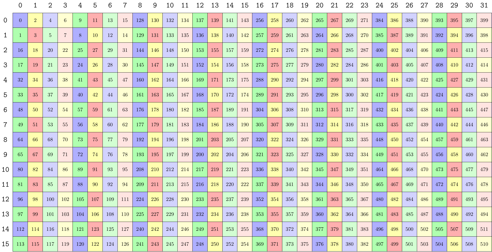<br>
    <small>mn-major 32B swizzle tiling 128×64</small>
</div>
<br>


下面是打印不同块上的描述符的结果。一共有 2×4 块。第一块的起始地址就是 smem 的起始地址，为 0x0040。行方向第二块和第一块的起始地址差了 8×8 = 64，所以地址变成了 0x0080。列方向第二块和第一块相差了 16×16 = 256，所以地址变成了 0x0140。

```log
GMMA::DescriptorIterator o (_1,_2,_4):(_0,_64,_256):
  GmmaDescriptor: 0xc000008000100040
  start_addr :  0x0040
  leading_off:  0x0010 (16)
  stride_off :  0x0080 (128)
  base_offset:  0x0
  layout_type:  0x3 (B32)
  GmmaDescriptor: 0xc000008000100080
  start_addr :  0x0080
  leading_off:  0x0010 (16)
  stride_off :  0x0080 (128)
  base_offset:  0x0
  layout_type:  0x3 (B32)

----------
  GmmaDescriptor: 0xc000008000100140
  start_addr :  0x0140
  leading_off:  0x0010 (16)
  stride_off :  0x0080 (128)
  base_offset:  0x0
  layout_type:  0x3 (B32)
  GmmaDescriptor: 0xc000008000100180
  start_addr :  0x0180
  leading_off:  0x0010 (16)
  stride_off :  0x0080 (128)
  base_offset:  0x0
  layout_type:  0x3 (B32)

----------
  GmmaDescriptor: 0xc000008000100240
  start_addr :  0x0240
  leading_off:  0x0010 (16)
  stride_off :  0x0080 (128)
  base_offset:  0x0
  layout_type:  0x3 (B32)
  GmmaDescriptor: 0xc000008000100280
  start_addr :  0x0280
  leading_off:  0x0010 (16)
  stride_off :  0x0080 (128)
  base_offset:  0x0
  layout_type:  0x3 (B32)

----------
  GmmaDescriptor: 0xc000008000100340
  start_addr :  0x0340
  leading_off:  0x0010 (16)
  stride_off :  0x0080 (128)
  base_offset:  0x0
  layout_type:  0x3 (B32)
  GmmaDescriptor: 0xc000008000100380
  start_addr :  0x0380
  leading_off:  0x0010 (16)
  stride_off :  0x0080 (128)
  base_offset:  0x0
  layout_type:  0x3 (B32)
```

### 64B swizzle

还是以 128×64 大小的 MN-major half tensor 为例。64B swizzle MN-major 的 layout 为 `Sw<2,3,3> o _0 o (_32,_8):(_1,_32)`。

因此整个 shared memory 被分成 `Sw<2,4,3> o smem_ptr16b o ((_32,_4),(_8,_8)):((_1,_256),(_32,_1024))`。

与 wgmma 的 `LayoutA_TV: (_128,(_64,_16)):(_0,(_1,_64))` 组合后得到：`Sw<2,4,3>_smem_ptr16b o (((_32,_2),(_8,_2)),_2,_4):(((_1,_256),(_32,_1024)),_512,_2048)`。

然后创建 tensor 描述符。创建描述符的时候传进 make_gmma_desc 函数的是 `Sw<2,4,3>_smem_ptr16b o ((_32,_2),(_8,_2)):((_1,_256),(_32,_1024))`。

recast 为 128bit 后变成 `Sw<2,4,3>_smem_ptr128b o ((_4,_2),(_8,_2)):((_1,_32),(_4,_128))`。

设置 layout_type 为 64B，起始地址为 smem 的地址，base_offset = 0。然后计算 LBO 和 SBO。

把 uint128 tensor 按（W，8）进行分块。这里 W 就是 swizzle pattern 的宽度，none = 1，32B = 2，64B = 4，128B = 8。

得到 `canonical_layout = ((_4,_2),(_8,_2)):((_1,_32),(_4,_128))`。

有了 canonical_layout 后就可以计算 LBO 和 SBO 了。

stride_00 = stride<0,0>(canonical_layout) = 1。这里因为 MN 方向连续，所以 stride = 1。

stride_10 = stride<1,0>(canonical_layout) = 4。stride10 和 swizzle pattern 的宽度相等。

stride_01 = stride<0,1>(canonical_layout) = 32。因为是 64B swizzle，所以一个 pattern 有 32 个元素。

stride_11 = stride<1,1>(canonical_layout) = 128。因为是 64B swizzle，所以两列之间的 stride = 16 * 8 = 128。

最终

```cpp
desc.bitfield.stride_byte_offset_  = (LAYOUT_TYPE == LayoutType::INTERLEAVE) ? stride_01 : stride_11 = 128。
desc.bitfield.leading_byte_offset_ = (LAYOUT_TYPE == LayoutType::INTERLEAVE) ? stride_11 : stride_01 = 32。
```

直接从图中也可以看到

<div align="center">
    <br>
    <small>mn-major 64B swizzle tiling 128×64</small>
</div>
<br>


下面是打印不同块上的描述符的结果。一共有 2×4 块。第一块的起始地址就是 smem 的起始地址，为 0x0040。行方向第二块和第一块的起始地址差了 8×8 = 64，所以地址变成了 0x0080。列方向第二块和第一块相差了 16×16 = 256，所以地址变成了 0x0140。

```log
GMMA::DescriptorIterator o (_1,_2,_4):(_0,_64,_256):
  GmmaDescriptor: 0x8000008000200040
  start_addr :  0x0040
  leading_off:  0x0020 (32)
  stride_off :  0x0080 (128)
  base_offset:  0x0
  layout_type:  0x2 (B64)
  GmmaDescriptor: 0x8000008000200080
  start_addr :  0x0080
  leading_off:  0x0020 (32)
  stride_off :  0x0080 (128)
  base_offset:  0x0
  layout_type:  0x2 (B64)

----------
  GmmaDescriptor: 0x8000008000200140
  start_addr :  0x0140
  leading_off:  0x0020 (32)
  stride_off :  0x0080 (128)
  base_offset:  0x0
  layout_type:  0x2 (B64)
  GmmaDescriptor: 0x8000008000200180
  start_addr :  0x0180
  leading_off:  0x0020 (32)
  stride_off :  0x0080 (128)
  base_offset:  0x0
  layout_type:  0x2 (B64)

----------
  GmmaDescriptor: 0x8000008000200240
  start_addr :  0x0240
  leading_off:  0x0020 (32)
  stride_off :  0x0080 (128)
  base_offset:  0x0
  layout_type:  0x2 (B64)
  GmmaDescriptor: 0x8000008000200280
  start_addr :  0x0280
  leading_off:  0x0020 (32)
  stride_off :  0x0080 (128)
  base_offset:  0x0
  layout_type:  0x2 (B64)

----------
  GmmaDescriptor: 0x8000008000200340
  start_addr :  0x0340
  leading_off:  0x0020 (32)
  stride_off :  0x0080 (128)
  base_offset:  0x0
  layout_type:  0x2 (B64)
  GmmaDescriptor: 0x8000008000200380
  start_addr :  0x0380
  leading_off:  0x0020 (32)
  stride_off :  0x0080 (128)
  base_offset:  0x0
  layout_type:  0x2 (B64)
```

### 128B swizzle

以 128×64 大小的 MN-major half tensor 为例。128B swizzle MN-major 的 layout 为 `Sw<3,3,3> o _0 o (_64,_8):(_1,_64)`。

因此整个 shared memory 被分成 `Sw<3,4,3> o smem_ptr16b o ((_64,_2),(_8,_8)):((_1,_512),(_64,_1024))`。

与 wgmma的 `LayoutA_TV: (_128,(_64,_16)):(_0,(_1,_64))` 组合后得到：`Sw<3,4,3>_smem_ptr16b o ((_64,(_8,_2)),_2,_4):((_1,(_64,_1024)),_512,_2048)`。

然后创建 tensor 描述符。创建描述符的时候传进 make_gmma_desc 函数的是 `Sw<3,4,3>_smem_ptr16b o (_64,(_8,_2)):(_1,(_64,_1024))`。

recast 为 128bit 后变成 `Sw<3,4,3>_smem_ptr128b o (_8,(_8,_2)):(_1,(_8,_128))`。

设置 layout_type 为 128B，起始地址为 smem 的地址，base_offset = 0。然后计算 LBO 和 SBO。

把 uint128 tensor 按（W，8）进行分块。这里W就是 swizzle pattern 的宽度，none = 1，32B = 2，64B = 4，128B = 8。

得到 `canonical_layout = ((_8,_1),(_8,_2)):((_1,_0),(_8,_128))`。

有了 canonical_layout 后就可以计算 LBO 和 SBO 了。

stride_00 = stride<0,0>(canonical_layout) = 1。这里因为 MN 方向连续，所以 stride = 1。

stride_10 = stride<1,0>(canonical_layout) = 8。stride10 和 swizzle pattern 的宽度相等。

stride_01 = stride<0,1>(canonical_layout) = 0。因为是 128B swizzle 的一个 pattern 就占满 MN 的大小了，所以 stride 没有意义。如果 wgmma 的 N = 128，这个 stride 就是 128B swizzle 的元素个数 64。

stride_11 = stride<1,1>(canonical_layout) = 128。因为是 64B swizzle，所以两列之间的 stride = 16 * 8 = 128。

最终

```cpp
desc.bitfield.stride_byte_offset_  = (LAYOUT_TYPE == LayoutType::INTERLEAVE) ? stride_01 : stride_11 = 128。
desc.bitfield.leading_byte_offset_ = (LAYOUT_TYPE == LayoutType::INTERLEAVE) ? stride_11 : stride_01 = 0。
```

直接从图中也可以看到

<div align="center">
    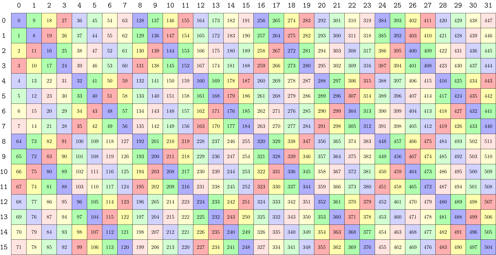<br>
    <small>mn-major 128B swizzle tiling 128×64</small>
</div>
<br>


下面是打印不同块上的描述符的结果。一共有 2×4 块。第一块的起始地址就是 smem 的起始地址，为 0x0040。行方向第二块和第一块的起始地址差了 8×8 = 64，所以地址变成了 0x0080。列方向第二块和第一块相差了 16×16 = 256，所以地址变成了 0x0140。

```log
GMMA::DescriptorIterator o (_1,_2,_4):(_0,_64,_256):
  GmmaDescriptor: 0x4000008000000040
  start_addr :  0x0040
  leading_off:  0x0000 (0)
  stride_off :  0x0080 (128)
  base_offset:  0x0
  layout_type:  0x1 (B128)
  GmmaDescriptor: 0x4000008000000080
  start_addr :  0x0080
  leading_off:  0x0000 (0)
  stride_off :  0x0080 (128)
  base_offset:  0x0
  layout_type:  0x1 (B128)

----------
  GmmaDescriptor: 0x4000008000000140
  start_addr :  0x0140
  leading_off:  0x0000 (0)
  stride_off :  0x0080 (128)
  base_offset:  0x0
  layout_type:  0x1 (B128)
  GmmaDescriptor: 0x4000008000000180
  start_addr :  0x0180
  leading_off:  0x0000 (0)
  stride_off :  0x0080 (128)
  base_offset:  0x0
  layout_type:  0x1 (B128)

----------
  GmmaDescriptor: 0x4000008000000240
  start_addr :  0x0240
  leading_off:  0x0000 (0)
  stride_off :  0x0080 (128)
  base_offset:  0x0
  layout_type:  0x1 (B128)
  GmmaDescriptor: 0x4000008000000280
  start_addr :  0x0280
  leading_off:  0x0000 (0)
  stride_off :  0x0080 (128)
  base_offset:  0x0
  layout_type:  0x1 (B128)

----------
  GmmaDescriptor: 0x4000008000000340
  start_addr :  0x0340
  leading_off:  0x0000 (0)
  stride_off :  0x0080 (128)
  base_offset:  0x0
  layout_type:  0x1 (B128)
  GmmaDescriptor: 0x4000008000000380
  start_addr :  0x0380
  leading_off:  0x0000 (0)
  stride_off :  0x0080 (128)
  base_offset:  0x0
  layout_type:  0x1 (B128)
```

前面提到 swizzle pattern tiling smem 可以按照列主序或行主序。上面这么多全部是按照列主序 tiling 的，下面以 MN 128B swizzle 为例介绍如果是行主序 tiling 的话 LBO 和 SBO 怎么设置。


